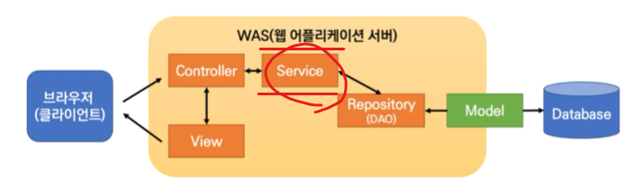
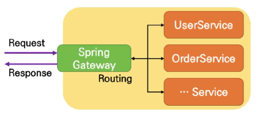

# 🎶Java
---

<a href="#스프링_프레임워크_개요_및_특징">스프링 프레임 워크 개요 및 특징</a>  
<a href="#스프링_빌드도구">스프링 빌드도구</a>  
<a href="#스프링_컨테이너와_빈">스프링 컨테이너와 빈</a>  
<a href="#의존성_주입">의존성 주입</a>  
<a href="#스프링_aop">스프링 AOP</a>  
<a href="#스프링_mvc_소개_및_구조">스프링 MVC 소개 및 구조</a>  
<a href="#컨트롤러와_요청_매핑">컨트롤러와 요청 매핑</a>  
<a href="#뷰와_뷰_리졸버">뷰와 뷰 리졸버</a>  
<a href="#스프링_부트">스프링 부트</a>  
<a href="#스프링_부트_프로젝트_구조">스프링 부트 프로젝트 구조</a>  
<a href="#스프링_부트_구성요소">스프링 부트 구성요소</a>  
<a href="#스프링_부트_배포와_패키징">스프링 부트 배포와 패키징</a>  
<a href="#스프링_부트_개발_환경_설정_및_프로젝트_생성">스프링 부트 개발 환경 설정 및 프로젝트 생성</a>  
<a href="#스프링_데이터_소개_및_jpa_기본">스프링 데이터 소개 및 JPA 기본</a>  
<a href="#jpa_엔티티_매핑">JPA 엔티티 매핑</a>  
<a href="#jpa_연관_관계_매핑">JPA 연관 관계 매핑</a>  
<a href="#jpa_repository_패턴">JPA Repository 패턴</a>  
<a href="#jpa_쿼리_메소드">JPA 쿼리 메소드</a>  
<a href="#jpa_페이징_및_정렬">JPA 페이징 및 정렬</a>  
<a href="#service_레이어">Service 레이어</a>  
<a href="#restful_api_소개_및_설계_원칙">RESTful API 소개 및 설계 원칙</a>  
<a href="#restful_api_응답_형식_및_버전_관리">RESTful API 응답 형식 및 버전 관리</a>  
<a href="#controller_레이어">Controller 레이어</a>  
<a href="#스프링_데이터_rest">스프링 데이터 REST</a>  
<a href="#스프링_게이트웨이">스프링 게이트웨이</a>  
<a href="#스프링_시큐리티_개요">스프링 시큐리티 개요</a>  
<a href="#junit_소개_및_문법">Junit 소개 및 문법</a>  
<a href="#swagger_소개_및_설치">Swagger 소개 및 설치</a>  
<a href="#swagger_문서_작성_및_ui_사용법">Swagger 문서 작성 및 UI 사용법</a>  


---

<a href="./01.실습폴더/jpaDemo">JPA 실습(게시판 제작)</a>  

---


# JDK 설치
1. OpenJDK 검색
1. OpenJDK 11 또는 17 버전 검색
1. 또는zuju jdk 11 또는 17 검색
1. 사이트에 들어가, Java11 또는 17(LTS)설치 (윈도우) .zip으로해도 되고, .msi로 해도 됨
1. 환경 변수 설정 한 후, cmd로 확인 하면 끝

# Maven 설치
1. maven 다운로드 검색
1. 다운로드 후 압축풀기 해서 환경변수 설정 bin폴더로
1. vscode Extension Pack for Java를 설치하면 끝
1. Extension에서 Community Server Connection 설치

---
# 스프링_프레임워크_개요_및_특징

### 스프링 프레임워크
`엔터프라이즈용 Java 애플리케이션 개발을 편하게 할 수 있게 해주는 오픈소스 경량급 애플리케이션 프레임워크 - 기업과 개인에 무관하게 웹 애플리케이션 개발을 위해 스프링 코드를 사용할 수 있도록 오픈소스로 제공되는 방대한 소스를 지닌 프레임워크`

- 엔터프라이즈 용 : 기업용 (db, 복잡한 로직, 규격화 된 통신 제공)

### 프레임 워크란?
`소프트웨어의 구체적인 부분에 해당하는 설계와 구현을 재사용이 가능하게끔 일련의 협업화된 형태로 클래스들을 제공하는 것`

- 개발 용이성 : 패턴 기반 개발과 비즈닛 로직에만 집중한 개발 가능 공통 기능은 프레임워크가 제공
- 시스템 복잡도의 감소 : 복잡한 기술은 프레임워크에 의해 숨겨지며, 미리 잘 정의된 기술 셋 적용
- 이식성 : 플랫폼 비의존적인 개발 가능, 플랫폼과의 연동은 프레임워크가 제공함
- 품질보증 : 검증된 개발기술과 패턴에 따른 개발, 고급 개발자와 초급 개발자의 차이를 줄여줌.
- 운영 용이성 : 변경이 용이, 비즈니스로직/아키텍처 파악이 용이
- 개발코드의 최소화 : 반복 개발 제거, 공통 컴포넌트와 서비스 활용
- 변경 용이성 : 잘 구조화 된 아키텍처 적용, 플랫폼에 비 의존성
- 설계와 코드의 재사용성 : 프레임워크 서비스 및 패턴의 재사용, 사전에 개발된 컴포넌트으 재사용

### EJB(Enterprise JavaBeans)
`Java 기반의 엔터프라이즈 애플리케이션 개발을 위한 서버측 컴포넌트 모델`

- JavaBeans : 자바로 작성된 소프트웨어 컴포넌트들, 자바 클래스들이 복합적으로 이루어진 구조

- 문제점
    - 복잡성, 무거움, 학습 곡선과 개발 복잡성

### 스프링 프레임워크의 구조
- Core
    - 프레임워크의 가장 기본적인 부분이며 `IoC` 및 종속성 주입 기능을 제공
    - BeanFactory를 기반으로 `Bean 클래스`들을 제어할 수 있는 기능 지원
- Context
    - Spring Core 바로 위에 있으며 Spring Core에서 지원하는 기능 외에 추가적인 기능들과 좀 더 쉬운 개발이 가능하도록 지원하고 EJB등을 위한 Adaptor들을 포함
- DAO
    - 데이터베이스 공급업체별 `JDBC` 코딩 및 구문 분석을 수행할 필요가 없는 JDBC 추상화 계층을 제공
- ORM
    - `JPA`, `JDO`, `Hibernate` 및 `iBatis`를 포함한 일반적인 개체 관계 매핑 API에 대한 통합 계층을 제공
- Web
    - 파일 업로드 기능, 서블릿 수신기를 사용한 IoC 컨테이너 초기화 및 웹 지향 애플리케이션 컨텍스트와 같은 기본적인 웹 지향 통합 기능을 제공
- MVC
    - MVC(ModelViewController) 구현을 제공
    - 도메인 모델 코드와 웹 양식을 완벽하게 구분할 수 있으며 Spring Framework의 다른 모드 기능을 사용할 수 있음
- JPA(Java Persistence API)
    - 현재 ORM(Object Relational Mapping)의 기술 표준으로, 인터페이스 모음
    - ORM에 대한 자바 API 규격이며 Hibernate, OpenJPA 등이 JPA를 구현한 구현체

### 스프링 프레임워크의 특징
- 경량화
- 제어 반전(IoC, Inversion of Control)
    - 객체의 생성, 관계 설정, 생명주기 관리 등을 개발자가 아닌 스프링 프레임워크가 담당해서 객체 간의 결합도를 낮추고, 유연한 구조를 구축함
- 의존성 주입 (DI, Dependency Injection)
    - 객체 간의 의존성을 개발자가 직접 관리하지 않고, 스프링 프레임워크가 의존성을 관리
- 관점 지향 프로그래밍 (AOP, AspctOriented Programming)
    - 여러 객체에 공통적으로 적용될 수 있는 기능(ex. 로깅, 트랜잭션, 보안 등)을 모듈화하고, 이를 통해 코드의 재사용성과 유지보수성을 높임
- 통합, 테스트, 보안

### 스프링의 주요 패턴 3가지
1. Dependency Injection(DI, 의존성 주입)

`객체 간의 의존성을 최소화하고 유연하게 관리하기 위한 패턴`
``` java
public class UserService {
    private UserRepository userRepository;

    // 생성자를 통한 의존성 주입
    public UserService(UserRepository userRepository) {
        this.userRepository = userRepository;
    }

    public void createUser(User user) {
        //userRepository를 사용하여 사용자 생성 로직 수행
        userRepository.save(user);
    }
}

위의 예시에서 보면, userRepository라는 db를 spring이 알고 있으니 
UserService라는 객체에 의존성 주입을 통해 저장할 수 있는 기능을 제공
```

2. Aspect Oriented Programming (AOP, 관점 지향 프로그래밍)

`객체 지향 개념에서의 관심사 분리를 위해 사용되는 패턴`
``` java
public interface LoggingAspect {
    // 공통 로깅 동작을 정의하는 메서드
    void logBefore(JoinPoint joinPoint);
}

@Component
public class LoggingAspectImpl implements LoggingAspect {
    // 메서드 구현
    public void logBefore(JoinPoint joinPoint) {
        // 메서드 호출 전 로깅 동작을 수행
        System.out.println("Logging before method: " + joinPoint.getSignature().getName());
    }
}
메서드를 호출하기 전에 수행함으로써 관점 분리 가능
```

3. Model-View-Controller (MVC)

`컨트롤러, 뷰, 모델의 세 가지 요소를 사용해 웹 애플리케이션을 구성`

``` java
@Controller
public class UserController {
    @Autowired
    private UserService userService;

    @GetMapping("/users")
    public ModelAndView getUsers() {
        List<User> users = userService.getUsers();
        ModelAndView modelAndView = new ModelAndView("user-list");
        modelAndView.addObject("users", users);
        return modelAndView;
    }

    @PostMapping("/users")
    public String createUser(@ModelAttribute("user") User user) {
        userService.createUser(user);
        return "redirect:/users";
    }
}
```
---

# 스프링_빌드도구
`Maven과 Gradle을 주로 지원하지만, 다른 도구인 Ant도 사용됨`

- Spring Boot 프로젝트일 경우, Gradle Wrapper 또는 Maven Wrapper를 사용해 내장 빌드 도구를 사용할 수 있음
    - Wrapper를 사용하면 프로젝트에 빌드 도구를 별도로 설치하지 않고도 프로젝트를 빌드할 수 있음

### 빌드 도구
`소스 코드의 빌드 과정을 자동으로 처리해주는 프로그램, 외부 소스코드(외부 라이브러리) 자동 추가 및 관리`

- 필요한 이유
    - 수동으로 빌드 할 경우 무엇을 빌드할지, 어떤 순서를 가지고 빌드할지, 어떤 의존성이 있는지 모두 추적하기 쉽지 않음.
    - 빌드 툴을 사용하면 해당 과정을 일관되게 할 수 있음.
    - 프로젝트의 규모가 커질수록 빌드 프로세스를 수동으로 호출할 경우 실용적이지 못함

### 스프링 빌드도구 : Maven
`Apache Software Foundation에서 개발한 Java 기반 프로젝트 관리 도구`

- 프로젝트 빌드, 종속성 관리, 프로젝트 문서화, 테스트, 배포 등을 자동화하는 데 사용
- 프로젝트의 라이프사이클을 기반으로 작동, 프로젝트 빌드 시 필요한 작업을 수행하고, 의존성을 해결하여 필요한 라이브러리를 다운
- 중앙 저장소(Central Repository)라는 공개된 저장소를 통해 다양한 라이브러리와 프로젝트 종속성을 관리
- 프로젝트의 pom.xml(POM: Project Object Model) 파일에 필요한 종속성을 선언하면 Maven은 해당 종속성을 자동으로 검색하고 다운로드하여 빌드에 필요한 라이브러리를 가져옴

```xml
<?xml version="1.0" encoding="UTF-8"?> -> xml의 기본 정보
<project xmlns="http://maven.apache.org/POM/4.0.0"
    xmlns:xsi="http://www.w3.org/2001/XMLSchema-instance"
    xsi:schemaLocation="http://maven.apache.org/POM/4.0.0
    http://maven.apache.org/xsd/maven-4.0.0.xsd"> -> xml의 규격

    <!-- 프로젝트 정보 -->
    <modelVersion>4.0.0</modelVersion>
    <groupId>com.example</groupId>
    <artifactId>my-project</artifactId> -> 프로젝트를 artifact로 부름
    <version>1.0.0</version>

    <!-- 프로젝트 종속성 --> -> 외부 라이브러리
    <dependencies>
      <!-- 예시로 JUnit 4 라이브러리를 종속성으로 추가 -->
      <dependency>
        <groupId>junit</groupId>
        <artifactId>junit</artifactId>
        <version>4.12</version>
        <scope>test</scope> -> 언제 사용할 것인지
      </dependency>
    </dependencies>

    <!-- 빌드 설정 -->
    <build>
      <!-- 소스 디렉토리 및 컴파일 설정 -->
      <sourceDirectory>src/main/java</sourceDirectory> -> 실제java 소스가 위치한 곳
      <plugins>
        <plugin>
          <groupId>org.apache.maven.plugins</groupId>
          <artifactId>maven-compiler-plugin</artifactId>
          <version>3.8.1</version>
          <configuration>
            <source>1.8</source>
            <target>1.8</target>
          </configuration>
        </plugin>
      </plugins>
    </build>

</project>

참고로 xml은 html과 다르게 태그를 정의해서 사용 가능

```

### maven 빌드 라이프 사이클
validate -> compile -> test -> package -> verify -> install -> deploy (default)

```
- default 빌드 라이프 사이클

    - validate : 프로젝트가 유효한지 확인하고 필요한 설정을 검증
    - compile : 소스 코드를 컴파일
    - test : 단위 테스트를 실행
    - package : 컴파일된 코드와 리소스를 포함한 빌드 가능한 아티팩트(JAR, WAR)를 생성
    - verify : 품질 검증 도구를 실행하고 테스트 결과를 확인
    - install : 빌드된 아티팩트를 로컬 저장소에 설치
    - deploy : 빌드된 아티팩트를 원격 저장소에 배포
```

pre-clean -> clean (clean)

- clean : 이전 빌드 생성 파일 삭제

pre-site -> site -> post-site -> site-deploy (site)

- site : 문서 사이트 생성

### 스프링 빌드도구 : Gradle
`Groovy를 기반으로 한 빌드 자동화 도구`
- Maven과 Ant의 장점을 결합한 것으로, Maven의 선언적인 구문과 의존성 관리 기능을 제공하면서도 Ant의 유연한 스크립트 작성과 확장성을 갖추고 있음
- Groovy DSL(Groovy Domain Specific Language)을 사용하여 빌드 스크립트를 작성
- 작업(task), 의존성(dependency), 플러그인(plugin) 등을 정의할 수 있는 빌드 스크립트를 통해 필요한 작업을 자동으로 수행하고 필요한 라이브러리를 다운로드
- Spring 기반 프로젝트의 빌드뿐만 아니라 Android 애플리케이션 개발에서 널리 사용

```groovy
// 빌드 스크립트에서 사용할 Gradle 플러그인 추가
plugins {
    id 'java' // java 플러그인 추가
}

// 프로젝트 설정
group 'com.example'
version '1.0.0'

// 프로젝트 종속성
dependencies {
    // 예시로 JUnit 5 라이브러리를 종속성으로 추가
    testImplementation 'org.junit.jupiter:junit-jupiter:5.7.2'
}

// 빌드 설정
// Java 소스 및 컴파일러 설정
java {
    sourceCompatibility = JavaVersion.VERSION_11
    targetCompatibility = JavaVersion.VERSION_11
}

// 테스트 태스크 설정
test {
    useJUnitPlatform() // 테스트 실행에 사용할 테스트 프레임워크 지정
}
```

- Gradle은 Build 대신 Task 절차
    - 사용자가 빌드 스크립트에 정의한 Task에 따라 빌드 프로세스가 구성
        - Gradle의 유연성과 강력한 기능 중 하나
    - 기본적인 빌드 단계를 사용할 수 있음
        - 초기화 단계(Initialization phase) : Gradle 빌드 스크립트를 초기화하고 설정
        - 구성 단계(Configuration phase) : 프로젝트 및 태스크의 설정이 수행
        - 실행 단계(Excution phase) : 태스크들이 실행되는 단계로, 여러 태스크들이 병렬 또는 순차적으로 실행될 수 있음
    - 사용자는 필요에 따라 태스크를 정의, 의존성을 설정 등을 다양한 플러그인을 사용해 빌드 프로세스를 조정할 수 있음.

- Gradle 명령어
    - gradle clean : 이전 빌드에서 생성된 파일들을 삭제
    - gradle build : 소스 코드를 컴파일하고, 테스트를 실행하며, 빌드 가능한 아티팩트(JAR, WAR 등)을 생성
    - gradle test : 테스트를 실행
    - gradle install : 빌드된 아티팩트를 로컬 저장소에 설치
    - gradle publish : 빌드된 아티팩트를 배포
---

# 스프링_컨테이너와_빈

### 스프링 프레임워크 아키텍처 구성
- Core Container
    - 스프링의 핵심 기능을 담당하는 모듈로, 스프링 컨테이너(BeanFactory 또는 ApplicationContext)와 스프링의 핵심 라이브러리를 포함하고 스프링의 의존성 주입(DI)와 제어 역전(IoC)를 구현하는 기능을 제공
- Data Access/Integration
    - 데이터 액세스와 데이터 통합을 담당하는 모듈로, JDBC, ORM(Object-Relational Mapping) 등의 데이터 액세스와 통합 기능을 제공
- Web
    - 스프링의 웹 기능을 담당하는 모듈로, 웹 애플리케이션 개발을 위한 MVC(Model-View-Controller) 아키텍처, 웹 소켓(Web Socket), REST(Representational State Transfer) 등을 지원

### 스프링 컨테이너의 정의
`의존성 주입(DI)을 통해 객체 간의 의존 관계를 해결하고, 관점 지향 프로그래밍(AOP)를 지원하여 여러 객체에서 공통으로 사용하는 기능을 모듈화 할 수 있음`

- BeanFactory
    - 가장 기본적인 컨테이너이며, 객체의 생성과 관리를 담당
    - BeanFactory는 지연 초기화(lazy initialization)를 지워하여, 필요한 시점에 객체를 생성
    - 이를 통해 애플리케이션의 시작 시간을 최적화할 수 있음
- ApplicationContext
    - BeanFactory의 모든 기능을 포함하며, 더 빠르고, AOP, 메시지 처리, 이벤트 처리 등의 기능을 지원

### BeanFactory와 ApplicationContext
`BeanFactory는 스프링 컨테이너의 최상위 인터페이스, ApplicationContext는 BeanFactory의 기능을 모두 상속 그 외 부가적인 기능(DI) 또한 지원 및 제공`
- Bean 추가는 어노테이션 방식과 xml 방식으로 진행됨


### 단순 생성과 의존성 추가
```java
public class UserService {
    private EmailService emailService;

    public UserService() {
        this.emailService = new EmailService();
    }
}

public class EmailService {
    // 이메일 서비스의 로직
}

new로 객체 생성은 단순 생성
-> 강한 결합이 형성되어, 유지 보수 및 테스트가 어려움

public class UserService {
    private EmailService emailService;

    public UserService(EmailService emailService) {
        this.emailService = emailService;
    }
}

public class EmailService {
    // 이메일 서비스의 로직
}

매개변수를 통해 객체를 가져옴
-> 느슨하게 결합되어 있어, 의존성의 변경에 유연하게 대응할 수 있고 테스트를 위해 Mock 객체 등을 주입할 수도 있음.
```

### ApplicationContext가 제공하는 부가적인 기능
- 메시지 소스 처리
    - App에서 사용되는 메시지들을 관리하고, 다양한 언어로 번역하여 제공
- 환경변수 처리
    - App의 실행환경에 따라 설정을 동적으로 변경할 수 있도록 환경변수를 관리
- 애플리케이션 이벤트 처리
    - App이 발생하는 이벤트를 감지하고, 이벤트에 대한 리스너를 등록하여 처리할 수 있음
- AOP 지원
    - App의 핵심 로직과 공통 로직을 분리하여 사용 가능
- 트랜잭션 관리
    - 트랜잭션을 시작하고, 커밋 또는 롤백하여 트랜잭션 관리를 자동으 로 처리 가능
- 스프링 선언저긴 모델(DAO, ORM 등) 통합
    - 간단한 설정으로 다양한 데이터 액세스 기술을 사용할 수 있음

### 스프링 Bean의 정의
```스프링 컨테이너(BeanFactory 또는 ApplicationContext)가 관리하는 객체, IoC의 대상이 되는 객체이다. 스프링 컨테이너는 객체를 생성하고 필요한 곳에서 해당 객체를 주입하여 사용```

### 스프링의 주요 Bean
- ApplicationContext
    - Spring Framework에서 중요한 Bean이며, 애플리케이션의 빈을 생성하고 관리
- BeanFactory
    - 애플리케이션에서 사용하는 모든 빈을 생성하고 관리하는 인터페이스
- DispatcherServlet
    - Spring MVC 프레임워크에서 HTTP 요청을 처리하는 컨트롤러 역할을 하는 Bean
- JdbcTemplate
    - JDBC를 사용하여 DB와 상호작용하는 데 사용되는 Bean
- TransactionManager
    - Spring에서 제공하는 트랜잭션 관리 Bean

### 스프링의 주요 Bean Scope
- Singleton (default)
    - 스프링 컨테이너에서 해당 bean의 인스턴스를 오직 하나만 생성하고, 이후에는 동일한 인스턴스를 반환
- Prototype
    - 매번 해당 bean을 요청할 때마다 새로운 인스턴스를 생성 (다수 생성 가능)
- Request
    - 웹 앱에서만 사용 가능한 scope로, 각각의 HTTP 요청마다 새로운 인스턴스를 생성
    - 각각의 요청에 대해 독립적인 인스턴스를 생성하며, 요청이 완료되면 인스턴스가 소멸
- Session
    - 웹 앱에서만 사용 가능한 scope로, 각각의 사용자 세션에 대해 하나의 인스턴스를 생성
    - 사용자 세션이 종료되기 전까지는 인스턴스가 유지
- Global Session
    - 포털 애플리케이션에서 사용되는 scope로, 여러 개의 포털 애플리케이션 간에 하나의 인스턴스를 공유
- Application
    - 웹 애플리케이션에서만 사용 가능한 scope로, 해당 웹 애플리케이션 내에서 하나의 인스턴스를 생성하고 공유

### 스프링 Bean의 라이프사이클
`Container Started -> Bean Instantiated -> Dependencies Injected -> Custom init() method -> Custom utility method -> Custom destroy() method`

1. Bean 인스턴스 생성
2. 의존성 주입(DI)
3. Bean 초기화
4. Bean 사용
5. Bean 소멸
---

# 의존성_주입

### IoC/DI 개념
`IoC(Inversion of Control, 제어의 역전) 또는 DI(Dependency Injection, 의존성 주입)는 개발자가 객체 간의 의존성을 설정해두면 컨테이너가 해당 의존성을 관리하고, 필요한 객체를 생성하여 의존성을 주입`


### IoC/DI의 장점
- 결합도 감소
    - IoC/DI는 의존성을 객체 내부에 직접 결합시키지 않고 외부에서 주입하므로 결합도를 감소
- 테스트 용이성
    - 의존성을 주입함으로써 테스트할 때 해당 의존성을 대체할 수 있으며, 모의 객체(Mocking)를 사용하여 테스트 환경을 설정 가능
    - 단위 테스트와 통합 테스트를 수행하는 데 도움을 줌
- 재사용성
    - 의존성으 주입하는 방식으로 작성된 모듈을 다른 프로젝트나 다른 부분에서 재사용하기 용이하게 만듬
    - 의존성을 변경하거나 대체하는 것만으로 모듈을 다양한 환경에서 사용할 수 있음
- 유연성과 확장성
    - IoC 컨테이너를 사용하면 객체의 생성, 관리 및 구성을 외부에 위임할 수 있음 이로서 애플리케이션을 더 유연하게 확장 가능

### IoC/DI의 단점
- 학습 곡선
    - 처음 접하는 개발자들에겐 IoC/DI 컨테이너의 동작 방식과 설정 방법을 이해하는 데 시간이 걸릴 수 있음
- 복잡성 증가
    - IoC/DI를 사용하면 코드의 일부 구성 요소를 외부에서 주입해야 하므로 코드의 복잡성이 증가할 수 있음.
    - 추가적인 구성 작업이 필요하고, 오용에 대한 주의가 필요
- 컨테이너 종속성
    - 컨테이너에 종속되는 경향이 있음
    - 코드가 특정 컨테이너에 의존하는 경우, 다른 컨테이너로 전환하기가 어려울 수 있음
- 실행 시 오류
    - 컴파일 시점이 아닌 실행 시점에 의존성이 주입되므로, 잘못된 의존성 설정 또는 누락된 의존성으로 인해 런타임 오류가 발생할 수 있음

### IoC/DI의 주요 기능
- 객체 생성 및 관리
    - 객체의 생성과 소멸을 관리
- 컴포넌트 조립
    - IoC/DI는 애플리케이셔의 컴포넌트를 조립하는 데 사용
    - 컨테이너는 설정 정보에 따라 필요한 컴포넌트를 생성하고 의존성을 주입하여 애플리케이션의 기능을 조합
- 의존성 해결
    - 의존성 주입을 통해 필요한 의존 객체를 주입할 수 있음
    - 객체 간의 결합도를 낮추고 유연성을 높일 수 있음
- 설정 관리
    - XML,JSON,Annotation 등을 통해 제공되며, 컨테이너가 설정 정보를 기반으로 객체를 생성하고 구성
    - 애플리케이션의 동작 방시을 유연하게 변경할 수 있음

### IoC/DI의 설정 방법
- xml 설정 방법
```xml
<?xml ~~ ?>
<beans xmlns> -> bean 규격 ~~
  <!-- 객체를 정의합니다 -->
  <bean id="greetingService" class="com.example.GreetingSeerviceImpl">
    <!-- 프로퍼티에 값을 주입합니다 -->
    <property name="greeting" value="Hello, World!"/>
  </bean>

  <bean id="client" class="com.example.Client">
    <!-- greetingService 프로퍼티에 참조를 주입합니다 -->
    <property name="greetingService" ref="greetingService" /> -> ref : 다른 bean
  </bean>
</beans>

위의 예시는 Client는 GreetingService에 의존하고있다는 관계
```

- java config 설정 방법
``` java
@Configuration // 설정하는 annotation
public class AppConfig {
    @Bean
    public GreetingService greetingService() {
        GreetingServiceImpl greetingService = new GreetingServiceImpl();
        greetingService.setGreeting("Hello, World!");
        return greetingService;
    }

    @Bean
    public Client client() {
        Client client = new Client();
        client.setGreetingService(greetingService());
        return client;
    }
}
```

- Annotation 설정 방법
``` java
public interface GreetingService {
    String greet();
}

@Service // 서비스면 빈이라고 스프링이 해석
public class GreetingServiceImpl implements GreetingService {
    private String greeting;

    @Value("Hello, World!")
    public void setGreeting(String greeting) {
        this.greeting = greeting;
    }

    public String greet() {
        return greeting;
    }
}
```

### IoC/DI의 예시
- 사용하지 않은 경우
    - "GreetingServiceImpl" 클래스가 강하게 결합되어 있어서, "GreetingServiceImpl" 클래스의 생성자나 메서드가 변경되면, "Client" 클래스도 변경해야 할 수 있음
``` java
public class Client {
    private GreetingService greetingService;

    public Client() {
        this.greetingService = new GreetingServiceImpl();
    }

    public void doSomething() {
        System.out.println(greetingService.greet());
    }
}
```
---
# 스프링_AOP

### 스프링 AOP의 개념(Aspect-Oriented Programming)
- Spring AOP는 '관점 지향 프로그래밍' 기법을 지원하는 Spring Framework의 기능 중 하나
- OOP에서의 상속, 다형성 등의 개념을 보완하여, 코드 중복을 제거하고, 관심사를 분리하여 유지보수성을 향상시킨 기술
- proxy를 이용해 구현되며, 주로 로깅,보안,트랜잭션,캐싱 등과 같은 부가적인 기능을 구현하는 데 사용

### 스프링 AOP 관련 용어
- Aspect : 여러 객체에 공통으로 적용되는 모듈화된 관심사
- Join Point : Aspect를 적용할 수 있는 지점, 메소드 호출, 필드 접근 등
- Advice : Join Point에서 실행되는 코드, Before, After 등
- Pointcut : 어떤 Join Point에 어떤 Advice를 적용할 것인지 정의하는 표현식
- Target Object : Aspect를 적용할 객체
- Proxy : Target Object를 감싸서 Advice를 적용한 객체

### 스프링 AOP의 장점
- 중복 코드 제거 및 모듈화
- 유연한 기능 추가 및 제거
- 로깅, 보안, 트랜잭션 관리 등에 대한 분리

### 스프링 AOP의 단점
- 실행 시간 성능 저하
- 복잡성
- 디버깅 어려움

### 스프링 AOP의 기능
- AOP Alliance 기반의 프록시 패턴을 이용한 AOP 구현
    - 스프링은 AOP Alliance에서 제공하는 인터페이스와 프록시 패턴을 이용하여 AOP를 구현
    - AOP Alliance는 AOP 관련 인터페이스를 표준화한 조직으로, 스프링과 같은 다양한 AOP 구현체에서 활용
- @AspectJ 어노테이션을 활용한 AOP 구현
    - 스프링은 @AspectJ 어노테이션을 이용하여 AOP를 구현
    - @AspectJ 어노테이션은 AspectJ에서 제공하는 어노테이션을 스프링에서 사용할 수 있도록 지원
- XML 설정 파일을 이용한 AOP 구현
    - 스프링은 XML 설정 파일을 이용해 AOP 구현 가능
    - XML 설정 파일에선 AOP 구현을 위한 포인트컷, 어드바이스, 어드바이스와 포인트컷의 조합인 Aspect를 정의할 수 있음

### 스프링 AOP 설정 방법
1. AOP 의존성 추가
2. 관점(Aspect) 클래스 작성
    - AOP에서 관심사를 모듈화한 클래스를 작성, 이 클래스는 @Aspect 어노테이션으로 표시되어야 함.
``` Java
@Aspect
@Component // 빈 선언
public class MyAspect {
    // Advice 정의 -> 서비스 패키지 내에 있는 타 클래스들을 실행하기 전에 다음의 메서드를 실행한다.
    @Before("execution(* com.example.service.*.*(..))")
    public void doSomethingBefore(JoinPoint joinPoint) {
        // ..
    }
}
```
3. 포인트컷(Pointcut) 정의
    - 어느 메소드에 관점을 적용할지를 정의하는 포인트컷을 작성 Spring AOP에서는 @Pointcut 어노테이션을 사용하여 포인트컷을 정의
``` Java
@Aspect
public class LoggingAspect {
    
    // Pointcut 정의
    @Pointcut("execution(* com.example.MyClass.*(..))")
    private void myMethodPointcut() {

    }

    // Advice 적용할 메소드
    @Before("myMethodPointcut()")
    public voidd beforeAdvice() {
        // Advice 로직 구현
        System.out.println("메소드 실행 전 로깅");
    }
}
```
4. 어드바이스(Advice) 정의
    - 관점이 적용될 때 실행될 코드를 어드바이스로 정의, 일반적으로 @Before, @After, @AfterThrowing, @AfterReturning 어노테이션 등을 사용하여 어드바이스를 정의할 수 있음
``` Java
@Aspect
public class LoggingAspect {

    // Pointcut 정의
    @Pointcut("execution(* com.example.MyClass.*(..))")
    private void myMethodPointcut() {

    }

    // Advice 적용할 메소드
    @Before("myMethodPointcut()")
    public voidd beforeAdvice() {
        // Advice 로직 구현
        System.out.println("메소드 실행 전 로깅");
    }
}
```

5. 테스트 및 검증
    - AOP 설정이 올바로 동작하는지 테스트하고 검증, 적용하려는 관점이 올바르게 동작하고, 포인트컷에 의해 지정된 메소드가 관점에 의해 올바르게 처리되는지 확인
``` Java
@RunWith(SpringRunner.class)
@SpringBootTest
public class LoggingAspectTest {

    @MockBean
    private MyService myService;

    @Autowired
    private LoggingAspect loggingAspect;

    @Test
    public void testBeforeAdvice() {
        // Mock 객체를 사용하여 메소드 호출
        myService.doSomething();

        // 해당 Advice가 호출되었는지 검증
        Mockito.verify(loggingAspect).beforeAdvice();
    }
}
```
---
# 스프링_MVC_소개_및_구조

### 스프링 MVC의 개념
- Spring MVC는 Spring 프레임워크의 일부로서 웹 애플리케이션을 개발하기 위한 모델-뷰-컨트롤러(Model-View-Controller) 아키텍처를 구현하는 웹 프레임워크
- Spring MVC는 웹 애플리케이션의 요청과 응답을 처리하고, 비즈니스 로직과 사용자 인터페이스를 분리하여 개발할 수 있는 구조를 제공


- Model

`일반적으로 Java 객체(POJO-순수한 자바 객체- 외부 환경, 기술에 독립적)로 표현되며, DB에서 가져온 정보나 사용자 입력 데이터 등을 처리하고 저장`
- View

`사용자에게 데이터를 시각적으로 표현하는 역할`

    - HTML, JSP, Thymeleaf 등과 같은 템플릿 엔진을 사용하여 동적으로 생성된 웹 페이지를 생성학 클라이언트에게 전달
    - 모델의 데이터를 표현하기 위해 필요한 정보를 가져올 수 있음

- Controller

`사용자 요청을 처리하고 모델과 뷰 간의 상호 작용을 조정하는 역할`

    - 사용자 요청을 분석하고 해당 요청에 맞는 비즈니스 로직을 실행하며, 모델을 업데이트하고 뷰에 전달

### 스프링 MVC의 특징
- 경량화
- 모듈성
- 유연성
- 테스트 용이성
- 보안
- 커스터마이징이 용이

### 스프링 MVC의 구조
`Spring MVC는 Model-View-Controller 패턴을 기반으로 한 웹 애플리케이션 아키텍처를 구현`

    - 이 패턴은 애플리케이션을 모델, 뷰 및 컨트롤러로 구성하며, 각 부분은 역할에 따라 분리되어 있음


### 스프링 MVC - DispatcherServlet
- 요청의 분배
    - 클라이언트의 모든 웹 요청을 수신
    - 웹 요청은 URL 경로, HTTP 메소드, 요청 헤더 등을 기준으로 분배
- 핸들러 매핑(Handler Mapping)
    - 요청을 처리하기 위해 어떤 핸들러(컨트롤러)가 적합한지를 결정
- 핸들러 어댑터(Handler Adapter)
    - 찾아낸 핸들러에게 요청을 전달하고, 핸들러의 실행 결과를 적절한 응답으로 변환하기 위해 사용
- 뷰(View)의 선택과 렌더링
    - 뷰 리졸버(View Resolver)를 통해 뷰를 찾아내고, 모델 데이터와 함께 뷰에 전달하여 최종적인 응답을 생성
- 예외 처리
    - 예외를 적절한 HTTP 응답 상태 코드로 변환하거나, 예외 처리자(Exception Handler)를 사용하여 사용자 정의 에러 페이지로 리다이렉션함


---

# 컨트롤러와_요청_매핑

### 스프링 MVC의 컨트롤러
- 스프링 MVC의 컨트롤러는 웹 애플리케이션에서 클라이언트 요청을 처리하고, 응답을 생성하는 데 사용되는 핵심 구성 요소
- 컨트롤러는 모델과 뷰 사이의 상호 작용을 조정하며, 웹 요청을 처리하고 필요한 작업을 수행한 후 적절한 응답을 생성
- 스프링 MVC에서 컨트롤러는 일반적으로 @Controller 어노테이션을 사용하여 클래스에 지정
- @RequestMapping 어노테이션을 사용해 특정 URL 패턴과 매핑

### 스프링 MVC의 컨트롤러
- 웹 어플리케이션에는 아래 이미지와 같은 구성요소로 이뤄진 http request 처리 레이어가 존재
- 웹 서버에서 수신 -> 라우팅에서 컨트롤러로 전달 -> 컨트롤러에서 요청 처리 및 로직 수행 -> 서비스에서 데이터 처리


### 스프링 MVC 컨트롤러의 요청 처리 관련
`요청은 URL로 진행, URL의 구조는 아래와 같음`
```
http://localhost:8080/api/user/{id}/regist-email?key1=value1&key2=val
프로토콜://도메인:Port/path/?Parameter
```
- 프로토콜 : URL의 시작 부분에 위치하며, 리소스에 접근하는 데 사용되는 통신 프로토콜을 지정
- 도메인 : 프로토콜 다음에 위치하며, 리소스가 호스팅되어 있는 서버의 도메인 이름 또는 IP 주소를 나타냄
- 포트 : 도메인 다음에 위치하며, 리소스에 접근하는 데 사용되는 네트워크 포트 번호를 지정
- 패스 : 도메인 뒤에 위치하며, 서버에서 제공되는 리소스의 경로
- 파라미터 : URL에 추가 정보를 전달하기 위해 사용되며, ?로 시작

`Spring MVC에서 컨트롤러는 클라이언트의 요청을 처리하는 비즈니스 로직을 담당하는 객체로서 컨트롤러는 @Controller 어노테이션을 사용하며 선언하며, 다음과 같은 요청 매핑 어노테이션을 사용해 클라이언트의 요청을 처리`


``` Java
/*
@RequestMapping
- @RequestMapping 어노테이션은 URL 매핑을 지정하는 데 사용
- 예를 들어, @RequestMapping("/users")와 같이 URL 패턴을 설정하면, /users 경로로 들어오는 요청을 처리하는 메소드를 지정할 수 있음
*/
@Controller
@RequestMapping("/users") // path
public class UserController {
    @RequeestMapping(method=RequestMethod.GET) // GET 요청만
    public String listUsers(ModelMap model) {
        List<User> users = userService.getAllUsers();
        model.addAttribute("users",users);
        return "userList"; // userList라는 뷰한테 넘겨줘라는 의미
    }
}
```

``` Java
/*
@GetMapping, @PostMapping, @PutMapping, @DeleteMapping
- Spring 4.3부터는 HTTP 메소드에 따라 처리하는 요청 매핑 어노테이션도 추가
- @GetMapping, @PostMapping, @PutMapping, @DeleteMapping 어노테이션은 각각 HTTP GET, POST, PUT, DELETE 요청을 처리하는 데 사용
*/

@Controller
public class UserController {
    private String userName = "John Doe"; // 기본 사용자 이름

    @PutMapping("/updateName")
    public String updateName(@RequestParam("name") String name) {
        userName = name; // 새로운 사용자 이름으로 업데이트
        return "redirect:/"; // 사용자 페이지로 리다이렉트
    }
}
```

``` Java
/*
@PathVariable
- @PathVariable 어노테이션은 URL 패턴에서 변수를 추출하는 데 사용
- 예를 들어, @RequestMapping("/users/{id}")와 같이 URL 패턴에서 {id} 변수를 추출하여, @PathVariable("id") 어노테이션을 사용하여 해당 변수를 메소드 파라미터로 전달할 수 있음
*/

@Controller
public class UserController {
    @GetMapping("/users/{id}") 
    public String getUser(@PathVariable("id") Long userId, Model model) { // "id"가 userId로 들어갈 수 있다.
        User user = userService.geUserById(userId);
        model.addAttribute("user", user);
        return "user";
    }
}
```

``` Java
/*
@RequestParam
- @RequestParam 어노테이션은 요청 파라미터를 추출하는 데 사용
- 요청 파라미터는 URL 뒤에 ?key=value 형태로 전달되며, @RequestParam 어노테이션을 사용하여 메소드 파라미터로 전달할 수 있음
*/

@Controller
public class UserController {
    @PostMapping("/register")
    public String processRegistration(@RequestParam("name") String name, @RequestParam("email") String email, Model model) {
        User newUser = new User(name, email);
        userService.addUser(newUser);

        model.addAttribute("user", newUser);

        return "redirect:/user";
    }
}
```
---

# 뷰와_뷰_리졸버

### 스프링 MVC의 뷰
- Spring MVC에서 View는 컨트롤러(Controller)에서 처리한 결과를 보여주는 역할
- HTML, XML, JSON 등의 형식으로 제공될 수 있으며, 이를 위해 다양한 템플릿 엔진(Template Engine)을 사용할 수 있음
- Spring MVC에서 뷰는 보통 컨트롤러에서 반환한 문자열에 해당하는 뷰 이름을 사용하여 렌더링
    - 이를 위해 컨트롤러에서 반환한 뷰 이름과 실제 뷰 템플릿 파일의 매핑 정보를 설정할 수 있는 ViewResolver가 사용됨

### 스프링 MVC의 주요한 뷰
- JSP(JavaServer Pages)
    - JSP는 Java코드와 HTML을 결합하여 동적인 웹 페이지를 생성하는 데 사용
    - JSP 뷰는 일반적으로 JSP 템플릿과 함께 사용되며, 컨트롤러가 전달한 데이터를 JSP 템플릿에서 동적으로 처리하여 HTML을 생성
- Thymeleaf
    - Thymeleaf는 자바 템플릿 엔진으로 스프링 생태계에서 널리 사용
    - Thymeleaf 뷰는 HTML 템플릿 내에서 태그 기반의 표현식을 사용하여 데이터를 렌더링
    - Thymeleaf는 서버 사이드와 클라이언트 사이드의 렌더링을 모두 지원하므로, 백엔드와 프론트엔드 코드를 쉽게 통합할 수 있음
- JSON/XML
    - 스프링 MVC는 JSON이나 XML과 같은 데이터 형식을 반환하는 뷰를 지원
    - 이러한 뷰는 주로 RESTful API에서 사용되며, 데이터를 직렬화하여 클라이언트에게 전달
- Freemarker
    - Freemarker는 다른 자바 템플릿 엔진으로서, Thymeleaf와 유사한 기능을 제공
- Velocity
    - Java 기반의 템플릿 엔진으로서, 주로 웹 애플리케이션에서 동적인 컨텐츠를 생성하는 데 사용

### 스프링 MVC의 뷰 리졸버
- Spring MVC에서 뷰 리졸버는 컨트롤러에서 반환한 뷰 이름을 실제 뷰 템플릿 파일과 매핑하여 해당 뷰를 찾아내고, 렌더링하는 역할
- View Resolver는 DispatcherServlet에 의해 생성되며, 설정 파일(xml 또는 java config)에서 지정할 수 있음

`InternalResourceViewResolver`

- JSP나 HTML과 같은 뷰를 매핑할 때 사용

`ResourceBundleViewResolver`

- 다국어 처리에 사용

`XmlViewResolver`

- XML 형식으로 된 뷰를 매핑할 때 사용

`JsonViewResolver`

- Json 형식으로 된 뷰를 매핑할 때 사용

### 뷰와 뷰 리졸버 사용 예시
- 뷰 템플릿 작성
``` html
<!-- Thymeleaf를 사용하여 사용자를 추가하는 뷰 템플릿을 작성 -->
<!DOCTYPE html>
<html xmlns:th="http://www.thymeleaf.org">
<head>
    <meta charset="UTF-8">
    <title>Add User</title>
</head>
<body>
    <h1>Add User</h1>
    <form action="/users" method="post">
        <label for="username">Username:</label>
        <input type="text" id="userid" name="username" required>
        <br/>
        <label for="email">Email:</label>
        <input type="email" id="userid" name="email" required>
        <br/>
        <button type="submit">Add</button>
    </form>
</body>
</html>
```
- 정보를 처리할 컨트롤러 생성
    - 사용자가 /users/add 경로로 접속하면 컨트롤러의 showAddUserForm() 메소드가 실행되어 addUser 뷰 템플릿이 렌더링되어 클라이언트에 반환
``` Java
@Controller
@RequestMapping("/users")
public class UserController {
    @GetMapping("/add")
    public String showAddUserForm() {
        return "addUser";
    }

    @PostMapping
    public String addUser(User user, Model model) {
        // 사용자 추가 로직
        // ...
        model.addAttribute("message", "User added successfully!");
        return "addUser";
    }
}
```

---
# 스프링_부트

### 스프링부트의 개념
- Spring Boot는 자바 기반의 웹 어플리케이션 개발을 쉽게 할 수 있도록 도와주는 오픈소스 프레임워크
- Spring Framework의 기반 기술을 이용하며, 개발자가 설정 작업 없이 쉽게 어플리케이션을 빠르게 구축할 수 있도록 도와줌
- 주로 마이크로서비스 아키텍처와 클라우드 기반의 애플리케이션 개발을 지원하는 데 많이 사용
- 다양한 db, 보안, 웹 개발, 테스트 등의 영역에서 개발자들이 자주 사용하는 라이브러리와 통합되어 작업을 간소화

### 스프링부트와 기존 스프링 프레임워크와의 차이점
- Spring Framework는 자바 기반의 애플리케이션을 개발하기 위한 전체적인 프레임워크이고, Spring MVC는 Spring Framework에서 웹 어플리케이션을 개발하기 위한 모듈
- Spring Boot는 Spring Framework를 기반으로 한 어플리케이션을 빠르게 구축할 수 있도록 도와주는 도구
- Spring Boot는 내장형 서버를 제공하기 때문에, 별도의 서버 설정이 필요없어 편리
- Spring Boot는 자동 설정 기능을 제공하여 개발자가 애플리케이션의 구성을 간편하게 할 수 있음

### 스프링부트의 특징
- 간단한 설정
    - 기본 설정을 제공하며, 설정 파일을 별도로 작성하지 않아도 구축 가능
- 내장형 서버
    - Spring Boot는 내장형 서버 (Tomcat 등)를 제공하므로 별도의 서버 설치 없이 쉽게 애플리케이션을 실행할 수 있음
- 스프링 생태계 지원
    - Spring Framework를 기반으로 하며, 스프링 security, 스프링 데이터 등의 스프링 프로젝트를 통합하여 사용할 수 있음
- 통합된 의존성 관리
    - 의존성 버전 충돌과 같은 문제를 방지할 수 있으며, 의존성 추가와 관리가 간편함
- 자동 설정
    - 애플리케이션의 요구사항에 따라 필요한 의존성만 추가하도록 단순해짐

### 스프링부트의 생태계

출처 : https://springtutorials.com

- Spring Data
    - 다양한 데이터 저장소에 대한 접근을 추상화한 기술
    - Spring Boot에서는 Spring Data JPA를 포함하여 MongoDB, Redis, Cassandra 등 다양한 데이터 저장소에 대한 액세스를 간편하게 처리할 수 있도록 지원
- Spring Security
    - 보안과 관련된 기능을 제공하는 Spring 프로젝트
    - Spring Boot에서는 Spring Security를 이용해 보안과 관련된 기능을 쉽게 구현할 수 있음
- Spring Cloud
    - 클라우드 네이티브 애플리케이션을 개발하기 위한 도구들을 제공
    - Spring Boot에서는 Spring Cloud를 이용해 클라우드 애플리케이션을 쉽게 개발하고, 배포할 수 있음
    - Spring Cloud Config, Spring Cloud Netflix, Spring Cloud Stream, Spring Cloud Gateway 등 다양한 기술을 포함하고 있음

### 스프링 부트의 단점
- 학습곡선
- 자동설정의 복잡성
- 제한된 커스터마이징
- 애플리케이션 크기 : 애플리케이션의 크기가 상대적으로 크게 될 수 있음
- 외부 종속성 관리 : 외부 종속성의 버전 충돌이나 관리에 주의

---

# 스프링_부트_프로젝트_구조

- Controller
    - Client에서 보낸 요청 URL에 따라 응답
    - 요청에 따라 Service로 적절한 데이터를 넘겨주고 Client에게 응답을 돌려주는 역할
- Service
    - Client의 요청에 대해 어떤 처리를 할지 결정하는 부분
- DAO(Repository)
    - 실제로 DB에 접근하여 데이터를 CRUD 하는 객체


### 스프링부트 프로젝트 구조 상세
- 소스 코드(src)
    - 소스 코드 디렉토리는 주요한 애플리케이션 소스 코드가 위치
    - 일반적으로 패키지 구조를 따르며, Java 클래스 파일이나 Kotlin 파일이 이 디렉토리 안에 저장
- 리소스(resources)
    - 리소스 디렉토리는 애플리케이션에서 사용하는 정적 리소스 파일들을 포함
    - 주로 설정 파일, HTML 템플릿, CSS, JavaScript, 이미지 등이 위치
    - 스프링 부트는 리소스 디렉토리의 내용을 클래스 패스에 자동으로 추가
- 테스트(test)
    - 소스 코드 디렉토리는 주요한 애플리케이션 소스 코드가 위치
    - 일반적으로 패키지 구조를 따르며, Java 클래스 파일이나 Kotlin 파일이 이 디렉토리 안에 저장
- 소스 코드 구성
    - 스프링 부트는 주로 여러 개의 모듈로 구성된 마이크로 서비스 아키텍처를 지원
    - 각 모듈은 주요 기능이나 도메인에 따라 패키지로 구분
    - 모듈화된 구조는 코드의 가독성과 유지보수성을 향상시킴
- 애플리케이션 실행 클래스
    - @SpringBootApplication 어노테이션이 적용되어 스프링 부트 애플리케이션을 실행시키는 역할을 하는 클래스가 존재
    - 이 클래스는 애플리케이션의 설정과 구성을 담당하는데, 필요에 따라 추가적인 설정 클래스들이 사용될 수 있음
- 설정 파일(application.properties 또는 application.yml)
    - 스프링 부트는 외부 설정을 관리하기 위해 설정 파일을 사용
    - "application.properties" 또는 "application.yml" 파일로 지정되며, 데이터베이스 연결 정보, 서버 포트, 로깅 설정 등을 포함
    - 이 설정 파일을 통해 애플리케이션 동작을 조정할 수 있음
- 빌드 파일(build.gradle 또는 pom.xml)
    - Gradle 또는 Maven을 사용하여 프로젝트를 빌드하고 의존성을 관리
    - 빌드 파일은 프로젝트의 구성, 의존성, 플러그인 설정 등을 포함
---
# 스프링_부트_구성요소

### 스프링 부트 의존성 관리
- 의존성들의 버전을 관리하여 버전 충돌 문제를 방지
    - 의존성들은 스프링 부트가 미리 정의한 버전 규칙에 따라 호환되는 버전으로 자동으로 설정
    - 개발자가 직접 버전을 명시하지 않아도, 스프링 부트가 버전 관리를 담당하여 일관된 의존성 관리를 제공
- 빌드 파일인 "pom.xml" (Maven) 또는 "build.gradle" (Gradle)에서 수행
    - Maven 또는 Gradle과 같은 빌드 도구를 사용하여 이루어짐
    - 프로젝트를 생성할 때 스프링 부트 스타터(Starter) 종속성을 추가하면, 해당 스타터에 필요한 의존성들이 자동으로 프로젝트에 추가
> 예시
>   - "spring-boot-starter-web" 스타터를 추가하면 웹 개발에 필요한 스프링 웹 관련 의존성들이 자동으로 프로젝트에 추가
>   - 스타터는 애플리케이션 개발에 필요한 다양한 기술 스택에 대해 미리 정의되어 있어, 개발자는 수동으로 의존성을 하나씩 추가하는 번거로움을 줄일 수 있음 (스프링 이니셜라이저)

### 스프링부트 의존성 관리의 장점
- 간편한 의존성 추가
- 버전 관리의 용이성
- 일관된 환경 구성
- 오버라이딩 가능 : 개발자가 특정 의존성의 버전을 직접 지정하고자 할 때, 해당 의존성을 오버라이딩하여 설정한 버전을 사용할 수 있음

### 스프링부트 의존성 관리의 단점
- 의존성 제한 : 스프링 부트가 지원하지 않는 의존성을 추가해야 하는 경우엔 별도로 설정
- 의존성 버전 제한 : 의존성 버전을 자동으로 관리하므로 개발자가 직접 버전을 지정하는 것이 제한
- 추가적인 의존성 관리 부담
    - 스프링 부트의 의존성 관리 기능을 사용하면 프로젝트의 의존성 관리를 스프링 부트에 의존해야 함
    - 즉, 스프링 부트의 빌드 도구와 관련된 설정을 이해하고 관리해야 함을 의미
```
- 스프링 부트 의존성 관리 예시
plugins {
    id 'org.springframework.boot' version '2.5.0'
    id 'io.spring.dependency-management' version '1.0.11.RELEASE'
    id 'java'
}

group 'com.example'
version '1.0-SNAPSHOT'

repositories { // Maven 중앙 저장소(mavenCentral())를 사용하도록 설정
    mavenCentral()
}
// 스프링 부트의 spring-boot-starter-web 스타터를 추가하였으며, testImplementation 구성 요소를 통해 테스트에 필요한 의존성인 spring-boot-starter-test를 추가
dependencies {
    implementation 'org.springframework.boot:spring-boot-starter-web'
    testImplementation 'org.springframework.boot:spring-boot-starter-test'
}

test { // JUnit 5 테스트를 실행하도록 설정
    useJUnitPlatform()
}

이런 config를 다 설정하긴 힘드므로, 스프링부트 프로젝트 생성시 이니셜라이저 사용 (Spring initializer)
참고 사이트 : https://start.spring.io/
```
---
# 스프링_부트_배포와_패키징

### 스프링 부트 배포
`스프링 부트 : 자바 기반의 웹 어플리케이션을 쉽게 개발하고 배포할 수 있도록 도와주는 프레임 워크`
- 내장형 서버와 함께 실행 가능한 JAR 파일로 애플리케이션을 패키징하고 배포하는 것을 권장
- 일반적인 옵션은 내장형 서버를 사용하는 JAR파일을 통한 배포하는 방법
- 다른 옵션은 WAR 파일로 애플리케이션을 패키징하여 외부 서버에 배포하는 방법

### Jar와 War
```
            JAR 파일                            WAR 파일
확장자      |.jar                               |.war

내용        |실행 가능한 java 애플리케이션        |웹 애플리케이션

주요 용도   |독립적인 실행 가능한 애플리케이션     |웹 애플리케이션을 서블릿 컨테이너에 배포

내장 서버   |내장형 서버를 사용하여 실행 가능      |외부 서블릿 컨테이너에서 배포 및 실행

실행 방법   |java-jar your-application.jar      |외부 서블릿 컨테이너에서 배포 및 실행

의존성 관리 |Maven 또는 Gradle 등의 빌드 도구 사용|Maven 또는 Gradle 등의 빌드 도구 사용

패키징      |애플리케이션 및 의존성 JAR 파일을 포함|웹 애플리케이션 파일 및 리소스를 포함

배포        |단독으로 실행 가능한 형태로 배포      |외부 서블릿 컨테이너에 배포

대표적 사례  |독립적인 CLI 애플리케이션, standalone|웹 애플리케이션, 서블릿 기반 애플리케이션
```

### 스프링부트 배포(JAR)
- 내장형 서버를 사용하여 배포하는 방법
    - 스프링 부트 애플리케이션 자체가 웹 서버를 실행하는 데 필요한 기능을 내장
    - 별도의 웹 서버 설치 없이 JAR 파일을 실행하여 애플리케이션을 시작
    - 스프링 부트 Maven 플러그인을 사용하여 Jar 파일 생성
    - JAR 파일 실행 : `java -jar your-application.jar`

### 스프링부트 배포(WAR)
-애플리케이션을 패키징하여 외부 서버에 배포하는 방법
    - 스프링 부트의 spring-boot-starter-web 의존성 추가
    - WAR 파일 생성 : `mvn package`
    - 외부 서버에 배포
        - 생성된 WAR 파일을 외부 서버에 배포학, 해당 서버에서 WAR 파일을 실행, 이를 위해 외부 서버에 서블릿 컨테이너(ex. Tomcat, Jetty)가 설치되어야 함

### 스프링부트 배포를 위한 설정
1. 포트 설정

`스프링 부트 애플리케이션의 기본 포트는 8080`
``` yml
# application.yml 파일
server:
    port: 9090
```

2. 컨텍스트 패스 설정

`스프링 부트 애플리케이션의 루트 컨텍스트 패스를 변경하는 방법`
``` yml
# application.yml 파일
server:
    servlet:
        context-path: /myapp
```

3. HTTPS 설정

`HTTPS를 사용하여 스프링 부트 애플리케이션을 실행하려면 다음과 같은 추가 설정 필요`
``` yml
# application.yml 파일
server:
    port: 9090
ssl:
    key-store:classpath: {ssl 인증서 파일 경로 및 이름}
    key-store-password: {ssl 인증서 비밀번호}
    key-store-type: PKCS12
    key-alias: myapp
```

4. Database 연결정보 설정

`아래 내용을 통해 H2 db와 연결` (H2 : 메모리 데이터 베이스(파일))
``` yml
# application.yml 파일

# H2 db 연결 정보
spring:
    datasource:
        url: jdbc:h2:mem:testdb
        username: sa
        password:
        driver-class-name: org.h2.Driver

# H2 콘솔 활성화
spring:
    h2:
        console:
            enabled: true
```
---
# 스프링_부트_개발_환경_설정_및_프로젝트_생성

`실습을 진행하기 전에 꼭 java 17버전을 환경변수로 설정해줘야함`

https://start.spring.io/ 사이트
```
Project : Maven
Language : Java
Spring Boot : 3.16(가장 아래)
Project Metadata
    Group : com.example
    Artifact : demo
    Name : demo
    Description : 아무거나
    Package name : com.example.demo
Packaging : Jar
Java : 17 (가장 아래) (LTS 추천)
Dependencies : Spring Web, Lombok
```

1. DemoApplication.java 파일을 실행
2. 웹 브라우저에서 `localhost:8080`
3. 웹 서버가 뜨면 반응했다는 의미

```
참고 : vscode에서 spring boot extention
사용법은 Spring Boot Dashboard에서 바로 실행 가능

중요 : vscode에서 Spring initializr Java Support
사용법은 ctrl + shift + P에서 spring initializr를 치면, 바로 initailizr 사용 가능
```

---
# 스프링_데이터_소개_및_JPA_기본

### 스프링데이터란?
- 스프링 데이터 소개  
`자바 기반의 개발 프레임워크인 Spring에서 데이터 액세스 계층을 쉽게 구현할 수 있도록 도와주는 프로젝트`
    - 일반적인 데이터 액세스 작업을 단순화하고 반복적인 코드 작성을 줄여주는 목적으로 만들어짐

- 다양한 DB와 상호작용을 위한 다양한 모듈 제공
    - RDBMS인 MySQL, PostgreSQL, Oracle, SQL Server 등과 NoSQL DB인 MongoDB, Redis, Elasticsearch 등을 지원
    - 각 DB에 특화된 기능을 제공하며, 데이터 액세스 작업을 추상화하여 개발자가 DB에 직접 접근하는 것보다 훨씬 편리하게 데이터를 다룰 수 있도록 도와줌

### 스프링데이터와 스프링의 차이
- 스프링 프레임워크 버전 3부터 스프링 데이터를 지원
    - 기존의 스프링 프레임워크에서도 데이터 액세스를 위한 다양한 모듈과 기술이 있었지만, 스프링 데이터는 이러한 모듈들을 통합하고 표준화하여 일관된 방식으로 데이터 액세스를 처리할 수 있도록 만들었음
    - 스프링 데이터의 개별 모듈들은 버전에 따라 다르게 출시되었고, 지속적인 업데이트와 개선이 이루어지고 있음. 따라서 스프링 데이터의 각 모듈의 출시 버전은 스프링 프레임워크의 버전과 독립적으로 존재함
    - 2021년 9월 기준, 스프링 데이터의 주요 모듈인 스프링 데이터 JPA, 스프링 데이터 MongoDB, 스프링 데이터 Redis 등은 최신 버전을 지원하며, 스프링 프레임워크의 최신 버전과 함께 사용할 수 있음

- 목적
    - 스프링 데이터는 주로 데이터 액세스 계층을 단순화하고 개발자의 생산성을 높이기 위해 만들어진 프로젝트로 DB와 상호작용을 추상화하여 일관된 방식으로 데이터 액세스 코드를 작성할 수 있음
    - 일반적인 스프링 프레임워크는 애플리케이션의 모든 계층을 포괄하는 큰 개발 프레임워크로 다양한 기능과 모듈을 제공

- 주요 기능
    - 스프링 데이터는 리포지원과 데이터 액세스 기능을 강화한 모듈을 중심으로 동작
        - 리포를 정의하고, 스프링 데이터가 자동으로 쿼리 생성과 실행을 처리하는 등의 기능을 제공
    - 일반적인 스프링 프레임워크는 의존성 주입, AOP, MVC 패턴, 보안, 트랜잭션 관리 등 다양한 기능을 포함

- 모듈 구성
    - 스프링 데이터는 다양한 DB와의 상호작용을 위해 여러 개의 모듈로 구성
        - 스프링 데이터 JPA(Java Persistence API)를 사용하여 RDBMS와 상호작용하는 기능을 제공하고, 스프링 데이터 MongoDB는 MongoDB와 상호작용하는 기능을 제공
        - 일반적인 스프링 프레임워크는 코어 모듈(Spring Core)을 중심으로 여러 개의 모듈로 구성되어 있으며, 각 모듈은 특정 기능을 제공
- 설정과 사용법
    - 스프링 데이터는 스프링 프레임워크와의 통합이 용이하며, 스프링 부트와 함께 사용할 경우 자동 설정 기능을 통해 기능을 더욱 간단하게 작성할 수 있음
        - 스프링 데이터의 설정과 사용법은 상대적으로 간단하고 직관적
    - 일반적인 스프링 프레임워크는 보다 많은 설정과 구성을 필요로 하며, 개발자가 프레임워크의 다양한 기능과 개념을 이해해야 함

### 스프링 데이터의 특징
- 공통 기능 제공
    - 페이징, 정렬, 검색 등의 공통적인 데이터 액세스 기능을 추상화하여 제공
    - 개발자는 반복적이고 일관성 없는 코드를 작성하지 않아도 스프링 데이터의 기능을 사용하여 빠르고 효율적인 데이터 액세스 코드를 작성할 수 있음
- 스프링과의 통합
    - 스프링 프레임워크와의 통합이 용이
    - 스프링 부트와 함께 사용할 경우 자동 설정 기능을 통해 더욱 간단하게 설정할 수 있음
- 확장 가능성
    - 확장 가능한 구조로 설계되어 있어 개발자는 필요에 따라 기존의 스프링 데이터 모듈을 확장하거나 새로운 모듈을 개발하여 도입할 수 있음

### 스프링 데이터 설정방법
- 데이터베이스 설정
    - 데이터베이스와 상호작용하기 때문에 DB의 연결 정보를 설정해야 함
    - 데이터 소스 관련 설정은 스프링의 DataSource 인터페이스를 구현한 클래스를 생성하고, 연결 정보를 제공하는 방식
    - 스프링 부트를 사용하는 경우, application.properties 또는 application.yml 파일에 DB 연결 설정을 추가할 수도 있음
``` yml
# application.yml
spring:
    datasource:
        url: jdbc:h2:mem:testdb
        username: sa
        password:
        driver-class-name: org.h2.Driver # 쓸 드라이브
```

- H2 DB란
    - 자바로 작성된 오픈 소스 RDBMS
    - 주로 개발 및 테스트 용도로 사용되며, 인메모리 모드(DB에 올렸다가 끄면 데이터 다 삭제)와 디스크 모드(저장)를 지원
    - H2 DB는 경량이면서도 많은 기능을 제공하며, 다양한 방식을 통합 가능

- H2 DB의 주요 특징
    - 테스트나 임시 데이터 저장 등의 용도로 유용한 인메모리 DB
    - 파일 기반 DB로 사용할 수 있는 디스크 DB
    - JDBC를 사용하여 DB에 접속하고 상호작용할 수 있는 JDBC 드라이버
    - 애플리케이션과 함께 내장되어 실행될 수 있는 내장 모드
    - ANSI SQL 표준을 준수하며, 다양한 SQL 기능을 제공
    - DB를 관리하기 위한 웹 기반 콘솔을 제공

- 엔티티 클래스 설정
    - DB 테이블과 매핑될 엔티티 클래스를 생성
    - 엔티티 클래스는 @Entity 어노테이션으로 표시되며, 필드는 DB의 열과 매핑
    - ex. User 엔티티 클래스를 생성하고, id, name, email과 같은 필드를 정의할 수 있음
``` java
@Entity // 테이블 생성
public class User {
    @Id // Primary Key
    private Long id;

    private String name;

    private String email;
    // getters and setters
}
```

- Repo 인터페이스 생성
    - 데이터 액세스를 위한 리포지토리 인터페이스를 생성
    - 리포지토리 인터페이스는 데이터 액세스 계층의 인터페이스로 정의되며, 스프링 데이터는 이 인터페이스를 분석하여 쿼리 생성과 실행을 자동화
    - Repo 인터페이스에는 데이터 액세스를 위한 메서드들을 선언
``` java
// DAO (Data Access Object)
@Repository
public interface UserRepository extends JpaRepository<User, Long> {
    // custom query methods
}
```

- 사용
    - 서비스나 컨트롤러 등에서 UserRepository를 주입받아 DB 조작을 수행할 수 있음
    - UserRepository를 주입받아 사용자를 조회하는 메서드를 작성할 수 있음

### 스프링 데이터 JPA란?
`Java Persistence API(JPA)를 사용하여 RDBMS와 상호작용하는 기능을 제공하는 모듈`

- JPA는 자바에서 객체-관계 매핑(Object-Relational Mapping, ORM)을 수행하는 표준 인터페이스
- JPA를 사용하면 객체를 DB에 저장, 수정, 검색하는(CRUD)등의 작업을 보다 쉽게 처리할 수 있음

### ORM이란?
- ORM의 개념 및 특징
    - 객체-관계 매핑은 객체 지향 프로그래밍 언어와 RDBMS간의 데이터 변환과 상호작용을 도와주는 기술 또는 패러다임을 의미
    - 객체 지향 프로그래밍은 현실 세계의 개념을 객체로 모델링하고, 이러한 객체들 간의 관계를 표현하는 프로그래밍 패러다임
        - 객체는 속성과 메서드로 구성되며, 객체 간의 관계를 통해 기능을 구현하고 데이터를 처리

### 스프링 데이터 JPA의 주요 기능
- 리포 지원
    - 스프링 데이터 JPA는 JPA를 기반으로 하는 리포 인터페이스를 제공
    - 개발자는 이 인터페이스를 사용하여 DB와 상호작용하는 메서드를 선언할 수 있음
    - 스프링 데이터 JPA는 리포의 메서드를 분석하여 자동으로 쿼리를 생성하고 실행할 수 있음
- 쿼리 메서드 지원
    - 스프링 데이터 JPA는 메서드 이름을 기반으로 쿼리를 생성하는 기능을 제공
    - 개발자는 메서드의 이름을 통해 쿼리 조건, 정렬, 페이징 등을 지정할 수 있음
    - 개발자는 직접 쿼리를 작성하는 것보다 더욱 간단하고 편리하게 데이터 액세스를 처리할 수 있음
- 페이징과 정렬 지원
    - 스프링 데이터 JPA는 페이징과 정렬을 위한 기능을 제공
    - 개발자는 페이징 및 정렬 관련 메서드를 사용하여 쉽게 데이터를 분할하고 정렬할 수 있음
- 캐시 지원
    - 스프링 데이터 JPA는 캐시 기능을 지원하여 반복적인 데이터 액세스 작업을 최적화해 성능을 향상시킬 수 있음

### 스프링 데이터 JPA 설정방법
- 의존성 추가
    - spring-boot-starter-data-jpa 의존성을 프로젝트의 의존성 관리 파일에 추가
    - spring-data-jpa 의존성과 함께 DB 의존성 추가
``` xml
<!-- 스프링 부트 스타터 데이터 JPA -->
<dependency>
    <groupId>org.springframework.boot</groupId>
    <artifactId>spring-boot-starter-data-jpa</artifactId>
</dependency>

<!-- H2 DB (넣는 DB에 따라 달라짐)-->
<dependency>
    <groupId>com.h2database</groupId>
    <artifactId>h2</artifactId>
    <scope>runtime</scope>
</dependency>
```

- DB 연결 설정
    - DB와 연동하여 작동하기 때문에 DB 연결 설정을 수행
``` yml
# H2 DB 설정
spring:
    datasource:
        url: jdbc:h2:mem:testdb
        username: sa
        password:
        driver-class-name: org.h2.Driver
# JPA 설정
spring:
    jpa:
        database-platform: org.hibernate.dialect.H2Dialect
        show-sql: true # 어떤 Sql이 나갔는지 확인하기 위해서 설정 (default : false)
        hibernate:
            ddl-auto: update # ddl을 자동으로 만들어주냐 (create, update ...)
```

- 엔티티 클래스 생성
    - JPA에서는 객체와 DB 테이블 간의 매핑을 위해 엔티티 클래스를 생성
    - 엔티티 클래스는 @Entity 어노테이션을 사용하여 지정하며, 각 엔티티 클래스는 DB 테이블과 매핑
``` java
@Entity
public class User {
    @Id
    @GeneratedValue(strategy=GenerationType.IDENTITY) // 실제 Id를 Long으로 썻을 때 sql의 autoIncrement와 비슷
    private Long id;

    private String name;
}
```

- 리포 인터페이스 생성
    - 데이터 액세스를 위한 리포 인터페이스를 생성
    - 스프링 데이터 JPA는 리포 인터페이스를 분석하여 자동으로 쿼리를 생성하고 실행
    - 리포 인터페이스는 보통 CrudRepository 또는 JpaRepository 인터페이스를 확장하여 사용
``` java
import org.springframework.data.jpa.repository.JpaRepository;

public interface UserRepository extends JpaRepository<User, Long> {
    // 추가적인 메서드 선언이 필요한 경우 작성 (쿼리 메서드)
}
```

- 설정 옵션 설정
    - 스프링 데이터 JPA는 다양한 설정 옵션을 제공
    - 쿼리 로깅을 활성화하거나 트랜잭션 관리 방식을 설정할 수 있음
    - 설정 옵션은 application.properties 또는 application.yml 파일에 추가하거나, @EnableJpaRepositories 어노테이션을 사용하여 지정할 수 있음
``` yml
# application.yml
spring:
    data:
        jpa:
            repositories:
                enabled: true
                base-package: com.example.repository
```

- 애플리케이션에서 스프링 데이터 JPA 사용
    - 스프링 데이터 JPA를 애플리케이션에서 사용할 수 있도록 설정
    - 엔티티 매니저(Entity Manager)와 트랜잭션 매니저(Transaction Manager)를 설정하고, 리포 인터페이스를 주입받아 사용
    - 이것을 직접 설정할 필요없이 간단히 작업 가능

---
# JPA_엔티티_매핑

### JPA 엔티티 설정이란?
- 엔티티 매핑(Entity Mapping)에 대한 개념
    - JPA(Java Persistence API)에서 엔티티(Entity)와 데이터베이스 테이블 간의 매핑을 설정하는 과정
    - 엔티티(Entity)는 Database 모델관련해 E-R model의 설명과 동일
    - 엔티티 매핑은 주로 어노테이션을 사용하여 수행

- @Entity
    - JPA 엔티티 클래스는 @Entity 어노테이션을 사용하여 지정
    - 해당 클래스가 JPA의 엔티티임을 나타내며, 데이터베이스 테이블과 매핑됨을 의미
``` java
// class 이름에 해당하는 테이블을 생성
@Entity
public class User {
    @Column // 생략 가능
    private Long id;

    private String name;
}
```

- @Table
    - @Entity 어노테이션을 사용한 엔티티 클래스는 기본적으로 클래스 이름과 동일한 이름의 데이터베이스 테이블과 매핑
    - 테이블 이름을 직접 지정하고 싶은 경우 @Table 어노테이션을 사용할 수 있음
``` java
// 테이블의 이름을 직접 설정
@Entity
@Table(name="users")
public class User {
    private Long id;

    private Stirng name;
}
```

- @Id
    - 엔티티 클래스의 주요 식별자(PK)는 @Id 어노테이션으로 지정
``` java
@Entity
@Table(name="users")
public class User {
    @Id
    @GeneratedValue(strategy=GenerationType.IDENTITY)
    private Long id;

    private String name;
}
```

- @Column
    - 엔티티 클래스의 속성은 기본적으로 DB 테이블의 열과 매핑
    - 속성과 열의 이름이 동일한 경우에는 추가적인 설정이 필요하지 않지만, 다른 이름으로 매핑하고 싶은 경우 @Column 어노테이션을 사용
``` java
@Entity
@Table(name="users")
public class User {

    @Id
    @GeneratedValue(strategy = GenerationType.IDENTITY)
    private Long id;

    @Column(name="name") // SQL의 VARCHAR속성의 길이를 지정하는 속성도 가능
    private String name;
}
```

- 관계 매핑
    - 엔티티 클래스 간의 관계를 매핑하기 위해서는 @ManyToOne, @OneToMany, @ManyToMany 등의 관계 어노테이션을 사용
    - DB 테이블 간의 외래 키(FK) 관계를 매핑할 수 있음

``` java
@Entity
@Table(name="users")
public class User {

    @Id
    @GeneratedValue(strategy = GenerationType.IDENTITY)
    private Long id;

    @Column(name="name")
    private String name;

    @OneToMany(mappedBy = "user", cascade = CascadeType.ALL)
    private List<Order> orders; // 하나의 유저는 여러개의 Order 테이블과 1:N 관계
}
```

---
# JPA_연관_관계_매핑
### JPA 연관 관계란?
- JPA 연관 관계 개념
    - JPA(Java Persistence API)에서 연관 관계 매핑은 객체 간의 관계를 DB 테이블 간의 관계로 매핑하는 것을 의미
    - 연관 관계 매핑을 사용하면 OOP 모델과 RDBMS 모델 간의 변환을 자동화 할 수 있음
    - JPA에서는 주로 단방향 관계와 양방향 연관 관계, 두 가지 유형의 연관 관계 매핑을 제공
    - 객체지향에서는 단방향 2개로 연결(양방향)

### 단방향 연관 관계
- 단방향 연관 관계의 기본 개념
    - 한 엔티티가 다른 엔티티를 참조하는 관계
    - 단방향 연관관계에서는 한 엔티티에서 다른 엔티티로의 참조만 가능하며, 역방향으로의 참조는 없음

- 일대일(One-to-One)
    - 한 객체가 다른 객체와 하나의 관계만 가지는 경우
``` java
// - ex. User 엔티티와 Address 엔티티가 있을 때, 각 User는 하나의 Address만을 가질 수 있는 경우

@Entity
@Table(name="users")
public class User {

    @Id
    @GeneratedValue(strategy = GenerationType.IDENTITY)
    private Long id;

    @Column(name="name")
    private String name;

    @OneToOne(cascade = CascadeType.ALL)
    @JoinColumn(name = "address_id")
    private Address address; // User를 조회하면 Address도 같이 가져오겠다는 의미
``` 

- 일대다(One-to-Many)
    - 한 객체가 다른 객체들과 여러 개의 관계를 가지는 경우
``` java
// - ex. User 엔티티와 Order 엔티티가 있을 때, 각 User는 여러 개의 Order를 가질 수 있음
@Entity
@Table(name="users")
public class User {

    @Id
    @GeneratedValue(strategy = GenerationType.IDENTITY)
    private Long id;

    @Column(name="name")
    private String name;

    @OneToMany(cascade = CascadeType.ALL)
    @JoinColumn(name="user_id")
    private List<Order> orders; // User table에 넣을 수 없으므로, Order의 마지막에 user_id가 있다는 의미
    // 즉 User.getOrders() 를 하면, 그 유저의 주문 목록을 다 가져오겠다는 의미
}
```

- 다대일(Many-to-One)
    - 다수의 객체가 하나의 객체와 관계를 가지는 경우
``` java
// - ex. Order 엔티티와 User 엔티티가 있을 때, 여러 개의 Order가 하나의 User에 속하는 경우
@Entity
@Table(name="orders")
public class Order {

    @Id
    @GeneratedValue(strategy = GenerationType.IDENTITY)
    private Long id;

    @Column(name="order_name")
    private String orderName;

    @ManyToOne
    @JoinColumn(name="user_id")
    private User user;
}
```

- 다대다(Many-to-Many)
    - 다수의 객체들이 다수의 객체들과 서로 관계를 가지는 경우
``` java
// - ex. 학생(Student)과 강좌(Course)라는 두 객체가 있을 때, 학생은 여러 강좌를 수강하고 강좌는 여러 학생들이 수강할 수 있음. 이러한 경우에는 연결 테이블(조인 테이블)을 사용하여 매핑
@Entity
@Table(name="students")
public class Student {
    @Id
    @GeneratedValue(strategy=GenerationType.IDENTITY)
    private Long id;

    @Column(name="name")
    private String name;

    @ManyToMany
    @JoinTable(name = "student_course", joinColumns= @JoinColumn(name="student_id"), inverseJoinColumns=@JoinColumn(name="course_id"))
    // 가운데에 들어가는 클래스인 student_course 클래스를 생성하지 않고 다대다관계를 매핑하는 법 (즉, N:1,1:N 관계를 매핑해주는 테이블만 생성)
    private List<Course> courses;
}
```

### 양방향 연관 관계
- 양방향 연관 관계의 기본 개념
    - 단방향 연관 관계의 반대 방향으로의 참조를 추가하는 것을 의미
    - 단방향 연관 관계에 @OneToMany와 @ManyToOne 어노테이션을 함께 사용하여 구현
    - ex. User 엔티티와 Order 엔티티가 있을 때, 한 사용자는 여러 개의 주문을 가지고 있고, 각 주문은 특정 사용자에 속하는 경우

- 양방향 연관 관계의 예제
``` java
@Entity
@Table(name = "users")
public class User {
    @Id
    @GeneratedValue(strategy=GenerationType.IDENTITY)
    private Long id;

    @Column(name="name")
    private String name;

    @OneToMany(mappedBy="user", cascade=CascadeType.ALL)
    // DB에서는 이미 Order Table이 key값을 받아서 문제가 없지만,
    // 편의상 user 테이블과 매핑되었다는 사실을 알려주는 것
    private List<Order> orders;

    public void addOrder(Order order) {
        orders.add(order);
        order.setUser(this);
    }
}

@Entity
@Table(name="orders")
public class Order {
    
    // 엔티티의 테이블 정보

    @ManyToOne
    @JoinColumn(name="user_id")
    private User user;
}
```

---

# JPA_Repository_패턴

### JPA Repository 패턴 사용
- Repository 인터페이스 사용 및 작성
    - JPA Repository는 인터페이스로 정의
    - JPA 엔티티와 관련된 작업을 수행하는 메서드를 정의
    - User 엔티티의 경우 UserRepository 인터페이스를 작성할 수 있음
``` java
public interface UserRepository {} // CrudRepo나 SortRepo를 상속
```

- 상속 가능한 Repository : CrudRepository
    - Spring Data에서 제공하는 기본적인 CRUD (Create, Read, Update, Delete) 작업을 지원하는 Repository Interface
    - 데이터 저장, 조회, 수정, 삭제와 관련된 메서드들을 제공
    - 개발자는 이러한 메서드들을 사용하여 간단하게 데이터 액세스 기능을 구현할 수 있고 특정 엔티티 클래스와 해당 엔티티의 기본 키 타입을 제네릭으로 지정하여 사용함

- 상속 가능한 Repository : SortRepository
    - 정렬(Sorting)과 관련된 메서드를 추가로 제공하는 인터페이스
    - Spring Data JPA에서는 데이터를 정렬하여 가져올 수 있는 기능을 제공하는데, 이를 SortRepository를 상속하여 사용할 수 있음
    - Sort 객체를 사용하여 정렬 방식과 정렬 기준(속성)을 지정하여 데이터를 정렬할 수 있음

- 상속 가능한 Repository : JpaRepository
    - Spring Data JPA에서 제공하는 Repository 인터페이스 중 하나로, JPA르 기반으로 데이터 액세스를 처리하는데 사용
    - JpaRepository는 CrudRepository를 상속하면서 추가적으로 JPA에 특화된 메서드들을 제공

- JpaRepository 상속
    - 작성한 Repository 인터페이스는 JpaRepository 인터페이스를 상속받아야 함
    - JpaRepository는 Spring Data JPA가 제공하는 기본적인 CRUD 메서드를 포함하고 있음
    - 개발자는 직접 CRUD 메서드들 구현하지 않고도 기본적인 데이터 조작을 수행할 수 있음
``` java
import org.springframework.data.jpa.repository.JpaRepository;

public interface UserRepository extends JpaRepository<User,Long> {}
```
    - DB의 특정 테이블과 매핑되는 JPA 엔티티 클래스: User
        - 엔티티 클래스는 DB 테이블과 1:1로 매핑되어, 테이블의 각 열은 클래스의 필드로, 행은 객체로 표현
    - Java의 Wrapper 클래스로, 기본 자료형 : Long
        - JpaRepository는 엔티티의 기본 키(PK) 타입을 나타내는데, User 엔티티의 PK 타입으로 Long을 사용한다는 의미

- JpaRepository에서 기본 제공되는 CRUD
    - Create(저장)
        - save() 메서드를 사용하여 엔티티를 DB에 저장할 수 있음 : 새로운 엔티티를 추가하거나, 기존 엔티티를 수정할 때 사용
    - Read(조회)
        - findById() 메서드를 사용하여 주어진 PK 값에 해당하는 엔티티를 조회할 수 있음
        - findAll() 메서드를 사용하여 해당 엔티티의 모든 데이터를 조회할 수 있음
    - Update(수정)
        - save() 메서드를 사용하여 엔티티를 DB에 저장할 수 있음 : 이미 존재하는 PK 값에 해당하는 엔티티를 저장하면 업데이트 됨
    - Delete(삭제)
        - deleteById() 메서드를 사용하여 주어진 PK 값에 해당하는 엔티티를 삭제
        - delete() 메서드를 사용하여 특정 엔티티를 삭제할 수 있음

- 커스텀 메서드 추가
    - 필요에 따라 Repository 인터페이스에 커스텀 메서드를 추가할 수 있음
    - JPA의 Query 메서드를 사용하여 DB 검색을 정의할 수 있고, @Query 어노테이션을 사용하여 JPQL(Querydsl, 네이티브 쿼리)을 직접 작성할 수도 있음
``` java
import org.springframework.data.jpa.repository.JpaRepository;

public interface UserRepository extends JpaRepository<User, Long> {
    User findByEmail(String email);

    @Query()// Query 안에 Select query문 작성을 직접 할 수도 있음
    List<User> findByNameContaining(String keyword);
}
```

- Repository 인터페이스 사용
    - Repository 인터페이스를 사용하여 DB 조작을 수행
    - Spring Framework에서는 Repository 인터페이스를 자동으로 구현한 구현체를 제공
    - 개발자는 이 구현체를 주입받아 사용하거나, 커스텀한 Repository 구현체를 작성하여 사용할 수도 있음
``` java
@Service
public class UserServiceImpl implements UserService {

    private final UserRepository userRepository; // 구현체 공급 (하이버네이트가 만든 것을 주입해준다.)
    // 즉, userServiceImpl가 생성되면서, UserRepository로 생성됨

    @Override
    public User getUserByEmail(String email) {
        return userRepository.findByEmail(email);
    }
}
```

---
# JPA_쿼리_메소드

### JPA 쿼리 메소드란?
- 쿼리 메소드 개념
    - JPA를 사용하여 DB에 대한 쿼리를 작성하는 방법 중 하나
    - 메소드 이름을 기반으로 자동으로 쿼리를 생성하는 기능을 제공
    - 개발자는 SQL 쿼리를 직접 작성하지 않고도 메소드를 통해 DB 조작을 수행할 수 있음
    - 메소드 이름을 기반으로 쿼리를 생성하는 기능을 제공

### JPA 쿼리메소드 규칙
- 메소드 이름을 기반으로 쿼리 생성
    - 메소드 이름은 일반적으로 "findBy", "readBy", "getBy" 등의 접두사로 시작하며, 이어지는 속성 이름을 기반으로 조건을 생성

- 메소드 종류
    - findBy : 검색 조건에 해당하는 데이터를 가져오는 메소드를 작성할 때 사용
    - readBy : findBy와 동일한 역할
    - queryBy : 검색 조건에 해당하는 데이터를 가져오는 메소드를 작성할 때 사용
    - countBy :검색 조건에 해당하는 데이터의 개수를 가져오는 메소드를 작성할 때 사용
    - getBy : 단일 결과를 가져오는 메소드를 작성할 때 사용

- 속성명 작성
    - 검색 조건에 해당하는 엔티티의 속성명
    - findByName
``` sql
Create Table 테이블이름 (
    Name <- 이것을 의미함
)
```

- 조건 키워드 작성
    - 속성명 뒤에 조건 키워드를 사용

- 조건 키워드 종류
    - Equals : 속성 값이 주어진 값과 정확히 일치하는 데이터를 검색
    - Is : Equals와 동일한 역할
    - LessThan : 속성 값이 주어진 값보다 작은 데이터를 검색
    - GreaterThan : 속성 값이 주어진 값보다 큰 데이터를 검색
    - Like : 속성 값이 주어진 값과 부분적으로 일치하는 데이터를 검색

- 연결 키워드 작성
    - 여러 조건을 연결하는 키워드를 사용

- 키워드 종류
    - And : 두 개의 검색 조건을 AND 연산으로 연결
    - Or : 두 개의 검색 조건을 OR 연산으로 연결

- 쿼리메소드 관련 어노테이션 : @Query
    - 사용자가 직접 JPQL(JPA Query Language) 또는 네이티브 SQL 쿼리를 작성하여 Repository 메서드에 쿼리를 정의할 때 사용
    - JPQL은 엔티티 객체를 대상으로 하는 객체 지향 쿼리 언어로, SQL과는 다르게 DB 테이블 이름이 아니라 엔티티 클래스와 필드명을 사용하여 쿼리를 작성
    - 메서드 위에 선언되며, value 속성에 JPQL 또는 네이티브 SQL 쿼리를 작성
``` java
// Java에는 테이블이란 개념이 없으므로, User는 객체를 가져온것, :age는 매개변수
@Query("SELECT u.username FROM User u WHERE u.age > :age")
public List<String> findByAge(int age) {}
```

- 쿼리메소드 관련 어노테이션 : @Param
    - @Query 어노테이션과 함께 사용되어 쿼리 메서드의 매개변수와 쿼리에서 사용되는 파라미터를 매핑하는 역할
    - 메서드의 매개변수에 붙여서 사용되며, 해당 매개변수가 쿼리에 사용되는 파라미터와 매핑될 수 있도록 지정
``` java
@Query("SELECT u.username FROM User u WHERE u.age > :age")
List<String> findByUsernamesByAgeGreaterThan(@Param("age") int age);

// 쿼리가 길어지면 길어질수록 메서드의 길이도 길어져 가독성이 떨어질 수 있기 때문에 @Query 어노테이션 사용하기를 권장하는 경우도 있음
```

### JPA 쿼리메소드 예제
- 쿼리 메소드가 포함된 레포지토리
``` java
public interface UserRepository extends JpaRepository<User, Long> {
    // 모든 데이터를 조회하는 쿼리 메소드
    List<User> findAll();

    // 단일 조건 쿼리 메소드
    User findByUsername(String username);

    // 여러 조건 쿼리 메소드
    List<User> findByAgeGreaterThanAndUsernameContains(int age, String partOfUsername);

    // 정렬 및 제한 쿼리 메소드
    List<User> findByAgeGreaterThanOrderByUsernameAsc(int age);

    // 특정 속성만 조회하는 쿼리 메소드
    @Query("SELECT u.username FROM User u WHERE u.age > :age")
    List<String> findUsernamesByAgeGreaterThan(@Param("age") int age);
}
```

---
# JPA_페이징_및_정렬

### 페이지네이션이란?
- 페이지네이션 개념
    - 많은 양의 데이터를 제공할 때 서버의 부하가 이를 방지하기 위해 대부분의 서비스에서는 데이터를 일정 길이로 잘라 그 일부분만을 사용자에게 제공하는 방식을 사용
    - 사용자는 현재 보고 있는 데이터의 다음, 이전 구간 혹은 특정 구간의 데이터를 요청하고, 전달한 구간에 해당하는 데이터를 수신

- 페이지네이션의 요소
    - 페이지 단위로 데이터를 나누는 방법 : DB 쿼리에서 LIMIT와 OFFSET 또는 ROW_NUMBER 등의 기능을 사용하여 특정 페이지의 데이터만 가져옴
    - 페이지 번호 표시 : 사용자가 현재 페이지가 몇 번째인지 알 수 있도록 페이지 번호를 표시
    - 이전/다음 버튼 : 이전 페이지 또는 다음 페이지로 이동할 수 있는 버튼을 제공
    - 페이지당 아이템 수 설정 : 한 페이지에 표시되는 항목의 개수를 설정

### JPA를 이용한 페이지네이션
- JPA의 페이지네이션
    - DB 벤더별로 페이지네이션을 처리하기 위한 쿼리는 다양
    - MySQL에서는 offset, limit으로 상대적으로 간단히 처리가 가능하지만, Oracle의 경우 복잡성이 높음
    - JPA는 이런 여러 DB 벤더별 방언(dialect)을 추상화하여 하나의 방법으로 페이지네이션을 구현할 수 있도록 제공
``` java
List<Item> items = entityManager.createQuery("select i from Item i", Item.class)
    .setFirstResult(0)
    .setMaxResults(10)
    .getResultList();
```

### 스프링데이터 JPA를 이용한 페이지네이션
- 스프링데이터 JPA 페이지네이션 개념
    - Pageable과 PageRequest는 Spring Data에서 제공하는 페이지네이션 정보를 담기 위한 인터페이스와 구현체로 페이지 번호와 단일 페이지의 개수를 담을 수 있음
    - 이를 Spring Data JPA 레포지토리의 파라미터로 전달하여, 반환되는 엔티티의 컬렉션에 대해 페이징할 수 있음

- JPA 페이지네이션 예제
    - PageRequest 객체를 생성하여 페이지 번호, 페이지 크기, 정렬 방식을 지정한 뒤, 이를 findByAgeGreaterThan() 메서드의 두 번째 인자로 전달
``` java
@Service
public class UserServiceImpl implements UserService {

    private final UserRepository userRepository;

    @Autowired
    public UserService(UserRepository userRepository) {
        this.userRepository = userRepository;
    }

    public Page<User> getuserByAgeGreaterThan(int age, int pageNumber, int pageSize) {
        // 페이지네이션 정보를 PageRequest 객체로 생성
        PageRequest pageRequest = PageRequest.of(pageNumber, pageSize, Sort.by(Sort.Direction.ASC, "id"))

        // 페이지네이션을 적용하여 사용자 데이터 조회
        return userRepository.findByAgeGreaterThan(age, pageRequest); // 알아서 Page 객체로 리턴해줌
    }
}
```

- PageRequest 생성
    - 아래와 같이 정적 메소드를 사용하여 PageRequest를 생성할 수 있음
    - 첫번째 파라미터는 페이지 순서이고, 두번째 파라미터는 단일 페이지의 크기를 의미
    - 페이지 순서는 0부터 시작
``` java
PageRequest page = PageRequest.of(0,10);
```

- Pageable의 ofSize() 스태틱 메소드
    - Pageable 인터페이스는 ofSize() 라는 스태틱 메소드를 제공
    - 메소드를 사용하면 아래와 같이, PageRequest를 생성할 수 있음
    - 페이지 번호는 0으로 고정되고 페이지 사이즈만 설정할 수 있음
``` java
Pageable.ofSize(10);
```

- 조회 결과 정렬
    - Sort 클래스 혹은 Sort 의 내부 enum 클래스인 Direction을 사용하여 정렬을 설정할 수도 있음
    - 정렬 방향을 지정하는 방법은 아래와 같음
    - PageRequest.of()의 세번째 인자로 Sort 혹은 Direction을 전달하면 됨
    - 전달된 "price"는 정렬 기준이 되는 컬럼 이름으로 아래 예시는 모두 내림차순으로 정렬된 결과를 받아올 때 사용
``` java
PageRequest.of(0, 10, Sort.by("price").descending());
PageRequest.of(0, 10, Sort.by(Direction.DESC), "price");
PageRequest.of(0, 10, Sort.by(Order.desc("price")));
PageRequest.of(0, 10, Direction.DESC, "price");
```

- Page
    - count 쿼리를 실행하여, 전체 데이터 개수와 전체 페이지 개수를 계산할 수 있음
    - 아래는 Page 내부 코드로 Slice를 상속하였으며, getTotalPages()로 전체 페이지 개수를, getTotalElements()로 전체 데이터 개수를 반환 받을 수 있음
``` java
public interface Page<T> extends Slice<T> {

    static <T> Page<T> empty() {
        return empty(Pageable.unpaged()); // 빈 페이지를 생성해 반환
    }

    static <T> Page<T> empty(Pageable pageable) {
        return new PageImpl<>(Collections.emptyList(), pageable, 0);
    } // Pageable을 받아 빈 페이지를 새엉하고 반환

    int getTotalPages(); // 전체 페이지 개수를 반환

    long getTotalElements(); // 전체 엔티티 개수를 반환

    <U> Page<U> map(Function<? super T, ? extends U> converter);
}
```

---

# Service_레이어

### Service 레이어란?

- Service 레이어 개념
    - Spring Service 레이어는 인터페이스와 구현 클래스로 구성
    - 인터페이스는 Service 레이어의 메서드를 정의하고, 구현 클래스는 실제 비즈니스 로직을 구현
    - 인터페이스와 구현 클래스를 분리함으로써 의존성 주입(Dependency Injection)을 통해 유연성과 테스트 용이성을 제공할 수 있음
    - Spring 프레임워크에서는 @Service 어노테이션을 사용하여 Service 레이어의 구현 클래스를 등록하고 관리함. 또한, @Transactional 어노테이션을 사용하여 트랜잭션 관리를 지원할 수 있음
    - Spring Service 레이어는 애플리케이션의 비즈니스 로직을 모듈화하고 확장 가능한 구조를 제공함으로써 애플리케이션의 유지 보수성과 테스트 용이성을 높일 수 있음

### Service 레이어의 주요 목적
- 비즈니스 로직 처리
    - Service 레이어는 애플리케이션의 비즈니스 로직을 처리
    - 이는 데이터의 유효성 검사, 데이터 변환, 외부 시스템과의 상호 작용, 규칙 및 정책의 적용 등을 포함할 수 있음
    - 비즈니스 로직은 Persentation 레이어에서 전달된 요청을 기반으로 수행되며, 데이터의 상태 변경이 필요한 경우 Data Access 레이어를 통해 DB와 상호작용 할 수도 있음

- 트랜잭션 관리
    - Service 레이어는 트랜잭션 관리를 담당
    - 트랜잭션은 데이터의 일관성과 안전성을 보장하기 위해 필요한 작업들의 논리적인 단위
    - Service 레이어에서는 트랜잭션의 시작, 커밋, 롤백 등을 처리하여 데이터 조작의 원자성을 보장
    - 데이터의 일관성을 유지하고 예외 상황에서 롤백을 수행함으로써 데이터의 무결성을 보장

- 외부 인터페이스 제공
    - Service 레이어는 Presentation 레이어와의 인터페이스를 제공
    - Presentation 레이어는 비즈니스 로직의 실행을 위해 Service 레이어의 메서드를 호출할 수 있음
    - Presentation 레이어는 데이터의 검증, 가공, 조작 등을 직접 처리하는 것이 아니라 Service 레이어에게 위임함으로써 애플리케이션의 구조를 유연하고 확장 가능하게 유지할 수 있음

### Service 레이어의 구조
`Controller와 Repository 사이에 위치`
- Controller부터의 요청과 Repository부터의 데이터를 처리


- interface로 된 Service와 로직을 담은 ServiceImpl로 구성
``` java
public interface UserService {
    List<User> getAllUsers();
    void saveUser(User user);
    void deleteUser(Long id);
}


@Service
public class UserServiceImpl implements UserService {

    private final UserRepository userRepository;

    @Override
    public List<User> getAllUsers() {
        return userRepository.findAll();
    }

    @Override
    @Transactional
    public void saveUser(User user) {
        userRepository.save(user);
    }

    @Override
    public void deleteUser(Long id) {
        userRepository.deleteUser(id);
    }
}
```

### Service 레이어의 주요 장점
- 재사용성과 모듈화
    - Service 레이어는 비즈니스 로직을 모아두는 곳으로, 여러 컨트롤러에서 동일한 비즈니스 로직을 사용할 수 있도록 재사용성과 모듈화를 촉진
- 단일 책임 원칙(Single Responsibility Principle)
    - 각 계층이 독립적으로 동작하도록 하여 코드를 단순화하고 유지보수를 용이하게 만듬
    - Service 레이어는 비즈니스 로직만을 처리하는데 집중하므로 단일 책임 원칙을 지키는데 도움이 됨
- 테스트 용이성
    - Service 레이어는 비즈니스 로직을 담당하므로, 이를 단위 테스트하기가 용이
    - 비즈니스 로직을 별도로 분리하여 테스트할 수 있기 때문에 테스트 코드 작성과 유지보수가 쉬워짐

---
# RESTful_API_소개_및_설계_원칙

### API란? (Application Programming Interface)
`프로그램과 프로그램 사이의 상호작용을 위한 인터페이스를 의미`
- 소프트웨어나 애플리케이션에서 제공하는 기능을 다른 프로그램이나 애플리케이션에서 호출하여 사용할 수 있도록 하는 방법을 제공
- API는 보통 웹 서비스나 DB, OS 등에서 제공되며, 데이터를 읽거나 쓰거나 수정하는 등의 작업을 수행할 수 있음
- 코드를 반복해서 작성할 필요 없이 더욱 효율적인 개발이 가능

### RESTful API란? (Representational State Transfer API)
`웹 서비스에서 자원을 요청하고 응답하는 데 사용되는 소프트웨어 디자인 패턴`
- RESTful API는 HTTP 프로토콜을 기반으로 하며, 클라이언트와 서버 간의 통신을 위해 HTTP 요청 메소드(GET, POST, PUT, DELETE 등)를 사용
- 자원에 대한 CRUD 작업을 수행할 수 있음
- URI(Uniform Resource Identifier)를 통해 자원을 표현하고, 요청한 자원의 상태를 HTTP 응답 코드로 나타냄
    - 이를 통해 API의 사용자는 요청한 자원이 성공적으로 처리되었는지, 혹은 오류가 발생했는지 등의 상태를 알 수 있음
- RESTful API는 이해하기 쉽고 유지보수가 용이하며, 여러 시스템 간의 통합에 적합

### RESTful API 레벨
`Representational State Transfer 아키텍처의 원칙을 따르는 웹 API의 성숙도와 준수 수준을 나타내는 척도`
- Roy Fielding의 박사학위 논문에서 처음 소개되었으며, REST 아키텍처의 설계 원칙을 얼마나 따르고 있는지를 평가하는 데 사용됨
- API가 어느 레벨에 속하는지를 확인함으로써 해당 API의 품질과 성능을 평가할 수 있음

- 레벨 0 (Level 0) : HTTP를 사용하지 않은 API
    - HTTP 프로토콜 대신, 단순한 TCP/IP 통신 등 다른 프로토콜을 사용
    - 웹 아키텍처 원칙을 전혀 따르지 않는 기본적인 API 수준
    - ex. 소켓같은 경우 (단순한 TCP/IP 통신)
- 레벨 1 (Level 1) : 리소스 사용 (Resource-based)
    - API가 HTTP를 통해 리소스에 접근하고자 시도
    - 각 리소스는 고유한 식별자(URI)를 가지며, CRUD 작업을 수행할 수 있음
    - HTTP 메소드를 올바르게 사용하지 않으며, 대부분의 경우 POST 메소드만 사용
- 레벨 2 (Level 2) : HTTP 메소드 사용 (HTTP Verbs)
    - HTTP 메소드를 올바르게 사용하여 리소스에 접근
    - 적절한 HTTP 메소드(GET, POST, PUT, DELETE 등)를 사용하여 CRUD 작업을 수행
    - 레벨 1보다 더 구조적이고 일관성 있게 API를 디자인할 수 있음
- 레벨 3 (Level 3) : 하이퍼미디어 제공 (HATEOAS - Hypermedia as the Engine of Application State)
    - 가장 높은 레벨로, API가 하이퍼미디어를 활용하여 응답에 다음 수행할 작업 링크 정보를 제공
    - 클라이언트트 이 링크 정보를 통해 상태 전이(State Transaction)를 수행하며, API의 상태와 기능을 더 잘 이해하고 사용할 수 있음
    - API의 변경 사항이나 확장성에 유연하게 대응할 수 있음

### RESTful API의 특징
- 클라이언트/서버 구조
    - Restful API는 클라이언트와 서버가 분리된 구조로 설계
    - 서버와 클라이언트 간의 의존성을 최소화하고, 독립적인 관계를 유지

- 상태를 관리하지 않음
    - Restful API는 상태를 관리하지 않음
    - 클라이언트가 필요한 모든 정보를 갖고 있음
    - 서버로 하여금 부담을 덜게 해줘 좋은 퍼포먼스를 갖고 있음

- 캐시 처리 가능
    - Restful API는 HTTP 프로토콜을 기반으로 하기 때문에, 캐시 처리가 가능
    - 같은 요청이 들어왔을 때 캐시된 데이터를 제공함으로써 네트워크 비용과 응답 시간을 줄일 수 있음

- 자원 식별
    - Restful API는 URI를 통해 자원을 식별
    - 각 자원에 고유한 ID를 할당하고, HTTP 메소드를 이용해 CRUD 작업을 수행할 수 있게 함

- 자기 서술적 메시지 (Self Description)
    - Restful API는 자기 서술적인 메시지를 사용
    - HTTP 요청 메시지에 요청 방식, 요청한 자원 등의 정보가 포함되어 있어, 이를 해석하는 데 필요한 추가적인 문서가 필요하지 않음

- 계층화
    - 중간 계층은 보안, 로드 밸런싱, 캐싱 등의 기능을 수행할 수 있음

### API 설계 원칙
- 명확성
- 일관성
- 안전성
- 가독성
- 확장성
- 효율성
- 보안성

### RESTful API 설계 원칙
- 자원(Resource)
    - API에서 다루는 모든 것들, 즉 데이터를 URI로 표현해야 함
    - 자원에 대한 행위는 HTTP 메소드로 표현
- 행위(Verb)
    - HTTP Method를 활용하여 자원에 대한 행위를 표현
    - URI에 HTTP Method만 사용하며, URI에 동사표현이 들어가면 안 됨 (엄격하지 않으면 허용하는 경우도 있음)
- 표현(Representation)
    - JSON, XML 등의 데이터 형식으로 데이터를 주고받음
    - 서버에서 클라이언트에게 보내는 데이터의 포맷을 명확하게 정의해야 함
- HATEOAS(Hypermedia as the Engine of Application State)
    - 서버로부터 받은 응답 내용 안에 링크 정보를 포함하여 클라이언트가 필요한 정보를 얻을 수 있도록 해야 함
    - RESTful API의 가장 큰 특징 중 하나로, 링크 정보를 통해 클라이언트와 서버의 연결 상태를 유지하게 됨
- Stateless
    - 서버는 클라이언트의 상태 정보를 저장하고 관리하지 않음
    - 각 요청 간의 독립성을 보장하며, 서버의 확장성을 높여줌

### RESTful API 주요 작성 원칙
- URI는 정보의 자원을 표현
    - URI는 어떤 자원을 나타내는 식별자(identifier)
    - URI는 해당 자원을 정확하게 표현하고 이해할 수 있도록 명확하게 작성되어야 함
```
ex.
- 회원 정보 = members
GET /api/v1/members     ->(Collection 멤버들이 저장되어 있는 곳)
GET /api/v1/members/{member_id}     ->(단일 레코드)
```

- 자원에 대한 행위는 HTTP Method로 표현해야 함
    - RESTful API는 HTTP Method를 이용해 자원에 대한 CRUD작업을 수행
    ```
    HTTP method |   CRUD(SQL)
    =======================
    POST        |   CREATE
    GET         |   READ
    PUT, PATCH  |   UPDATE
    DELETE      |   DELETE

    - ex. 회원정보를 생성하는 API의 경우
        - `POST /api/v1/members`
    - ex. 회원정보를 수정하는 API의 경우
        - `PUT /api/v1/members/{member_id}`
    ```
    
- 슬래시(/)는 계층 관계를 나타내는 데 사용
    - URI 경로에 (/)를 사용하여 자원의 계층 관계를 나타냄
    - ex. 회원 정보와 관련된 주문 정보를 조회하는 API의 경우
        - GET /api/v1/members/{member_id}/orders

### RESTful API 샘플
- 사용자 생성 (POST)
``` 
POST /api/users (전송)

Request Body:
{
    "name":"John Doe",
    "email":"johndoe@example.com"
}

Response:
Status:201 Created
{
    "id":1,
    "name":"John Doe",
    "email":"johndoe@example.com"
}
```

- 사용자 조회 (GET)
```
GET /api/users/{id}

Response:
Status: 200 OK
{
    "id":1,
    "name":"John Doe",
    "email":"johndoe@example.com"
}
```

- 사용자 삭제(DELETE)
```
DELETE /api/users/{id}

Response:
Status: 204 No Content
```

- 사용자 수정 (PUT)
```
PUT /api/users/{id}
Request Body:
{
    "name":"Jane Smith",
    "email":"janesmith@example.com"
}

Response:
Status:200 OK
{
    "id":1,
    "name":"Jane Smith",
    "email":"janesmith@example.com"
}
```

---

# RESTful_API_응답_형식_및_버전_관리
### RESTful API 응답 형식
- 클라이언트와 서버 간의 통신을 위해 JSON(JavaScript Object Notation) 형식을 많이 사용
    - JSON은 경량화된 데이터 교환 형식으로, 사람이 읽고 쓰기 쉬우며 기계가 분석하고 생성하기도 용이
    - XML(Extensible Markup Language) 형식도 많이 사용. XML은 JSON 보다 더 많은 메타데이터를 포함할 수 있으며, 대용량 데이터를 처리하기에 적합
- RESTful API에서는 클라이언트가 Accept 요청 헤더를 통해 선호하는 형식을 명시할 수 있으며, 서버는 Content-Type 응답 헤더를 통해 반환되는 형식을 지정

- 응답 헤더에 포함된 정보
    - 상태 코드 (Status Code) : 응답의 상태를 나타내는 세 자리 숫자 코드.
        - 상태 코드는 요청의 처리 성공 여부와 함께 클라이언트에게 다양한 상태 정보를 전달
    - 콘텐츠 유형 (Content-Type) : 응답으로 반환되는 데이터의 유형을 명시
        - 가장 일반적으로 사용되는 값은 "application/json"이며, JSON 형식의 데이터를 나타냄
    - 캐싱 (Caching) : 응답 데이터를 캐시하는 방법과 기간을 설정할 수 있음
        - 클라이언트가 동일한 리소스를 반복해서 요청하지 않도록 할 수 있음
    - 인증 (Authentication) : 보호된 리소스에 대한 접근 권한과 인증 방식을 헤더에 포함하여 클라이언트가 인증되었는지 확인할 수 있음
    - 리다이렉션 (Redirection) : 요청한 리소스가 다른 위치에 있거나 변경되었을 경우, 클라이언트에게 새로운 리소스의 위치를 알려줄 수 있음
    - 서버 정보 (Server Information) : 서버의 소프트웨어와 버전 정보를 포함할 수 있으며, 보안상 중요한 정보는 노출되지 않도록 주의해야 함
    - 응답 헤더의 예시 : 정상적 통신
    ```
    HTTP/1.1 200 OK
    Content-Type: application/json
    Authorization: ...
    Cache-Control: public, max-age=1800
    Server: My API Server v1.2.3
    ```
    - 응답 헤더의 예시 : 리다이렉트
    ```
    HTTP/1.1 301 Moved Permanently
    Location: https://example.com/new-location
    ```

### RESTful API 응답 예시
- JSON 응답 예시
```
GET /api/persons/1
Content-Type: application/json
{
    "id":1,
    "name":"John Doe",
    "email":"johndoe@example.com"
}
```
- XML 응답 예시
```
GET /api/persons/1
Content-Type: application/xml

<person>
    <id>1</id>
    <name>John Doe</name>
    <email>johnDoe@example.com</email>
</person>
```
- HTML 응답 예시
```
GET /api/persons/1
Content-Type: text/html

<!DOCTYPE html>
<html>
<head>
    <title>Person Details</title>
</head>
<body>
    <h1>Person Details</h1>
    <ul>
        <li><strong>ID:</strong>1</li>
        <li><strong>Name:</strong>John Doe</li>
        <li><strong>Email:</strong>johndoe@example.com</li>
    </ul>
</body>
</html>
```
- CSV 응답 예시 (다운로드 모드)
```
GET /api/persons/1
Content-Type: text/csv

id,name,email
1,John Doe,johndoe@example.com
2,Jane Smith,janesmith@example.com
3,Rober Johnson,robertjohnson@example.com
```

- YAML 응답 예시
```
GET /api/persons/1
Content-Type: application/x-yaml

id: 1
name: John Doe
email: johndoe@example.com
```

### RESTful API 버전
- API의 변경사항이 기존 클라이언트에게 영향을 주지 않도록 하기 위해 버전을 나눔
- 새로운 기능, 데이터 모델 변경, 성능 개선 등의 요구사항이 있을 때 버전을 나누어 기존 클라이언트와의 호환성을 보장하면서 새로운 기능을 도입하거나 변경사항을 적용할 수 있음

### RESTful API 버전 관리에서 유의할 점
- 일관성 유지
- 역호환성 고려
- 명확한 버전 관리 방식
- 문서화의 통보
- 점진적 업그레이드 (한번에 바꾸면 안됨)
- 테스트와 품질 관리

### RESTful API 버전 관리 예시
- URI에 버전 정보 포함
    - URI에 버전 정보를 포함하여 API를 구분하는 방법
        - `/api/v1/persons`
        - `/api/v2/persons`
- HTTP Header에 버전 정보 포함
    - "Accept"헤더나 사용자 정의 헤더를 활용
    - HTTP Header에 버전 정보를 포함하여 API를 구분하는 방법
        - `Accept-Version: v1`
        - `Accept-Version: v2`
- 서브도메인에 버전 정보 포함
    - 서브도메인에 버전 정보를 포함하여 API를 구분하는 방법
        - `api1.example.com/users`
        - `api2.example.com/users`
- MIME 타입에 버전 정보 포함
    - MIME 타입에 버전 정보를 포함하여 API르 구분하는 방법
        - `Content-type: application/example.v1+json`
        - `Content-type: application/example.v2+json`

---
# Controller_레이어
### Controller 레이어란?
- Controller 레이어 개념
    - SpringBoot는 웹 요청을 처리하고 응답을 반환하는 데 사용되는 Controller 레이어를 지원
    - Controller는 MVC 아키텍처 패턴에서 Controller 역할을 수행
    - 애플리케이션의 로직을 분리하고 관리하기 쉽도록 구성


### Controller 레이어의 구조
- API상 호출 지점을 표시하고 Service를 이용해 비즈니스 로직으로 연결
``` java
@RestController // Controller는 Data를 HTML로 전달 REST는 그냥 전달
@RequestMapping("/user") // domain/user로 요청하면 여기로 전달
public class UserController {

    private final UserService userService;

    @GetMapping("/{userid}") // GET domain/user/{userid}
    public ResponseEntity<UserDTO> getUser(@PathVariable Long userId) {
        // 사용자 정보 조회 요청 처리
        UserDTO userDTO = userService.getUser(userId);

        if (userDTO != null) {
            return ResponseEntity.ok(userDTO);
        } else {
            return ResponseEntity.notFound().build();
        }
    }
}
```

- Controller에 사용되는 주요 어노테이션
    - @Controller
        - 해당 클래스를 Spring의 Controller로 지정하고 웹 애플리케이션의 요청을 처리하는 컨트롤러로 동작
    - @RestController
        - @Controller 와 @ResponseBody의 조합으로, HTTP 응답 데이터를 JSON이나 XML과 같은 형식으로 바로 반환
    - @RequestMapping
        - 요청 URL과 해당 메서드를 매핑하는데 사용되며, 클래스 레벨에서 지정한 URL은 메서드 레벨에서 추가적으로 사용될 수 있음
    - @GetMapping, @PostMapping, @PutMapping, @DeleteMapping
        - 각각 HTTP GET, POST, PUT, DELETE 메서드에 대한 매핑을 간단하게 지정할 수 있도록 도와주는 어노테이션
    - @PathVariable
        - URL 경로에서 변수를 추출하여 메서드의 매개변수로 전달하는데 사용
        - @RequestMapping("/users/{id}")와 public User getUserById(@PathVariable Long id)는 "/users/{id}" URL에서 "id" 변수를 추출하여 getUserById 메서드의 id 매개변수로 전달
        - `/users/{userid}` 의 userid
    - @RequestParam
        - HTTP 요청의 쿼리 파라미터를 메서드의 매개변수로 바인딩하는데 사용
        - ex. public User getUserById(@RequestParam Long id)는 요청 URL에서 "id"라는 쿼리 파라미터를 추출하여 getUserById 메서드의 id 매개변수로 전달
        - `/users?age=18` 의 18
    - @RequestBody
        - HTTP 요청의 본문에 있는 데이터를 메서드의 매개변수로 바인딩하는데 사용
    
### Controller 레이어의 주요 기능
- HTTP 요청 처리
    - 클라이언트(브라우저, 모바일 앱 등)에서 들어오는 HTTP 요청을 처리
    - Spring Boot에서는 @Controller 또는 @RestController 어노테이션을 사용하여 클래스를 Controller로 지정할 수 있음
- 비즈니스 로직 호출
    - Controller는 주로 서비스(Service) 레이어를 호출하여 비즈니스 로직을 실행
    - 비즈니스 로직은 데이터를 가공하거나 다른 서비스와의 상호작용 등을 처리
- 요청 파라미터 처리
    - 클라이언트에서 보내는 요청 파라미터를 받아서 처리
    - URL 경로나 쿼리 문자열을 통해 전달된 데이터를 추출하고 이를 이용하여 로직을 수행
``` java
// GET '~/calculator/add?num1=10&num2=5 요청이 들어온다면,
// 계산을 해서 result를 반환해줌

@RestController
@RequestMapping("/calculator")
public class CalculatorController {

    @GetMapping("/add")
    public ResponseEntity<Integer> add(@RequestParam("num1") int num1, @RequestParam("num2") int num2) {
        int result = num1 + num2;
        return ResponseEntity.ok(result);
    }
}
```
- HTTP 응답 생성
    - Controller는 비즈니스 로직의 결과를 바탕으로 HTTP 응답을 생성
    - 일반적으로 JSON, XML 또는 HTML과 같은 형식으로 응답을 반환
- View 렌더링(Optional)
    - 일반적인 Spring MVC에서는 Controller가 View를 호출하여 데이터를 View에 바인딩하여 사용자에게 보여줄 최종적인 응답을 생성
    - Spring Boot에서는 @RestController를 사용하면 JSON/XML과 같은 데이터 응답만 처리하는 API 서비스를 간단하게 작성할 수도 있음

### Controller 레이어의 주요 장점
- MVC 아키텍처에 따른 논리적 분리
    - 비즈니스 로직과 사용자 인터페이스를 분리하여, 코드의 유지보수와 확장성이 향상되며, 애플리케이션의 개발이 더욱 효율적
- 다양한 요청 처리
- API 제공
- 테스트 용이
- AOP(Aspect-Oriented Programming) 적용
    - 로깅, 보안, 트랜잭션 관리 등과 같은 관심사를 분리하여 재사용하거나 적용할 수 있음

---
# 스프링_데이터_REST

### 스프링데이터 REST의 개념
- Spring Data 프로젝트의 일환으로, RESTful 웹 서비스를 쉽게 개발할 수 있도록 도와주는 프레임워크
    - Spring Data JPA, Spring Data MongoDB, Spring Data Neo4j 등 다양한 Spring Data와 연동이 가능
    - Spring Data 모듈을 이용하여 데이터 액세스 계층을 자동으로 생성하고, 이를 RESTful 웹 서비스로 노출

- HAL(Hypertext Application Language)을 기반으로 한 HATEOAS(Hypermedia as the Engine of Application State)를 지원
    - 이를 이용하여 API의 상태를 표현하는 링크를 자동으로 생성하고, 이를 통해 클라이언트가 API를 탐색하고 사용할 수 있음
    - 기본적인 CRUD 연산을 자동으로 제공하며, 사용자가 직접 컨트롤러를 작성하지 않아도 됨

- Spring Data Rest를 이용하면, 데이터 액세스 계층과 RESTful API를 모두 쉽게 구현할 수 있기 때문에, 개발 생산성이 크게 향상
    - HAL과 HATEOAS를 지원하기 때문에, 클라이언트가 API를 쉽게 탐색하고 사용할 수 있음

### HATEOAS란? (Hypermedia as the Engine of Application State)
`RESTful API의 한 가지 원칙, 클라이언트와 서버 간의 상호 작용을 동적으로 만들어주는 개념, API 응답에 하이퍼미디어 링크를 포함하여 클라이언트가 리소스와 상호작용할 수 있는 방법을 제공`

- HATEOAS의 핵심 아이디어는 클라이언트가 서버로부터 받은 응답을 통해 다음에 수행할 수 있는 작업들을 알 수 있도록 하는 것
    - 클라이언트는 리소스의 상태와 관련된 하이퍼링크를 따라가며 API와 상호 작용할 수 있음
    - 이는 클라이언트가 API에 대한 사전 지식 없이 리소스의 상태와 허용되는 작업을 동적으로 탐색할 수 있도록 함

- HATEOAS를 따르는 API의 응답은 일반적으로 JSON 형태로 표현
    - 리소스를 나타내는 JSON 객체는 해당 리소스와 관련된 링크를 포함하고 있음
- HATEOAS는 API의 자기서술적 특성을 강화하여 클라이언트와 서버 간의 결합도를 낮추고, API의 유연성과 확장성을 높임
    - 클라이언트는 상태와 작업의 관리를 서버에게 위임하고, 서버는 리소스 간의 관계와 작업의 제한을 관리함으로써 응용 프로그램의 상태 전이를 관리할 수 있음
    - RESTful API의 자체 문서화와 변화에 대한 유연한 대응을 가능하게 함

### 스프링데이터 REST의 특징
- 쉬운개발
- HAL과 HATEOAS 지원 (API의 상태를 표현하는 링크를 자동으로 생성하고, 이를 통해 클라이언트가 API를 탐색하고 사용할 수 있다)
- 커스터마이징(Repository 인터페이스와 도메인 객체에 어노테이션을 추가하여 API를 커스터마이징 가능)
- 보안(Spring Security와 통합이 가능)
- 다양한 데이터 소스 지원

### 스프링데이터 REST의 설정 방법
- 의존성 추가
    - 프로젝트의 의존성 파일에 스프링 데이터 JPA와 스프링 데이터 REST에 필요한 의존성을 추가
    - Maven의 경우 pom.xml 파일에 아래 의존성 추가
``` xml
<dependencies>
    <!-- 스프링 데이터 JPA -->
    <dependency>
        <groupId>org.springframework.boot</groupId>
        <artifactId>spring-boot-starter-data-jpa</artifactId>
    </dependency>

    <!-- 스프링 데이터 REST -->
    <dependency>
        <groupId>org.springframework.boot</groupId>
        <artifactId>spring-boot-starter-data-rest</artifactId>
    </dependency>
</dependencies>
```

- 엔티티 클래스 생성
    - JPA 엔티티 클래스를 생성
    - 이 클래스는 DB의 테이블과 매핑
``` java
@Entity
public class Customer {

    @Id
    @GeneratedValue(strategy=GenerationType.IDENTITY)
    private Long id;

    private String name;

    // Getter, Setter, Constructors, etc..
}
```

- 애플리케이션 클래스 설정
    - 스프링 부트의 애플리케이션 클래스에 @EnableJpaRepositories와 @EntityScan 어노테이션을 추가하여 JPA 리포와 엔티티 클래스를 스캔하도록 설정
``` java
@SpringBootApplication
@EnableJpaRepositories(basePackages="com.example.repository") // 없어도 자동으로 잡긴 함
@EntityScan(basePackages="com.example.entity") // 없어도 자동으로 잡긴 함
public class Application {
    public static void main(String[] args) {
        SpringApplication.run(Application.class, args);
    }
}
```

### 스프링데이터 REST의 주요 어노테이션
- 엔티티 클래스와 리포지토리 인터페이스 생성
    - 스프링 데이터 JPA를 사용하여 엔티티 클래스와 해당 엔티티를 조작하는 리포지토리 인터페이스를 생성
    - 엔티티 클래스는 JPA 어노테이션을 사용하여 매핑을 정의
    - 리포 인터페이스는 스프링 데이터 인터페이스르 상속하여 데이터 액세스 작업을 수행
``` java
@Entity
public class Product {
    @Id
    @GeneratedValue(strategy=GenerationType.IDENTITY)
    private Long id;
    private String name;
}

@RepositoryRestResource(collectionResourceRel="products", path="products") // product를 collection Resource로 만들어준다는 의미 ~/products라는 경로로 controller들을 자동으로 만들어 줌
public interface ProductRepository extends JpaRepository<Product, Long> {}
```

- @RepositoryRestResource
    - 리포지토리 인터페이스에 사용되며, 해당 리포지토리를 RESTful 엔드포인트로 노출하는데 사용
    - 기본적으로 엔티티의 복수형 이름으로 자동으로 엔드포인트 URL이 생성
- @RepositoryEventHandler
    - 리포지토리 이벤트 핸들러를 정의할 때 사용되는 어노테이션
    - 엔티티가 생성, 수정, 삭제될 때 발생하는 이벤트를 처리할 수 있음
- @RestResource
    - 리포지토리 인터페이스의 메소드에 사용되며, 특정 엔드포인트에 대한 세부 설정을 할 때 사용
    - 메소드에 대한 엔드포인트 URL을 직접 지정하거나, HTTP 메소드를 변경하거나, 커스텀 패스 변수를 지정하는 등의 설정이 가능
- @Param
    - Spring Data JPA 리포지토리 메소드에서 사용되며, 쿼리 메소드의 파라미터와 실제 DB의 컬럼을 매핑할 때 사용
- @RequsetMapping, @GetMapping, @PostMapping, @PutMapping, @DeleteMapping 등
    - 스프링 MVC에서 사용되는 일반적인 HTTP 요청 메소드와 URL 매핑 어노테이션
    - 스프링 데이터 REST의 커스텀 컨트롤러나 추가적인 엔드포인트를 정의할 때 사용

### 스프링데이터 REST의 사용 방법
- 엔티티 클래스와 리포지토리 인터페이스 생성
    - 스프링 데이터 JPA를 사용하여 엔티티 클래스와 해당 엔티티를 조작하는 리포지토리 인터페이스를 생성
    - 엔티티 클래스는 JPA 어노테이션을 사용하여 매핑을 정의
    - 리포 인터페이스는 스프링 데이터 인터페이스를 상속하여 데이터 액세스 작업을 수행
``` java
@Entity
public class Product {
    @Id
    @GeneratedValue(strategy=GenerationType.IDENTITY)
    private Long id;
    private String name;
}
@RepositoryRestResource(collectionResourceRel="products", path="products") // product를 collection Resource로 만들어준다는 의미 ~/products라는 경로로 controller들을 자동으로 만들어 줌
public interface ProductRepository extends JpaRepository<Product, Long> {}
```

- 애플리케이션 실행
    - 스프링 부트 애플리케이션을 실행
    - 스프링 데이터 REST는 자동으로 설정되어 엔티티와 리포를 기반으로 RESTful API를 생성
- API 사용
    - 생성된 RESTful API를 사용할 수 있음
    - 스프링 데이터 REST는 엔티티와 리포지토리에 대한 기본 경로를 제공
    - 다양한 HTTP 메소드(GET, POST, PUT, DELETE)를 사용하여 엔티티를 작성, 읽기, 업데이트, 삭제할 수 있음
    - PUT (전체데이터에서 변경된 것 적용)
    - PATCH (변경된 데이터만 가져와서 적용)

### 스프링데이터 REST의 사용 차이
- CRUD 기능 자동 노출
    - 스프링 데이터 REST를 사용하는 경우
        - @RepositoryRestResource 어노테이션을 통해 스프링 데이터 JPA 또는 MongoDB와 같은 스프링 데이터 리포를 RESTful 엔드포인트로 노출함
        - 기본적인 CRUD 기능에 대한 RESTful 엔드포인트가 자동으로 생성
        - GET /books, GET /books/{id}, POST /books, PUT /books/{id}, DELETE /books{id}와 같은 엔드포인트 자동으로 생성
        ``` java
        // 스프링 데이터 JPA 리포
        @RepositoryRestResource
        public interface BookRepository extends JpaRepository<Book, Long> {
            // 특별히 추가적인 메서드가 필요하지 않음
        }
        ```
    - 스프링 데이터 REST를 사용하지 않는 경우
        - 직접 REST 컨트롤러를 작성
        - CRUD 기능에 대한 각각의 엔드포인트를 직접 구현해야 하므로 더 많은 코드 작성이 필요
        - 컨트롤러를 전부 직접 작성
        ``` java
        // REST 컨트롤러
        @RestController
        @RequestMapping("/books")
        public class BookController {
            private final BookRepository bookRepository;

            @GetMapping
            public List<Book> getAllBooks(){
                return bookRepository.findAll();
            }

            @GetMapping("/{id}")
            public ResponseEntity<Book> getBookById(@PathVariable Long id) {
                Optional<Book> book = bookRepository.findById(id);
                return book.map(ResponseEntity::ok).orElse(ResponseEntity.notFound().build());
            }

            @PostMapping
            public ResponseEntity<Book> createBook(@RequestBody Book book) {
                Book savedBook = bookRepository.save(book);
                return ResponseEntity.created(URI.create("/books/" + savedBook.getId())).body(savedBook);
            }

            @PutMapping("/{id}")
            public ResponseEntity<Book> updateBook(@PathVariable Long id, @RequestBody Book book) {
                if (!bookRepository.existsById(id)) {
                    return ResponseEntity.notFound().build();
                }
                book.setId(id);
                bookRepository.save(book);
                return ResponseEntity.ok(book);
            }

            @DeleteMapping("/{id}")
            public ResponseEntity<Void> deleteBook(@PathVariable Long id) {
                if (!bookRepository.existsById(id)) {
                    return ResponseEntity.notFound().build();
                }
                bookRepository.deleteById(id);
                return ResponseEntity.noContent().build();
            }
        }
        ```

- 검색 기능 자동 노출
    - 스프링 데이터 REST를 사용하는 경우
        - 스프링 데이터 JPA와 MongoDB의 메소드 이름 규칙을 활용하여 검색 기능도 자동으로 노출시킬 수 있음
        - GET /books/search/findByTitle?title=Spring과 같은 형식으로 간단한 검색 기능을 사용할 수 있음
        ``` java
        // 스프링 데이터 JPA 리포지토리
        @RepositoryRestResource
        public interface BookRepository extends JpaRepository<Book, Long> {
            // 특별히 추가적인 메소드가 필요하지 않음

            // 제목으로 책 검색 기능 자동 노출
            List<Book> findByTitleContaining(@Param("title") String title);
        }
        ```
    - 스프링 데이터 REST를 사용하지 않는 경우
        - 검색 기능을 위한 커스텀 메소드를 직접 구현해야 함
        ``` java
        // 제목으로 책 검색 기능 수동 구현
        @GetMapping("/search/findByTitle")
        public List<Book> searchByTitle(@RequestParam("title") String title) {
            return bookRepository.findAll().stream()
                .filter(book -> book.getTitle().contains(title))
                .collect(Collectors.toList());
        }
        ```

- 페이지네이션과 정렬
    - 스프링 데이터 REST를 사용하는 경우
        - 자동으로 페이지네이션과 정렬 기능을 제공
        - GET /books?page=0&size=10&sort=title,asc과 같은 방식으로 페이지 크기, 정렬 필드 및 정렬 순서를 지정하여 데이터를 요청할 수 있음
        ``` java
        // 스프링 데이터 JPA 리포
        @RepositoryRestResource
        public interface BookRepository extends JpaRepository<Book, Long> {
            // 특별히 추가적이 메소드가 필요하지 않음
        }
        ```
    - 스프링 데이터 REST를 사용하지 않는 경우
        - 페이지네이션과 정렬 기능을 직접 구현해야 함
        ``` java
        @GetMapping
        public List<Book> getAllBooks(@RequestParam(defaultValue="0") int page,
        @RequestParam(defaultValue="10") int size,
        @RequestParam(defaultValue="title,asc") String sort) {
            Sort.Direction direction = sort.endsWith(",asc")? Sort.Direction.ASC:Sort.Direction.DESC;
            String property = sort.split(",")[0];
            Pageable pageable = PageRequest.of(page, size, direction, property);
            return bookRepository.findAll(pageable).getContent();
        }
        ```

---
# 스프링_게이트웨이
### 스프링 게이트웨이란?
- 스프링 게이트웨이의 개념  
`스프링 프레임워크 기반에서 구축되는 '마이크로서비스' 아키텍처에서 사용되는 도구`

    - 클라이언트로부터의 요청을 받아서 요청에 따라 필요한 서비스로 라우팅해주는 역할
    - 클라이언트는 단일 진입점을 통해 전체 애플리케이션을 사용할 수 있으며, 게이트웨이는 내부적으로 각 서비스와의 통신을 처리하여 클라이언트에게 필요한 데이터를 응답


### 마이크로 서비스란?  
`애플리케이션을 작은 단위로 쪼개서 각각 독립적인 서비스로 구축하는 접근 방식`

- 모든 기능과 모듈을 하나의 대규모 애플리케이션으로 개발하고 배포하는 모놀리식(monolithic) 아키텍처와는 달리 아래와 같은 특징을 갖고 있음

- 마이크로 서비스의 특징
    - 작은 서비스 단위 : 애플리케이션을 더 작고 독립적인 단위로 쪼개기 때문에 개별 마이크로서비스는 특정 기능 하나를 수행
    - 독립적인 배포 가능성 : 전체 애플리케이션을 다시 배포할 필요가 없이 독립적으로 배포될 수 있음
    - 다양한 기술 스택 사용 : 각 마이크로서비스는 개별적으로 개발되고 배포되기 때문에, 필요에 따라 다양한 언어나 기술 스택을 사용할 수 있음
    - 확장성 : 특정 마이크로서비스에 대한 수요가 증가하면 해당 서비스만 확장할 수 있으므로 리소스의 효율적인 사용이 가능
    - 서비스 간 통신 : 마이크로서비스들은 서로 네트워크를 통해 HTTP 기반의 API를 사용하거나 메시지 브로커를 활용하여 통신

### 스프링 게이트웨이의 구조
- 라우터(Router)
    - 클라이언트의 요청을 기반으로 어떤 서비스로 요청을 보낼지 결정하는 주요 컴포넌트 요청을 받아서 라우팅 규칙에 따라 해당하는 서비스로 요청을 전달
        - 특정 URL 패턴에 따라 특정 서비스로 라우팅하거나, 특정 헤더 값을 기준으로 라우팅할 수 있음
- 필터(Filter)
    - 클라이언트의 요청이나 서비스로부터의 응답을 가로채고 변경할 수 있는 기능을 제공
    - 요청의 헤더를 검사하여 인증 정보를 확인하거나, 요청 데이터를 검증하고 정제하는 역할을 수행
- 로드 밸런서 (Load Balancer)
    - 마이크로서비스 아키텍처에서 여러 개의 인스턴스로 구성된 서비스가 있을 때, 로드 밸런서는 요청을 이들 인스턴스 사이에서 분산하여 부하를 균형있게 분배
    - 서비스의 가용성과 확장성을 향상
- 인증과 보안(Authentication and Security)
    - 게이트웨이는 애플리케이션의 보안 측면을 다루기 위해 인증(Authentication)과 권한 부여(Authorization)를 담당
    - 사용자의 인증 정보를 검증하고, 요청에 필요한 권한을 확인하여 허용되지 않은 접근을 막음
- 서킷 브레이커(Circuit Breaker)
    - 서비스 간의 호출에서 장애를 대응하기 위한 패턴 중 하나
    - 게이트웨이는 서킷 브레이커 패턴을 구현하여 호출하는 서비스의 장애가 전파되지 않도록 조치할 수 있음
- 서비스 디스커버리(Service Discovery)
    - 마이크로서비스 환경에서는 서비스들이 동적으로 생성 및 종료될 수 있음
    - 게이트웨이는 이런 서비스들의 위치를 추적하기 위해 서비스 디스커버리 기능을 이용하여 서비스들의 정보를 동적으로 관리

### 스프링 게이트웨이의 특징
- 라우팅과 필터링
- 로드 밸런싱
- 서비스 디스커버리
- 내장된 서킷 브레이커
- 통합 가능성 (스프링 System의 다른 프로젝트와 통합하기 쉬움)
- 보안 및 인증
- 비동기 처리

### 스프링 게이트웨이 구축 방법
1. 스프링 부트 프로젝트 생성
2. 스프링 게이트웨이 의존성 추가
``` xml
<!-- spring-cloud-starter-gateway 라이브러리를 pom.xml 또느 build.gradle 파일에 추가 -->
<dependency>
    <groupId>org.springframework.cloud</groupId>
    <artifactId>spring-cloud-starter-gateway</artifactId>
</dependency>
```
3. 라우팅과 필터 설정
- application.yml 또는 application.properties 파일을 사용하여 라우팅과 필터를 설정
- 특정 경로로 들어오는 요청을 특정 서비스로 라우팅하거나, 필터를 사용하여 요청을 가로채고 인증을 처리하는 등의 작업 수행

- 라우팅 예제 : Path 기반 라우팅
    - ex. 클라이언트의 요청 중 경로가 "/users"로 시작하는 경우, 이를 "users-service"로 라우팅하는 설정
    ``` yml
    <!-- application.yml -->
    spring:
        cloud:
            gateway:
                routes: <-- 경로 설정 -->
                    - id: users_route
                      url: http://users-service <-- 내부적으로 연결할 경로 -->
                      predicates:
                        - Path=/users/** <-- 접속하는 경로 -->
    ```

- 라우팅 예제 : Host 기반 라우팅
    - 요청의 호스트 헤더를 기준으로 서비스를 라우팅하는 방법
    - ex. "example.com" 호스트로 들어오는 요청을 "example-service"로 라우팅하는 설정
    ``` yml
    <!-- application.yml -->
    spring:
        cloud:
            gateway:
                routes: <-- 경로 설정 -->
                    - id: example_route
                      url: http://example-service <-- 내부적으로 연결할 경로 -->
                      predicates:
                        - Host=example.com <-- 호스트 헤더 -->
    ```

- 라우팅 예제 : 메소드 기반 라우팅
    - HTTP 요청 메소드에 따라 서비스를 라우팅하는 방법
    - ex. GET 요청은 "get-service", POST 요청은 "post-service"와 같이 서로 다른 서비스로 라우팅하는 설정
    ``` yml
    <!-- application.yml -->
    spring:
        cloud:
            gateway:
                routes: <-- 경로 설정 -->
                    - id: get_route
                      url: http://get-service 
                      predicates:
                        - Method=GET
                    - id: post_route
                      url: http://post-service
                      predicates:
                        - Method=POST
    ```

- 필터 예제
``` java
@Component
public class AuthenticationFilter implements GatewayFilter, Ordered {
    
    @Override
    public Mono<Void> filter(ServerWebExchange exchange, GatewayFilterChain chain) {
        // 여기에서 실제 인증 로직을 구현함.
        // 아래는 Authorization 헤더 체크
        String authHeader = exchange.getRequest().getHeaders().getFirst("Authorization");
        if (authHeader == null || !authHeader.startsWith("Bearer")) {
            // 인증이 유효하지 않을 경우 401 Unauthorized 에러를 반환
            exchange.getResponse().setStatusCode(HttpStatus.UNAUTHORIZED);
            return exchange.getResponse().setComplete();
        }

        // 인증이 유효할 경우 다음 필터 또는 라우트로 전달
        return chain.filter(exchange);
    }

    @Override
    public int getOrder() {
        // 필터 우선순위를 설정. 낮은 숫자일수록 우선순위가 높음
        return 1;
    }
}
```

---
# 스프링_시큐리티_개요
### 스프링 시큐리티란?
- Spring Security 개념  
`Java 기반의 오픈 소스 보안 프레임워크로서, 주로 Spring 프레임워크 기반의 웹 애플리케이션과 서비스에 보안 기능을 추가하는 데 사용`
    - 웹 애플리케이션에서 사용자 인증, 권한 부여, 보안 인증, 인가 등을 관리하는데 도움을 줌

### 스프링 시큐리티의 구조
- SecurityContextHolder
    - 스프링 시큐리티에서 현재 실행 중인 스레드와 관련된 SecurityContext를 제공하는 기능을 담당. SecurityContext에는 현재 인증된 사용자와 해당 사용자의 권한 정보가 포함되어 있음
- SecurityContext
    - 현재 인증된 사용자의 정보를 포함하는 객체. 주로 Authentication 객체와 함께 사용
- Authentication
    - 인증된 사용자를 나타내는 객체로, 사용자의 자격 증명과 해당 사용자의 권한을 포함
    - 주로 Principal(사용자 식별자)과 Credentials(자격 증명) 그리고 Authorities(사용자의 권한 목록) 등의 정보를 가지고 있음
- UserDetails
    - 인증(Authentication) 과정에서 사용되는 인터페이스
    - 주로 스프링 시큐리티는 사용자 정의 클래스를 UserDetails 인터페이스를 구현하여 사용자 정보를 제공
    - 이를 통해 사용자 이름, 비밀번호, 계정의 활성화 여부, 계정이 만료되었는지 등의 정보를 스프링 시큐리티가 이해할 수 있는 형태로 제공
- UserDetailsService
    - Authentication과 동일
- AuthenticationManager
    - 실제 인증(Authentication)을 처리하는 인터페이스
    - 주로 인증 처리를 담당하는 Provider들을 관리하고, 실제 사용자의 인증을 수행
    - Provider들은 사용자 인증 방식에 따라 다양하게 구현될 수 있으며, 스프링 시큐리티는 이를 통합하여 편리한 인증 처리를 제공
    - 보안 필터 체인에서 가장 마지막에 위치하는 부분으로, 최종적인 권한 검사를 담당
    - 사용자의 요청에 따라 해당 리소스에 접근할 권한이 있는지를 확인하고, 접근 권한이 없을 경우에는 보통 예외를 발생시키거나 인증 페이지로 리다이렉트함
- FilterChain
    - 웹 애플리케이션에서 들어오는 요청을 처리하는 시스템의 여러 구성 요소들을 연결하는 역할
    - 스프링 시큐리티는 FilterChain을 이용해 요청에 대한 인증, 권한 부여 등의 보안 처리를 수행
    - 여러 개의 보안 필터들이 연쇄적으로 적용되어 요청과 응답을 처리하고, 최종적으로 인증 및 권한 검사를 수행
- SecurityContextHolder와 Authentication 예제
``` java
// 현재 사용자의 Authentication 객체를 가져오는 예제
Authentication authentication = SecurityContextHolder.getContext().getAuthentication();

// 현재 사용자의 이름(username)을 가져오는 예제
String username = authentication.getName();

// 현재 사용자의 권한(authorities) 목록을 가져오는 예제
List<GrantedAuthority> authorities = (List<GrantedAuthority>) authentication.getAuthorities();
```

- UserDetailsService와 UserDatails 예제
``` java

// 사용자 정보를 나타내는 User 엔티티 예제
@Entity
public class User {

    @Id
    @GeneratedValue(strategy=GenerationType.IDENTITY)
    private Long id;
    private String username;
    private String password;
    // 다른 필드

    // Getter, Setter, Constructor

    // 사용자 권한(authorities) 목록 반환 예제
    public List<GrantedAuthority> getAuthorities() {
        List<GrantedAuthority> authorities = new ArrayList<>();
        authorities.add(new SimpleGrantedAuthority("ROLE_USER"));
        return authorities;
    }
}

// UserDetailsService 구현 예제
@Service
public class UserDetailsSeerviceImpl implements UserDetailsService {
    
    @Autowired
    private UserRepository userRepository;

    @Override
    public UserDetails loadUserByUsername(String username) throws UsernameNotFoundException {
        // 사용자 이름(username)을 기반으로 DB 또는 저장소에서 사용자 정보를 조회
        User user = userRepository.findByUsername(username);
        if (user == null) {
            throw new UsernameNotFoundException("User not found with username: " + username);
        }

        // UserDetails 인터페이스를 구현한 객체를 생성하여 사용자 정보를 반환
        return new org.springframework.security.core.userdetails.User(user.getUsername(), ...)
    }
}
```

### 스프링 시큐리티의 주요 기능
- 사용자 인증
    - 사용자가 자신의 신원을 증명하도록 요구하는 메커니즘을 제공
    - 이를 통해 로그인 기능을 구현하고, 사용자 이름과 비밀번호 등의 자격 증명을 검증할 수 있음
- 권한 부여
    - 인증된 사용자가 액세스할 수 있는 리소스와 기능을 정의
    - 권한을 기반으로 사용자에게 필요한 데이터와 작업을 제한할 수 있음
- 보안 인증
    - 다양한 인증 기술을 사용하여 사용자의 인증을 처리
    - 예를 들어, 폼 인증, 토큰 기반 인증, OAuth, LDAP 등의 인증 방법을 지원
- 세션 관리
    - 사용자의 세션을 관리하여 보안 문제를 방지하고 세션 유효성을 유지
- CSRF(Cross-Site Request Forgery) 방어
    - CSRF 공격으로부터 애플리케이션을 보호하는 기능을 제공
- XSS(Cross-Site Scripting) 방어
    - XSS 공격으로부터 애플리케이션을 보호하는 기능을 제공
- 보안 헤더 관리
    - 애플리케이션에서 전송되는 HTTP 헤더를 관리하여 보안을 강화

### 스프링 시큐리티의 관련 개념
- Spring Security와 관련된 Bean Configuration
    - 주요 설정을 위해 다음과 같은 Bean들이 구성됨
    - UserDetailsService
        - 사용자 정보를 가져오는 서비스를 구현한 Bean
        - 사용자 이름을 기반으로 UserDetails 객체를 가져올 때 사용
    - PasswordEncoder
        - 비밀번호를 암호화 및 해싱하는데 사용되는 Bean
        - 사용자의 비밀번호를 저장할 때 암호화항 보안성을 강화
    - AuthenticationManagerBuilder
        - 사용자 인증을 설정하기 위한 빌더 클래스
        - UserDetailsService와 PasswordEncoder를 구성하여 사용자 인증 정보를 확인
    - HttpSecurity
        - HTTP 요청에 대한 보안 설정을 위한 클래스
        - 인증과 권한 부여, 로그인 및 로그아웃 설정 등을 구성

- Token
    - 사용자의 인증을 증명하기 위해 사용되는 정보의 작은 조각
    - 주로 웹 애플리케이션에서는 사용자가 로그인할 때 서버가 발급한 토큰을 사용하여 세션 관리 없이 사용자를 인증
    - Spring Security에서는 토큰 기반 인증을 지원
        - 대표적인 예로 JSON Web Token (JWT)을 사용
    - 토큰 기반 인증은 클라이언트와 서버 간의 상태를 유지하지 않기 때문에 확장성과 분산 시스템에서의 사용에 용이
    - 토큰과 세션의 차이
        - 세션 : 세션이라고 하는 일종의 메모리에 로그인한 유저를 관리(white list 느낌)
        - 토큰 : 서버가 클라이언트한테 로그인이 잘 되었다는 증명서만 줘서 Request할때는 인증서를 같이 서버한테 보내야 인증

- Token을 이용한 인증 예시
``` java
@Configuration // Bean 설정
@EnableWebSecurity
public class SecurityConfig extends WebSecurityConfigurerAdapter {
    
    @Autowired
    private JwtTokenProvider jwtTokenProvider;

    @Override
    protected void configure(HttpSecurity http) throws Exception {
        http.csrf().disable()
            .authorizeRequest()
                .antMatcher("/public/**").permitAll()
                .antMatcher("/admin/**").hasRole("ADMIN")
                .anyRequest().authenticated() // 인증 범위
            .and()
            .apply(new JwtTokenFilterConfigurer(jwtTokenProvider))
            .and()
            .formLogin()
                .loginPage("/login")
                .permitAll()
            .and()
            .logout()
                .logoutUrl("/logout")
                .permitAll();
    }
}
```

- Token을 이용한 인증 예시의 주요 요소 정리
    - csrf().disable()
        - CSRF(Cross-Site Request Forgery) 공격을 방지하는 기능을 비활성화
        - API 서비스를 개발할때엔 CSRF를 사용하지 않는 것이 일반적
    - authorizeRequest()
        - 요청에 대한 접근 권한을 구성하는 메소드
        - 이 메소드를 호출한 뒤, antMatchers() 메소드로 경로 패턴을 지정하여 해당 경로에 접근하는 데 필요한 권한을 설정
    - antMatchers("/public/")
        - "/public/"으로 시작하는 경로에 대한 정의
    - .permitAll()
        - 모든 사용자가 접근 가능하도록 허용
    - .hasRole("ADMIN")
        - ADMIN 역할(role)을 가진 사용자만 접근 가능하도록 허용

### 스프링 시큐리티 구축 방법
- 의존성 추가
    - Spring Boot 프로젝트를 생성하고 Maven 또는 Gradle에 Spring Security 의존성을 추가
    ``` xml
    <!-- pom.xml -->
    <dependency>
        <groupId>org.springframework.boot</groupId>
        <artifactId>spring-boot-starter-security</artifactId>
    </dependency>
    ```
- 사용자 정보 및 비밀번호 암호화 설정
    - UserDetailsService를 구현하여 사용자 정보를 가져오고, PasswordEncoder를 설정하여 비밀번호를 암호화
    - spring security example을 살펴보는게 도움이 많이됨(실제 구현하지 말고)
    ``` java
    @Configuration
    public class SecurityConfig extends WebSecurityConfigurerAdapter {
        // 임시로 사용자 정보를 저장하는 In-Memory DB (사용자 정보는 실제 DB에서 가져와야 함)
        @Autowired
        private UserDetailsService userDetailsService;

        @Bean
        public PasswordEncoder passwordEncoder() {
            return new BCryptPasswordEncoder();
        }

        @Override
        protected void configure(AuthenticationManagerBuilder auth) throws Exception {
            auth.userDetailsService(userDetailsService).passwordEncoder(passwordEncoder());
        }
    }
    ```
- 보안 설정
    - HttpSecurity를 사용하여 HTTP 요청에 대한 보안 설정을 구성
    - 접근 권한에 따른 URL 접근 제어, 로그인 페이지 설정, 로그아웃 설정 등을 수행
    ``` java
    @Configuration
    public class SecurityConfig extends WebSecurityConfigurerAdapter {
        // 이전 설정

        @Override
        protected void configure(HttpSecurity http) throws Exception {
            http.authorizeRequests()
                    .antMatchers("/public/**").permitAll() // "/public/**" 패턴은 누구나 접근 가능
                    .antMatchers("/admin/**").hasRole("ADMIN") // "/admin/**" 패턴은 ADMIN 권한이 필요
                    .anyRequest().authenticated() // 나머지 요청은 인증만 필요
                .and()
                .formLogin() // 폼 기반 로그인 사용
                    .loginPage("/login") // 커스텀 로그인 페이지 URL
                    .permitAll() // 누구나 접근 가능
                .and()
                .logout() // 로그아웃 설정
                    .logoutUrl("/logout") // 로그아웃 URL
                    .permitAll(); // 누구나 로그아웃 가능
        }
    }
    ```

- 사용자 정보를 조회하는 DetailService 구현
``` java
@Service
public class userDetailsServiceImpl implements UserDetailsService {
    // 임시로 사용자 정보를 저장하는 In-Memory DB
    private final Map<String, UserDetails> users = new HashMap<>();

    // 임시로 사용자 정보를 생성하여 In-Memory DB에 저장
    @PostConstruct
    public void init() {
        String encodedPassword = new BCryptPasswordEncoder().encode("password");
        users.put("user", User.withUsername("user").password(encodedPassword).roles("USER").build());
        users.put("admin", User.withUsername("admin").password(encodedPassword).roles("USER", "ADMIN").build());
    }

    @Override
    public UserDetails loadUserByUsername(String username) throws UsernameNotFoundException {
        UserDetails user = users.get(username);
        if (user == null) {
            throw new UsernameNotFoundException("User not found");
        }
        return user;
    }
}
```

---
# Junit_소개_및_문법

### JUnit이란?
- JUnit의 개념
    - 자바 프로그래밍 언어용으로 개발된 오픈 소스 단위 테스트 프레임워크
    - 프로그램의 각 메서드 또는 함수가 올바르게 동작하는지 검증하기 위해 테스트 케이스를 작성하고 실행하는 데 사용
    - 각 테스트 케이스는 예상되는 결과와 실제 결과를 비교하여 테스트 결과를 확인하며, 프로그램이 예상대로 작동하는지 여부를 판단할 수 있음

- JUnit의 버전
    - JUnit 5는 모듈식 구조로 되어 있으며, 새로운 기능 제공 (2017 출시)
    - JUnit 5는 JUnit Platform을 기반으로 만들어졌으며, JUnit Platform은 JUnit 5를 포함하여 다양한 단위 테스트 프레임워크를 지원함

- 단위 테스트란?
    - 소프트웨어 개발에서 소스 코드의 가장 작은 단위인 "단위(unit)"를 격리하여 테스트하는 프로그래밍 기법
    - 이러한 단위는 일반적으로 함수, 메서드, 클래스 또는 모듈과 같은 작은 부분을 의미
    - 각 단위는 독립적으로 테스트 가능한 기능을 수행하며, 주로 어떤 특정 작업을 수행하고 결과를 반환

- 단위 테스트의 목표
    - 안정성 확보
        - 코드가 의도한 대로 동작하는지 확인하고 예상치 못한 동작을 방지
    - 빠른 피드백 제공
        - 코드 변경 사항이 발생할 때마다 반복적으로 실행될 수 있음
        - 빠르게 피드백 받을 수 있고, 버그를 빨리 발견하고 수정할 수 있음
    - 유지보수 용이성 향상
        - 코드 변경 시 단위 테스트를 실행하여 기존 기능이 영향을 받는지 확인할 수 있음
        - 새로운 코드로 인해 기존 코드가 망가질 가능성을 줄이고, 코드 유지보수를 더욱 쉽게 만듦
    - 문서화 효과
        - 테스트 케이스를 통해 코드의 의도를 명확하게 문서화 가능
    - 리팩토링 지원
        - 단위 테스트가 잘 구성되어 있다면 코드 리팩토링을 더 안전하게 수행할 수 있음
        - 리팩토링 과정에서 기능이 변경되었으에도 단위 테스트가 성공한다면, 코드 변경에 대한 신뢰도가 높아짐

### JUnit의 구조
- Test Case(테스트 케이스)
    - 단위 테스트를 위해 작성된 각각의 독립적인 테스트 단위
    - @Test 어노테이션이 부여된 메서드로 표시되며, 테스트할 코드와 예상 결과를 정의하는 코드가 포함
    - 각 테스트 케이스는 하나의 기능 또는 동작을 테스트하고, 서로 간섭없이 독립적으로 실행될 수 있어야 함
- Test Suite(테스트 스위트)
    - 여러 테스트 케이스들을 논리적으로 그룹화하는 역할
    - 테스트 스위트를 사용하면 특정 기능 또는 클래스의 여러 테스트 케이스를 한 번에 실행할 수 있음
    - @RunWith와 @Suite 어노테이션을 사용하여 정의
- Assertions(어서션)
    - 테스트 결과의 예상값과 실제값을 비교하기 위해 Assertions를 제공
    - 테스트 케이스 내에서 사용되며, 예상 결과와 실제 결과가 일치하는지 확인하는 데 사용
    - 주요 어서션 메서드로는 assertEquals, assertTrue, assertFalse, assertNull, assertNotNull 등이 있음
- Annotations(어노테이션)
    - @Test : 해당 메서드를 테스트 케이스로 실행
    - @Before : 각 테스트 케이스 메서드 실행 이전에 한 번 실행, 테스트 케이스들 간에 공통적으로 필요한 설정 작업에 사용
    - @After : 각 테스트 케이스 메서드 실행 이후에 한 번 실행, 테스트 케이스들 간 공통적으로 필요한 정리 작업에 사용
    - @BeforeClass : 해당 테스트 클래스의 모든 테스트 케이스 실행 전에 한 번 실행, 정적(static) 메서드로 선언되어야 함
    - @AfterClass : 해당 테스트 클래스의 모든 테스트 케이스 실행 후에 한 번 실행, 정적(static) 메서드로 선언되어야 함
- Test Runners(테스트 실행기)
    - JUnit은 테스트 케이스들을 실행하기 위해 테스트 실행기 사용
    - 테스트 실행기는 테스트 케이스들을 실행하고, 결과를 보고하며, 어노테이션에 맞게 테스트를 관리하는 역할을 함
    - JUnit에서 기본적으로 제공하는 테스트 실행기는 JUnitCore 클래스를 통해 실행
    - 일반적으로 IDE에 거의 포함되어 있음

### JUnit의 문법
- JUnit의 구조에 사용되는 주요 문법
    - JUnit은 사용하면 각각의 메서드 또는 클래스를 개별적으로 테스트하고 결과를 확인할 수 있으며, 테스트의 자동화를 통해 코드 변경에 대한 영향을 빠르게 파악할 수 있음
    - Test Class, Test Method, Assertions 등 JUnit의 구조에 사용되는 문법이 존재
    - Test Method는 @들이 포함, Assertions은 Test Method 안에 포함, Test Class는 이러한 문법들이 포함되어 있는 클래스

### JUnit의 주요 문법
- 테스트 메서드 작성
    - JUnit으로 테스트하기 위해서는 @Test 어노테이션을 메서드 위에 붙여 해당 메서드가 테스트 메서드임을 표시해야 함
    - 메서드의 반환타입은 반드시 void여야 하며, 파라미터를 가질 수도 있고 없을 수도 있음
    ``` java
    import org.junit.Test;

    public class MyTestClass {
        @Test
        public void testMethod() {
            // 테스트할 코드 작성
        }
    }
    ```

- Assertion
    - 테스트 결과가 기대한 대로 맞는지 확인하기 위해 assert를 사용
    - assertEquals, assertTrue, assertFalse, assertNotNull, assertNull 등이 자주 쓰임
    ``` java
    import org.junit.Test;
    import static org.junit.Assert.assertEquals;

    public class MyTestClass {
        @Test
        public void testAddition() {
            int result = 2+2; // sum이란 함수가 있다면, 정확하게 덧셈이 되는지 판별
            assertEquals(4, result);
        }
    }
    ```
- 어노테이션 활용과 테스트 라이프사이클
    - JUnit은 테스트 클래스의 각 테스트 메서드를 독립적으로 실행하고, 테스트 메서드마다 객체를 새로 생성
    - 테스트 간의 의존성이 없도록 해야 함
    - JUnit에는 테스트 실행 전후에 특정한 작업을 수행하는데 사용되는 다음과 같은 어노테이션들이 존재
        - @Before : 각 테스트 메서드가 실행되기 전 실행되어 초기화 작업을 할 때 사용
        - @After : 각 테스트 메서드가 실행된 후 실행되어 정리 작업을 할 때 사용
        - @BeforeClass : 테스트 클래스가 로드될 때 딱 한 번 실행되며, 정적 초기화 작업에 사용
        - @AfterClass : 테스트 클래스의 모든 테스트 메서드가 끝난 후 딱 한 번 실행되며, 정리 작업에 사용

- 어노테이션 활용에 대한 예제
``` java
public class MyTestClass {
    @BeforeClass
    public static void setUpClass() {
        // 정적 초기화 작업
    }

    @AfterClass
    public static void tearDownClass() {
        // 정리 작업
    }
}

public class MyTestClass {
    @Before
    public void setUp() {
        // 초기화 작업
    }

    @After
    public void tearDown() {
        // 정리 작업
    }

    @Test
    public void testMethod1() {
        // 이하 생략
    }
}
```

### JUnit 테스트 코드 작성 방법
- JUnit 라이브러리 추가
    - 프로젝트의 빌드 도구(Maven, Gradle 등)를 사용하여 JUnit 라이브러리를 프로젝트에 추가해야함
    - JUnit4와 JUnit5가 있으며, JUnit5는 Jupiter라고도 불림
    ``` xml
    <!-- pom.xml -->
    <dependencies>
        <!-- 다른 의존성들.. -->
        <dependency>
            <groupId>org.junit.jupiter</groupId>
            <artifactId>junit-jupiter-ai</artifactId>
            <version>5.7.0</version>
            <scope>test</scope>
        </dependency>
    </dependencies>
    ```

- 테스트 클래스 작성
    - 테스트할 클래스의 각 기능에 대해 별도의 테스트 클래스를 작성
    - 일반적으로 테스트 클래스 이름은 원본 클래스 이름 뒤에 "Test"를 붙이는 것이 관례
    ``` java
    import org.junit.jupiter.api.Test;

    public class MyFeatureTest {
        // 테스트 메서드들을 작성
    }
    ```
- 테스트 메서드 작성
    - 테스트할 각 메서드에 대해 테스트 메서드를 작성
    - 테스트 메서드는 @Test 어노테이션을 붙여 표시하며, 반드시 void 타입
    ``` java
    import org.junit.jupiter.api.Test;
    import static org.junit.jupiter.api.Assertions.*;

    public class MyFeatureTest {
        @Test
        public void testAddition() {
            // 테스트할 코드 작성
        }
    }
    ```

- Assertion
    - 테스트 코드 안에서는 예상되는 결과와 실제 결과를 비교하기 위해 assertion 메서드 사용
    - assertion 메서드는 Assertions 클래스를 통해 제공
    ``` java
    import org.junit.jupiter.api.Test;
    import static org.junit.jupiter.api.Assertions.*;

    public class MyFeatureTest {
        @Test
        public void testAddition() {
            int result = 2+2; // sum이란 함수가 있다면, 정확하게 덧셈이 되는지 판별
            assertEquals(4, result);
        }
    }
    ```

### JUnit 관련 개념
- 순수 JUnit
    - JUnit 프레임워크만을 사용하여 단위 테스트를 작성하는 것을 의미
        - 외부 의존성을 가진 코드를 모킹(Mocking)하지 않고, 오로지 JUnit만을 이용하여 테스트를 수행하는 것
        - 실제 DB에 의존하여 테스트를 작성
        - 테스트 대상 코드가 외부 서비스, DB, filesystem 등과 같은 외부 리소스와 상호작용해야 하는 경우가 있어 테스트를 어렵게 만들고, 테스트 결과의 신뢰성을 떨어뜨릴 수 있음

- 순수 JUnit 사용 예제
``` java
// 대상 Service 예시
public class UserService {
    private List<String> uses = new ArrayList<>();

    public void createUser(String username) {
        users.add(username);
    }

    public List<String> getUsers() {
        return users;
    }
}

public class UserServiceTest {
    private UserService userService;

    @Before // @BeforeEach는 JUnit4
    public void setUp() {
        userService = new UserService();
    }

    @Test
    public void testCreateUser() {
        userService.createUser("Alice");
        userService.createUser("Bob");
        userService.createUser("Charlie");

        List<String> users = userService.getUsers();
        assertEquals(3, users.size());
        assertEquals("Alice", users.get(0));
        assertEquals("Bob", users.get(1));
        assertEquals("Charlie", users.get(2));
    }
}
```

- Mock
    - 테스트 시 외부 의존성을 가진 코드와 분리하여 테스트할 때 사용되는 가짜 객체
        - Mock 객체를 생성하고 원하는 동작을 정의한 후, 테스트 대상 코드가 Mock 객체와 상호작용하도록 만들어주면, 실제 외부 의존성을 대신하여 테스트를 수행할 수 있음
        - 수동으로도 관리할 수 있지만 라이브러리를 활용하면 더 쉽게 생성하고 관리할 수 있음
            - 대표적인 Mock 라이브러리 : Mockito, EasyMock, PowerMock 등
        - Mock 객체의 동작은 테스트 코드에서 명시적으로 정의
        - 테스트 주도 개발(Test-Driven Development, TDD) 등에서 널리 사용되고 있음

- Mock 사용 예제
``` java
// 대상 Service 예시
public class UserService {
    private List<String> uses = new ArrayList<>();

    public void createUser(String username) {
        users.add(username);
    }

    public List<String> getUsers() {
        return users;
    }
}

public class UserServiceTest {
    @Test
    public void testCreateUser() {
        UserService userService = new UserService();

        // Mock 객체 생성
        List<String> mockUsers = mock(List.class);
        // Mock 객체 설정
        userService.setUsers(mockUsers);

        // 테스트 데이터
        String username = "Alice";
        // 테스트 메서드 실행
        userService.createUser(username);

        // Mock 객체의 메서드가 올바르게 호출되었는지 검증
        verify(mockUsers).add(username);

        // Mock 객체의 메서드가 두 번 이상 호출되지 않았는지 검증
        verify(mockUsers, times(1)).add(username);

        // 다른 메서드는 호출되지 않았는지 검증
        verifyNoMoreInteractions(mockUsers);

        // 검사용 객체를 만들 수 있음
    }
}
```

---
# Swagger_소개_및_설치

### Swagger란?
`RESTful API 문서를 자동으로 생성하고 시각화하는 도구`
- API 개발자와 사용자 모두에게 API의 기능, 엔드포인트, 매개변수, 응답 형식 등을 이해하기 쉽게 제공

### Swagger의 주요 기능
- API 문서 생성
    - API의 메타데이터를 기반으로 자동으로 API 문서를 생성
    - API의 엔드포인트, 매개변수, 응답 형식, 오류 코드 등을 상세하게 문서화할 수 있음
- 시각화
    - Swagger는 생성된 API 문서를 시각적으로 표현
    - 사용자는 웹 인터페이스를 통해 API의 구조와 기능을 쉽게 파악 가능 (HTML 문서로 되어있음)
- 인터랙티브 API 테스트
    - Swagger UI를 사용하여 API를 테스트 가능
    - 사용자는 API의 엔드포인트와 매개변수를 선택하고 실제 요청을 보내며 응답을 확인할 수 있음
- 코드 생성
    - Swagger는 다양한 프로그래밍 언어로 API 클라이언트 코드를 자동으로 생성할 수 있음

### Swagger의 특징
- 쉬운 문서화
- 인터랙티브 UI 제공
- 다양한 언어 지원 (40개 이상) (다국어 기능 제공)
- 지속적인 업데이트 및 개선 (오픈소스 프로젝트임)
- 쉬운 통합 (다양한 언어와 프레임워크에서 사용 가능)
- 확장성 (다양한 플러그인 제공)
- 오픈소스 프로젝트

### Swagger 설치 및 설정
`Spring Boot 기반의 프로젝트에서 Swagger를 쉽게 통합하도록 도와주는 SpringDoc 라이브러리 제공`  
<a href="https://springdoc.org/v1/">SpringDoc API page</a>

- 의존성 추가
    - Maven을 사용하는 경우 pom.xml 파일에 다음 의존성을 추가
    ``` xml
    <dependency>
        <groupId>org.springdoc</groupId>
        <artifactId>springdoc-openapi-ui</artifactId>
        <version>1.5.10</version>
    </dependency>
    ```

- Swagger 설정 클래스 생성
    - SpringDoc를 사용하려면 Swagger 설정 클래스를 만들어야 함
    - 일반적으로 SwaggerConfig 또는 OpenApiConfig와 같은 이름의 클래스를 생성
    - 이 클래스는 @Configuration 어노테이션을 가지며, Swagger 설정을 정의
    ``` java
    @Configuration
    public class SwaggerConfig {

        @Bean
        public GroupedOpenApi publicApi() {
            return GroupedOpenApi.builder()
                .group("public-api")
                .pathsToMatch("/api/public/**")
                .build();
        }

        @Bean
        public GroupedOpenApi privateApi() {
            return GroupedOpenApi.builder()
                .group("private-api")
                .pathsToMatch("/api/private/**")
                .build();
        }

        // Swagger UI를 커스터마이징하려는 경우를 위한 설정
        @Bean
        public SwaggerUiConfigParameters swaggerUiConfigParameters() {
            return SwaggerUiConfigParameters.DEFAULT;
        }
    }
    ```

- Swagger 설정 클래스 생성에 대한 주요 설명
    - @Configuration
        - 해당 클래스가 Spring 구성 클래스임을 나타내며, Spring 컨테이너에서 관리되는 하나 이상의 빈(bean)을 정의
    - @Bean
        - 빈(bean)을 정의하는 데 사용
        - @Bean으로 표시된 메서드는 GroupedOpenApi와 SwaggerUiConfigParameters의 인스턴스를 반환하며, Spring에서 이러한 인스턴스를 관리
    - GroupedOpenApi
        - Springdoc OpenAPI 라이브러리의 클래스
        - 이 라이브러리는 Spring Boot를 OpenAPI(이전에는 Swagger로 알려졌음) 사양과 통합하는 데 사용
        - 제공된 기준에 따라 API 작업을 그룹화하는 데 사용
    - publicApi()
        - public API 작업을 그룹화하기 위한 Spring 빈 정의
        - GroupedOpenApi 인스턴스를 생성하고 그룹 이름을 "public-api"로 지정하며 해당 그룹과 일치하는 경로는 "/api/public/**"
            - 이는 "/api/public" 경로 아래에 있는 모든 엔드포인트가 "public-api"로 그룹화됨을 의미
    - privateApi()
        - private API 작업을 그룹화하기 위한 또 다른 Spring 빈 정의
    - swaggerUiConfigParameters()
        - Swagger UI를 사용자 정의하기 위한 Spring 빈 정의
        - 기본 설정이 적용된 SwaggerUiConfigParameters 인스턴스를 반환

- 애플리케이션 실행 및 Swagger 확인
    - Spring Boot 애플리케이션을 실행
    - 기본적으로 Swagger UI는 /swagger-ui.html 경로에서 사용할 수 있음
    - 예를 들어, `http://localhost:8080/swagger-ui.html`로 접속하면 자동으로 생성된 Swagger 문서를 볼 수 있음
        - `http://localhost:포트번호/swagge-ui.html`

---
# Swagger_문서_작성_및_UI_사용법

### Swagger 문서 작성
- Swagger는 API 컨트롤러에 작성된 주석을 읽어와 문서를 생성
- 주석을 통해 API의 설명, 매개변수, 응답 형식, 오류 코드 등을 정확하게 작성할 수 있음

``` java
@RestController
public class ExampleController {

    @ApiOperation("Get example", "Retrieve an example by ID")
    @ApiResponses() // 0분 11초
}
```