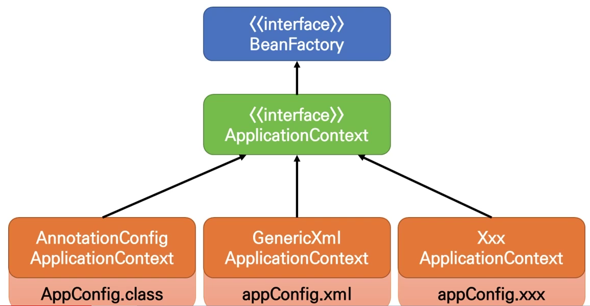

# 🎶Java
---

<a href="#스프링_프레임워크_개요_및_특징">스프링 프레임 워크 개요 및 특징</a>  
<a href="#스프링_빌드도구">스프링 빌드도구</a>  
<a href="#스프링_컨테이너와_빈">스프링 컨테이너와 빈</a>  
<a href="#의존성_주입">의존성 주입</a>  
<a href="#스프링_aop">스프링 AOP</a>  
<a href="#스프링_mvc_소개_및_구조">스프링 MVC 소개 및 구조</a>  
<a href="#컨트롤러와_요청_매핑">컨트롤러와 요청 매핑</a>  
<a href="#뷰와_뷰_리졸버">뷰와 뷰 리졸버</a>  
<a href="#스프링_부트">스프링 부트</a>  
<a href="#스프링_부트_프로젝트_구조">스프링 부트 프로젝트 구조</a>  
<a href="#스프링_부트_구성요소">스프링 부트 구성요소</a>  
<a href="#스프링_부트_배포와_패키징">스프링 부트 배포와 패키징</a>  
<a href="#스프링_부트_개발_환경_설정_및_프로젝트_생성">스프링 부트 개발 환경 설정 및 프로젝트 생성</a>  


# JDK 설치
1. OpenJDK 검색
1. OpenJDK 11 버전 검색
1. 또는zuju jdk 11 검색
1. 사이트에 들어가, Java11(LTS)설치 (윈도우) .zip으로해도 되고, .msi로 해도 됨
1. 환경 변수 설정 한 후, cmd로 확인 하면 끝

# Maven 설치
1. maven 다운로드 검색
1. 다운로드 후 압축풀기 해서 환경변수 설정 bin폴더로
1. vscode Extension Pack for Java를 설치하면 끝
1. Extension에서 Community Server Connection 설치

---
# 스프링_프레임워크_개요_및_특징

### 스프링 프레임워크
`엔터프라이즈용 Java 애플리케이션 개발을 편하게 할 수 있게 해주는 오픈소스 경량급 애플리케이션 프레임워크 - 기업과 개인에 무관하게 웹 애플리케이션 개발을 위해 스프링 코드를 사용할 수 있도록 오픈소스로 제공되는 방대한 소스를 지닌 프레임워크`

- 엔터프라이즈 용 : 기업용 (db, 복잡한 로직, 규격화 된 통신 제공)

### 프레임 워크란?
`소프트웨어의 구체적인 부분에 해당하는 설계와 구현을 재사용이 가능하게끔 일련의 협업화된 형태로 클래스들을 제공하는 것`

- 개발 용이성 : 패턴 기반 개발과 비즈닛 로직에만 집중한 개발 가능 공통 기능은 프레임워크가 제공
- 시스템 복잡도의 감소 : 복잡한 기술은 프레임워크에 의해 숨겨지며, 미리 잘 정의된 기술 셋 적용
- 이식성 : 플랫폼 비의존적인 개발 가능, 플랫폼과의 연동은 프레임워크가 제공함
- 품질보증 : 검증된 개발기술과 패턴에 따른 개발, 고급 개발자와 초급 개발자의 차이를 줄여줌.
- 운영 용이성 : 변경이 용이, 비즈니스로직/아키텍처 파악이 용이
- 개발코드의 최소화 : 반복 개발 제거, 공통 컴포넌트와 서비스 활용
- 변경 용이성 : 잘 구조화 된 아키텍처 적용, 플랫폼에 비 의존성
- 설계와 코드의 재사용성 : 프레임워크 서비스 및 패턴의 재사용, 사전에 개발된 컴포넌트으 재사용

### EJB(Enterprise JavaBeans)
`Java 기반의 엔터프라이즈 애플리케이션 개발을 위한 서버측 컴포넌트 모델`

- JavaBeans : 자바로 작성된 소프트웨어 컴포넌트들, 자바 클래스들이 복합적으로 이루어진 구조

- 문제점
    - 복잡성, 무거움, 학습 곡선과 개발 복잡성

### 스프링 프레임워크의 구조
- Core
    - 프레임워크의 가장 기본적인 부분이며 `IoC` 및 종속성 주입 기능을 제공
    - BeanFactory를 기반으로 `Bean 클래스`들을 제어할 수 있는 기능 지원
- Context
    - Spring Core 바로 위에 있으며 Spring Core에서 지원하는 기능 외에 추가적인 기능들과 좀 더 쉬운 개발이 가능하도록 지원하고 EJB등을 위한 Adaptor들을 포함
- DAO
    - 데이터베이스 공급업체별 `JDBC` 코딩 및 구문 분석을 수행할 필요가 없는 JDBC 추상화 계층을 제공
- ORM
    - `JPA`, `JDO`, `Hibernate` 및 `iBatis`를 포함한 일반적인 개체 관계 매핑 API에 대한 통합 계층을 제공
- Web
    - 파일 업로드 기능, 서블릿 수신기를 사용한 IoC 컨테이너 초기화 및 웹 지향 애플리케이션 컨텍스트와 같은 기본적인 웹 지향 통합 기능을 제공
- MVC
    - MVC(ModelViewController) 구현을 제공
    - 도메인 모델 코드와 웹 양식을 완벽하게 구분할 수 있으며 Spring Framework의 다른 모드 기능을 사용할 수 있음
- JPA(Java Persistence API)
    - 현재 ORM(Object Relational Mapping)의 기술 표준으로, 인터페이스 모음
    - ORM에 대한 자바 API 규격이며 Hibernate, OpenJPA 등이 JPA를 구현한 구현체

### 스프링 프레임워크의 특징
- 경량화
- 제어 반전(IoC, Inversion of Control)
    - 객체의 생성, 관계 설정, 생명주기 관리 등을 개발자가 아닌 스프링 프레임워크가 담당해서 객체 간의 결합도를 낮추고, 유연한 구조를 구축함
- 의존성 주입 (DI, Dependency Injection)
    - 객체 간의 의존성을 개발자가 직접 관리하지 않고, 스프링 프레임워크가 의존성을 관리
- 관점 지향 프로그래밍 (AOP, AspctOriented Programming)
    - 여러 객체에 공통적으로 적용될 수 있는 기능(ex. 로깅, 트랜잭션, 보안 등)을 모듈화하고, 이를 통해 코드의 재사용성과 유지보수성을 높임
- 통합, 테스트, 보안

### 스프링의 주요 패턴 3가지
1. Dependency Injection(DI, 의존성 주입)

`객체 간의 의존성을 최소화하고 유연하게 관리하기 위한 패턴`
``` java
public class UserService {
    private UserRepository userRepository;

    // 생성자를 통한 의존성 주입
    public UserService(UserRepository userRepository) {
        this.userRepository = userRepository;
    }

    public void createUser(User user) {
        //userRepository를 사용하여 사용자 생성 로직 수행
        userRepository.save(user);
    }
}

위의 예시에서 보면, userRepository라는 db를 spring이 알고 있으니 
UserService라는 객체에 의존성 주입을 통해 저장할 수 있는 기능을 제공
```

2. Aspect Oriented Programming (AOP, 관점 지향 프로그래밍)

`객체 지향 개념에서의 관심사 분리를 위해 사용되는 패턴`
``` java
public interface LoggingAspect {
    // 공통 로깅 동작을 정의하는 메서드
    void logBefore(JoinPoint joinPoint);
}

@Component
public class LoggingAspectImpl implements LoggingAspect {
    // 메서드 구현
    public void logBefore(JoinPoint joinPoint) {
        // 메서드 호출 전 로깅 동작을 수행
        System.out.println("Logging before method: " + joinPoint.getSignature().getName());
    }
}
메서드를 호출하기 전에 수행함으로써 관점 분리 가능
```

3. Model-View-Controller (MVC)

`컨트롤러, 뷰, 모델의 세 가지 요소를 사용해 웹 애플리케이션을 구성`

``` java
@Controller
public class UserController {
    @Autowired
    private UserService userService;

    @GetMapping("/users")
    public ModelAndView getUsers() {
        List<User> users = userService.getUsers();
        ModelAndView modelAndView = new ModelAndView("user-list");
        modelAndView.addObject("users", users);
        return modelAndView;
    }

    @PostMapping("/users")
    public String createUser(@ModelAttribute("user") User user) {
        userService.createUser(user);
        return "redirect:/users";
    }
}
```
---

# 스프링_빌드도구
`Maven과 Gradle을 주로 지원하지만, 다른 도구인 Ant도 사용됨`

- Spring Boot 프로젝트일 경우, Gradle Wrapper 또는 Maven Wrapper를 사용해 내장 빌드 도구를 사용할 수 있음
    - Wrapper를 사용하면 프로젝트에 빌드 도구를 별도로 설치하지 않고도 프로젝트를 빌드할 수 있음

### 빌드 도구
`소스 코드의 빌드 과정을 자동으로 처리해주는 프로그램, 외부 소스코드(외부 라이브러리) 자동 추가 및 관리`

- 필요한 이유
    - 수동으로 빌드 할 경우 무엇을 빌드할지, 어떤 순서를 가지고 빌드할지, 어떤 의존성이 있는지 모두 추적하기 쉽지 않음.
    - 빌드 툴을 사용하면 해당 과정을 일관되게 할 수 있음.
    - 프로젝트의 규모가 커질수록 빌드 프로세스를 수동으로 호출할 경우 실용적이지 못함

### 스프링 빌드도구 : Maven
`Apache Software Foundation에서 개발한 Java 기반 프로젝트 관리 도구`

- 프로젝트 빌드, 종속성 관리, 프로젝트 문서화, 테스트, 배포 등을 자동화하는 데 사용
- 프로젝트의 라이프사이클을 기반으로 작동, 프로젝트 빌드 시 필요한 작업을 수행하고, 의존성을 해결하여 필요한 라이브러리를 다운
- 중앙 저장소(Central Repository)라는 공개된 저장소를 통해 다양한 라이브러리와 프로젝트 종속성을 관리
- 프로젝트의 pom.xml(POM: Project Object Model) 파일에 필요한 종속성을 선언하면 Maven은 해당 종속성을 자동으로 검색하고 다운로드하여 빌드에 필요한 라이브러리를 가져옴

```xml
<?xml version="1.0" encoding="UTF-8"?> -> xml의 기본 정보
<project xmlns="http://maven.apache.org/POM/4.0.0"
    xmlns:xsi="http://www.w3.org/2001/XMLSchema-instance"
    xsi:schemaLocation="http://maven.apache.org/POM/4.0.0
    http://maven.apache.org/xsd/maven-4.0.0.xsd"> -> xml의 규격

    <!-- 프로젝트 정보 -->
    <modelVersion>4.0.0</modelVersion>
    <groupId>com.example</groupId>
    <artifactId>my-project</artifactId> -> 프로젝트를 artifact로 부름
    <version>1.0.0</version>

    <!-- 프로젝트 종속성 --> -> 외부 라이브러리
    <dependencies>
      <!-- 예시로 JUnit 4 라이브러리를 종속성으로 추가 -->
      <dependency>
        <groupId>junit</groupId>
        <artifactId>junit</artifactId>
        <version>4.12</version>
        <scope>test</scope> -> 언제 사용할 것인지
      </dependency>
    </dependencies>

    <!-- 빌드 설정 -->
    <build>
      <!-- 소스 디렉토리 및 컴파일 설정 -->
      <sourceDirectory>src/main/java</sourceDirectory> -> 실제java 소스가 위치한 곳
      <plugins>
        <plugin>
          <groupId>org.apache.maven.plugins</groupId>
          <artifactId>maven-compiler-plugin</artifactId>
          <version>3.8.1</version>
          <configuration>
            <source>1.8</source>
            <target>1.8</target>
          </configuration>
        </plugin>
      </plugins>
    </build>

</project>

참고로 xml은 html과 다르게 태그를 정의해서 사용 가능

```

### maven 빌드 라이프 사이클
validate -> compile -> test -> package -> verify -> install -> deploy (default)

```
- default 빌드 라이프 사이클

    - validate : 프로젝트가 유효한지 확인하고 필요한 설정을 검증
    - compile : 소스 코드를 컴파일
    - test : 단위 테스트를 실행
    - package : 컴파일된 코드와 리소스를 포함한 빌드 가능한 아티팩트(JAR, WAR)를 생성
    - verify : 품질 검증 도구를 실행하고 테스트 결과를 확인
    - install : 빌드된 아티팩트를 로컬 저장소에 설치
    - deploy : 빌드된 아티팩트를 원격 저장소에 배포
```

pre-clean -> clean (clean)

- clean : 이전 빌드 생성 파일 삭제

pre-site -> site -> post-site -> site-deploy (site)

- site : 문서 사이트 생성

### 스프링 빌드도구 : Gradle
`Groovy를 기반으로 한 빌드 자동화 도구`
- Maven과 Ant의 장점을 결합한 것으로, Maven의 선언적인 구문과 의존성 관리 기능을 제공하면서도 Ant의 유연한 스크립트 작성과 확장성을 갖추고 있음
- Groovy DSL(Groovy Domain Specific Language)을 사용하여 빌드 스크립트를 작성
- 작업(task), 의존성(dependency), 플러그인(plugin) 등을 정의할 수 있는 빌드 스크립트를 통해 필요한 작업을 자동으로 수행하고 필요한 라이브러리를 다운로드
- Spring 기반 프로젝트의 빌드뿐만 아니라 Android 애플리케이션 개발에서 널리 사용

```groovy
// 빌드 스크립트에서 사용할 Gradle 플러그인 추가
plugins {
    id 'java' // java 플러그인 추가
}

// 프로젝트 설정
group 'com.example'
version '1.0.0'

// 프로젝트 종속성
dependencies {
    // 예시로 JUnit 5 라이브러리를 종속성으로 추가
    testImplementation 'org.junit.jupiter:junit-jupiter:5.7.2'
}

// 빌드 설정
// Java 소스 및 컴파일러 설정
java {
    sourceCompatibility = JavaVersion.VERSION_11
    targetCompatibility = JavaVersion.VERSION_11
}

// 테스트 태스크 설정
test {
    useJUnitPlatform() // 테스트 실행에 사용할 테스트 프레임워크 지정
}
```

- Gradle은 Build 대신 Task 절차
    - 사용자가 빌드 스크립트에 정의한 Task에 따라 빌드 프로세스가 구성
        - Gradle의 유연성과 강력한 기능 중 하나
    - 기본적인 빌드 단계를 사용할 수 있음
        - 초기화 단계(Initialization phase) : Gradle 빌드 스크립트를 초기화하고 설정
        - 구성 단계(Configuration phase) : 프로젝트 및 태스크의 설정이 수행
        - 실행 단계(Excution phase) : 태스크들이 실행되는 단계로, 여러 태스크들이 병렬 또는 순차적으로 실행될 수 있음
    - 사용자는 필요에 따라 태스크를 정의, 의존성을 설정 등을 다양한 플러그인을 사용해 빌드 프로세스를 조정할 수 있음.

- Gradle 명령어
    - gradle clean : 이전 빌드에서 생성된 파일들을 삭제
    - gradle build : 소스 코드를 컴파일하고, 테스트를 실행하며, 빌드 가능한 아티팩트(JAR, WAR 등)을 생성
    - gradle test : 테스트를 실행
    - gradle install : 빌드된 아티팩트를 로컬 저장소에 설치
    - gradle publish : 빌드된 아티팩트를 배포
---

# 스프링_컨테이너와_빈

### 스프링 프레임워크 아키텍처 구성
- Core Container
    - 스프링의 핵심 기능을 담당하는 모듈로, 스프링 컨테이너(BeanFactory 또는 ApplicationContext)와 스프링의 핵심 라이브러리를 포함하고 스프링의 의존성 주입(DI)와 제어 역전(IoC)를 구현하는 기능을 제공
- Data Access/Integration
    - 데이터 액세스와 데이터 통합을 담당하는 모듈로, JDBC, ORM(Object-Relational Mapping) 등의 데이터 액세스와 통합 기능을 제공
- Web
    - 스프링의 웹 기능을 담당하는 모듈로, 웹 애플리케이션 개발을 위한 MVC(Model-View-Controller) 아키텍처, 웹 소켓(Web Socket), REST(Representational State Transfer) 등을 지원

### 스프링 컨테이너의 정의
`의존성 주입(DI)을 통해 객체 간의 의존 관계를 해결하고, 관점 지향 프로그래밍(AOP)를 지원하여 여러 객체에서 공통으로 사용하는 기능을 모듈화 할 수 있음`

- BeanFactory
    - 가장 기본적인 컨테이너이며, 객체의 생성과 관리를 담당
    - BeanFactory는 지연 초기화(lazy initialization)를 지워하여, 필요한 시점에 객체를 생성
    - 이를 통해 애플리케이션의 시작 시간을 최적화할 수 있음
- ApplicationContext
    - BeanFactory의 모든 기능을 포함하며, 더 빠르고, AOP, 메시지 처리, 이벤트 처리 등의 기능을 지원

### BeanFactory와 ApplicationContext
`BeanFactory는 스프링 컨테이너의 최상위 인터페이스, ApplicationContext는 BeanFactory의 기능을 모두 상속 그 외 부가적인 기능(DI) 또한 지원 및 제공`
- Bean 추가는 어노테이션 방식과 xml 방식으로 진행됨




### 단순 생성과 의존성 추가
```java
public class UserService {
    private EmailService emailService;

    public UserService() {
        this.emailService = new EmailService();
    }
}

public class EmailService {
    // 이메일 서비스의 로직
}

new로 객체 생성은 단순 생성
-> 강한 결합이 형성되어, 유지 보수 및 테스트가 어려움

public class UserService {
    private EmailService emailService;

    public UserService(EmailService emailService) {
        this.emailService = emailService;
    }
}

public class EmailService {
    // 이메일 서비스의 로직
}

매개변수를 통해 객체를 가져옴
-> 느슨하게 결합되어 있어, 의존성의 변경에 유연하게 대응할 수 있고 테스트를 위해 Mock 객체 등을 주입할 수도 있음.
```

### ApplicationContext가 제공하는 부가적인 기능
- 메시지 소스 처리
    - App에서 사용되는 메시지들을 관리하고, 다양한 언어로 번역하여 제공
- 환경변수 처리
    - App의 실행환경에 따라 설정을 동적으로 변경할 수 있도록 환경변수를 관리
- 애플리케이션 이벤트 처리
    - App이 발생하는 이벤트를 감지하고, 이벤트에 대한 리스너를 등록하여 처리할 수 있음
- AOP 지원
    - App의 핵심 로직과 공통 로직을 분리하여 사용 가능
- 트랜잭션 관리
    - 트랜잭션을 시작하고, 커밋 또는 롤백하여 트랜잭션 관리를 자동으 로 처리 가능
- 스프링 선언저긴 모델(DAO, ORM 등) 통합
    - 간단한 설정으로 다양한 데이터 액세스 기술을 사용할 수 있음

### 스프링 Bean의 정의
```스프링 컨테이너(BeanFactory 또는 ApplicationContext)가 관리하는 객체, IoC의 대상이 되는 객체이다. 스프링 컨테이너는 객체를 생성하고 필요한 곳에서 해당 객체를 주입하여 사용```

### 스프링의 주요 Bean
- ApplicationContext
    - Spring Framework에서 중요한 Bean이며, 애플리케이션의 빈을 생성하고 관리
- BeanFactory
    - 애플리케이션에서 사용하는 모든 빈을 생성하고 관리하는 인터페이스
- DispatcherServlet
    - Spring MVC 프레임워크에서 HTTP 요청을 처리하는 컨트롤러 역할을 하는 Bean
- JdbcTemplate
    - JDBC를 사용하여 DB와 상호작용하는 데 사용되는 Bean
- TransactionManager
    - Spring에서 제공하는 트랜잭션 관리 Bean

### 스프링의 주요 Bean Scope
- Singleton (default)
    - 스프링 컨테이너에서 해당 bean의 인스턴스를 오직 하나만 생성하고, 이후에는 동일한 인스턴스를 반환
- Prototype
    - 매번 해당 bean을 요청할 때마다 새로운 인스턴스를 생성 (다수 생성 가능)
- Request
    - 웹 앱에서만 사용 가능한 scope로, 각각의 HTTP 요청마다 새로운 인스턴스를 생성
    - 각각의 요청에 대해 독립적인 인스턴스를 생성하며, 요청이 완료되면 인스턴스가 소멸
- Session
    - 웹 앱에서만 사용 가능한 scope로, 각각의 사용자 세션에 대해 하나의 인스턴스를 생성
    - 사용자 세션이 종료되기 전까지는 인스턴스가 유지
- Global Session
    - 포털 애플리케이션에서 사용되는 scope로, 여러 개의 포털 애플리케이션 간에 하나의 인스턴스를 공유
- Application
    - 웹 애플리케이션에서만 사용 가능한 scope로, 해당 웹 애플리케이션 내에서 하나의 인스턴스를 생성하고 공유

### 스프링 Bean의 라이프사이클
`Container Started -> Bean Instantiated -> Dependencies Injected -> Custom init() method -> Custom utility method -> Custom destroy() method`

1. Bean 인스턴스 생성
2. 의존성 주입(DI)
3. Bean 초기화
4. Bean 사용
5. Bean 소멸
---

# 의존성_주입

### IoC/DI 개념
`IoC(Inversion of Control, 제어의 역전) 또는 DI(Dependency Injection, 의존성 주입)는 개발자가 객체 간의 의존성을 설정해두면 컨테이너가 해당 의존성을 관리하고, 필요한 객체를 생성하여 의존성을 주입`


### IoC/DI의 장점
- 결합도 감소
    - IoC/DI는 의존성을 객체 내부에 직접 결합시키지 않고 외부에서 주입하므로 결합도를 감소
- 테스트 용이성
    - 의존성을 주입함으로써 테스트할 때 해당 의존성을 대체할 수 있으며, 모의 객체(Mocking)를 사용하여 테스트 환경을 설정 가능
    - 단위 테스트와 통합 테스트를 수행하는 데 도움을 줌
- 재사용성
    - 의존성으 주입하는 방식으로 작성된 모듈을 다른 프로젝트나 다른 부분에서 재사용하기 용이하게 만듬
    - 의존성을 변경하거나 대체하는 것만으로 모듈을 다양한 환경에서 사용할 수 있음
- 유연성과 확장성
    - IoC 컨테이너를 사용하면 객체의 생성, 관리 및 구성을 외부에 위임할 수 있음 이로서 애플리케이션을 더 유연하게 확장 가능

### IoC/DI의 단점
- 학습 곡선
    - 처음 접하는 개발자들에겐 IoC/DI 컨테이너의 동작 방식과 설정 방법을 이해하는 데 시간이 걸릴 수 있음
- 복잡성 증가
    - IoC/DI를 사용하면 코드의 일부 구성 요소를 외부에서 주입해야 하므로 코드의 복잡성이 증가할 수 있음.
    - 추가적인 구성 작업이 필요하고, 오용에 대한 주의가 필요
- 컨테이너 종속성
    - 컨테이너에 종속되는 경향이 있음
    - 코드가 특정 컨테이너에 의존하는 경우, 다른 컨테이너로 전환하기가 어려울 수 있음
- 실행 시 오류
    - 컴파일 시점이 아닌 실행 시점에 의존성이 주입되므로, 잘못된 의존성 설정 또는 누락된 의존성으로 인해 런타임 오류가 발생할 수 있음

### IoC/DI의 주요 기능
- 객체 생성 및 관리
    - 객체의 생성과 소멸을 관리
- 컴포넌트 조립
    - IoC/DI는 애플리케이셔의 컴포넌트를 조립하는 데 사용
    - 컨테이너는 설정 정보에 따라 필요한 컴포넌트를 생성하고 의존성을 주입하여 애플리케이션의 기능을 조합
- 의존성 해결
    - 의존성 주입을 통해 필요한 의존 객체를 주입할 수 있음
    - 객체 간의 결합도를 낮추고 유연성을 높일 수 있음
- 설정 관리
    - XML,JSON,Annotation 등을 통해 제공되며, 컨테이너가 설정 정보를 기반으로 객체를 생성하고 구성
    - 애플리케이션의 동작 방시을 유연하게 변경할 수 있음

### IoC/DI의 설정 방법
- xml 설정 방법
```xml
<?xml ~~ ?>
<beans xmlns> -> bean 규격 ~~
  <!-- 객체를 정의합니다 -->
  <bean id="greetingService" class="com.example.GreetingSeerviceImpl">
    <!-- 프로퍼티에 값을 주입합니다 -->
    <property name="greeting" value="Hello, World!"/>
  </bean>

  <bean id="client" class="com.example.Client">
    <!-- greetingService 프로퍼티에 참조를 주입합니다 -->
    <property name="greetingService" ref="greetingService" /> -> ref : 다른 bean
  </bean>
</beans>

위의 예시는 Client는 GreetingService에 의존하고있다는 관계
```

- java config 설정 방법
``` java
@Configuration // 설정하는 annotation
public class AppConfig {
    @Bean
    public GreetingService greetingService() {
        GreetingServiceImpl greetingService = new GreetingServiceImpl();
        greetingService.setGreeting("Hello, World!");
        return greetingService;
    }

    @Bean
    public Client client() {
        Client client = new Client();
        client.setGreetingService(greetingService());
        return client;
    }
}
```

- Annotation 설정 방법
``` java
public interface GreetingService {
    String greet();
}

@Service // 서비스면 빈이라고 스프링이 해석
public class GreetingServiceImpl implements GreetingService {
    private String greeting;

    @Value("Hello, World!")
    public void setGreeting(String greeting) {
        this.greeting = greeting;
    }

    public String greet() {
        return greeting;
    }
}
```

### IoC/DI의 예시
- 사용하지 않은 경우
    - "GreetingServiceImpl" 클래스가 강하게 결합되어 있어서, "GreetingServiceImpl" 클래스의 생성자나 메서드가 변경되면, "Client" 클래스도 변경해야 할 수 있음
``` java
public class Client {
    private GreetingService greetingService;

    public Client() {
        this.greetingService = new GreetingServiceImpl();
    }

    public void doSomething() {
        System.out.println(greetingService.greet());
    }
}
```
---
# 스프링_AOP

### 스프링 AOP의 개념(Aspect-Oriented Programming)
- Spring AOP는 '관점 지향 프로그래밍' 기법을 지원하는 Spring Framework의 기능 중 하나
- OOP에서의 상속, 다형성 등의 개념을 보완하여, 코드 중복을 제거하고, 관심사를 분리하여 유지보수성을 향상시킨 기술
- proxy를 이용해 구현되며, 주로 로깅,보안,트랜잭션,캐싱 등과 같은 부가적인 기능을 구현하는 데 사용

### 스프링 AOP 관련 용어
- Aspect : 여러 객체에 공통으로 적용되는 모듈화된 관심사
- Join Point : Aspect를 적용할 수 있는 지점, 메소드 호출, 필드 접근 등
- Advice : Join Point에서 실행되는 코드, Before, After 등
- Pointcut : 어떤 Join Point에 어떤 Advice를 적용할 것인지 정의하는 표현식
- Target Object : Aspect를 적용할 객체
- Proxy : Target Object를 감싸서 Advice를 적용한 객체

### 스프링 AOP의 장점
- 중복 코드 제거 및 모듈화
- 유연한 기능 추가 및 제거
- 로깅, 보안, 트랜잭션 관리 등에 대한 분리

### 스프링 AOP의 단점
- 실행 시간 성능 저하
- 복잡성
- 디버깅 어려움

### 스프링 AOP의 기능
- AOP Alliance 기반의 프록시 패턴을 이용한 AOP 구현
    - 스프링은 AOP Alliance에서 제공하는 인터페이스와 프록시 패턴을 이용하여 AOP를 구현
    - AOP Alliance는 AOP 관련 인터페이스를 표준화한 조직으로, 스프링과 같은 다양한 AOP 구현체에서 활용
- @AspectJ 어노테이션을 활용한 AOP 구현
    - 스프링은 @AspectJ 어노테이션을 이용하여 AOP를 구현
    - @AspectJ 어노테이션은 AspectJ에서 제공하는 어노테이션을 스프링에서 사용할 수 있도록 지원
- XML 설정 파일을 이용한 AOP 구현
    - 스프링은 XML 설정 파일을 이용해 AOP 구현 가능
    - XML 설정 파일에선 AOP 구현을 위한 포인트컷, 어드바이스, 어드바이스와 포인트컷의 조합인 Aspect를 정의할 수 있음

### 스프링 AOP 설정 방법
1. AOP 의존성 추가
2. 관점(Aspect) 클래스 작성
    - AOP에서 관심사를 모듈화한 클래스를 작성, 이 클래스는 @Aspect 어노테이션으로 표시되어야 함.
``` Java
@Aspect
@Component // 빈 선언
public class MyAspect {
    // Advice 정의 -> 서비스 패키지 내에 있는 타 클래스들을 실행하기 전에 다음의 메서드를 실행한다.
    @Before("execution(* com.example.service.*.*(..))")
    public void doSomethingBefore(JoinPoint joinPoint) {
        // ..
    }
}
```
3. 포인트컷(Pointcut) 정의
    - 어느 메소드에 관점을 적용할지를 정의하는 포인트컷을 작성 Spring AOP에서는 @Pointcut 어노테이션을 사용하여 포인트컷을 정의
``` Java
@Aspect
public class LoggingAspect {
    
    // Pointcut 정의
    @Pointcut("execution(* com.example.MyClass.*(..))")
    private void myMethodPointcut() {

    }

    // Advice 적용할 메소드
    @Before("myMethodPointcut()")
    public voidd beforeAdvice() {
        // Advice 로직 구현
        System.out.println("메소드 실행 전 로깅");
    }
}
```
4. 어드바이스(Advice) 정의
    - 관점이 적용될 때 실행될 코드를 어드바이스로 정의, 일반적으로 @Before, @After, @AfterThrowing, @AfterReturning 어노테이션 등을 사용하여 어드바이스를 정의할 수 있음
``` Java
@Aspect
public class LoggingAspect {

    // Pointcut 정의
    @Pointcut("execution(* com.example.MyClass.*(..))")
    private void myMethodPointcut() {

    }

    // Advice 적용할 메소드
    @Before("myMethodPointcut()")
    public voidd beforeAdvice() {
        // Advice 로직 구현
        System.out.println("메소드 실행 전 로깅");
    }
}
```

5. 테스트 및 검증
    - AOP 설정이 올바로 동작하는지 테스트하고 검증, 적용하려는 관점이 올바르게 동작하고, 포인트컷에 의해 지정된 메소드가 관점에 의해 올바르게 처리되는지 확인
``` Java
@RunWith(SpringRunner.class)
@SpringBootTest
public class LoggingAspectTest {

    @MockBean
    private MyService myService;

    @Autowired
    private LoggingAspect loggingAspect;

    @Test
    public void testBeforeAdvice() {
        // Mock 객체를 사용하여 메소드 호출
        myService.doSomething();

        // 해당 Advice가 호출되었는지 검증
        Mockito.verify(loggingAspect).beforeAdvice();
    }
}
```
---
# 스프링_MVC_소개_및_구조

### 스프링 MVC의 개념
- Spring MVC는 Spring 프레임워크의 일부로서 웹 애플리케이션을 개발하기 위한 모델-뷰-컨트롤러(Model-View-Controller) 아키텍처를 구현하는 웹 프레임워크
- Spring MVC는 웹 애플리케이션의 요청과 응답을 처리하고, 비즈니스 로직과 사용자 인터페이스를 분리하여 개발할 수 있는 구조를 제공


- Model

`일반적으로 Java 객체(POJO-순수한 자바 객체- 외부 환경, 기술에 독립적)로 표현되며, DB에서 가져온 정보나 사용자 입력 데이터 등을 처리하고 저장`
- View

`사용자에게 데이터를 시각적으로 표현하는 역할`

    - HTML, JSP, Thymeleaf 등과 같은 템플릿 엔진을 사용하여 동적으로 생성된 웹 페이지를 생성학 클라이언트에게 전달
    - 모델의 데이터를 표현하기 위해 필요한 정보를 가져올 수 있음

- Controller

`사용자 요청을 처리하고 모델과 뷰 간의 상호 작용을 조정하는 역할`

    - 사용자 요청을 분석하고 해당 요청에 맞는 비즈니스 로직을 실행하며, 모델을 업데이트하고 뷰에 전달

### 스프링 MVC의 특징
- 경량화
- 모듈성
- 유연성
- 테스트 용이성
- 보안
- 커스터마이징이 용이

### 스프링 MVC의 구조
`Spring MVC는 Model-View-Controller 패턴을 기반으로 한 웹 애플리케이션 아키텍처를 구현`

    - 이 패턴은 애플리케이션을 모델, 뷰 및 컨트롤러로 구성하며, 각 부분은 역할에 따라 분리되어 있음


### 스프링 MVC - DispatcherServlet
- 요청의 분배
    - 클라이언트의 모든 웹 요청을 수신
    - 웹 요청은 URL 경로, HTTP 메소드, 요청 헤더 등을 기준으로 분배
- 핸들러 매핑(Handler Mapping)
    - 요청을 처리하기 위해 어떤 핸들러(컨트롤러)가 적합한지를 결정
- 핸들러 어댑터(Handler Adapter)
    - 찾아낸 핸들러에게 요청을 전달하고, 핸들러의 실행 결과를 적절한 응답으로 변환하기 위해 사용
- 뷰(View)의 선택과 렌더링
    - 뷰 리졸버(View Resolver)를 통해 뷰를 찾아내고, 모델 데이터와 함께 뷰에 전달하여 최종적인 응답을 생성
- 예외 처리
    - 예외를 적절한 HTTP 응답 상태 코드로 변환하거나, 예외 처리자(Exception Handler)를 사용하여 사용자 정의 에러 페이지로 리다이렉션함


---

# 컨트롤러와_요청_매핑

### 스프링 MVC의 컨트롤러
- 스프링 MVC의 컨트롤러는 웹 애플리케이션에서 클라이언트 요청을 처리하고, 응답을 생성하는 데 사용되는 핵심 구성 요소
- 컨트롤러는 모델과 뷰 사이의 상호 작용을 조정하며, 웹 요청을 처리하고 필요한 작업을 수행한 후 적절한 응답을 생성
- 스프링 MVC에서 컨트롤러는 일반적으로 @Controller 어노테이션을 사용하여 클래스에 지정
- @RequestMapping 어노테이션을 사용해 특정 URL 패턴과 매핑

### 스프링 MVC의 컨트롤러
- 웹 어플리케이션에는 아래 이미지와 같은 구성요소로 이뤄진 http request 처리 레이어가 존재
- 웹 서버에서 수신 -> 라우팅에서 컨트롤러로 전달 -> 컨트롤러에서 요청 처리 및 로직 수행 -> 서비스에서 데이터 처리


### 스프링 MVC 컨트롤러의 요청 처리 관련
`요청은 URL로 진행, URL의 구조는 아래와 같음`
```
http://localhost:8080/api/user/{id}/regist-email?key1=value1&key2=val
프로토콜://도메인:Port/path/?Parameter
```
- 프로토콜 : URL의 시작 부분에 위치하며, 리소스에 접근하는 데 사용되는 통신 프로토콜을 지정
- 도메인 : 프로토콜 다음에 위치하며, 리소스가 호스팅되어 있는 서버의 도메인 이름 또는 IP 주소를 나타냄
- 포트 : 도메인 다음에 위치하며, 리소스에 접근하는 데 사용되는 네트워크 포트 번호를 지정
- 패스 : 도메인 뒤에 위치하며, 서버에서 제공되는 리소스의 경로
- 파라미터 : URL에 추가 정보를 전달하기 위해 사용되며, ?로 시작

`Spring MVC에서 컨트롤러는 클라이언트의 요청을 처리하는 비즈니스 로직을 담당하는 객체로서 컨트롤러는 @Controller 어노테이션을 사용하며 선언하며, 다음과 같은 요청 매핑 어노테이션을 사용해 클라이언트의 요청을 처리`


``` Java
/*
@RequestMapping
- @RequestMapping 어노테이션은 URL 매핑을 지정하는 데 사용
- 예를 들어, @RequestMapping("/users")와 같이 URL 패턴을 설정하면, /users 경로로 들어오는 요청을 처리하는 메소드를 지정할 수 있음
*/
@Controller
@RequestMapping("/users") // path
public class UserController {
    @RequeestMapping(method=RequestMethod.GET) // GET 요청만
    public String listUsers(ModelMap model) {
        List<User> users = userService.getAllUsers();
        model.addAttribute("users",users);
        return "userList"; // userList라는 뷰한테 넘겨줘라는 의미
    }
}
```

``` Java
/*
@GetMapping, @PostMapping, @PutMapping, @DeleteMapping
- Spring 4.3부터는 HTTP 메소드에 따라 처리하는 요청 매핑 어노테이션도 추가
- @GetMapping, @PostMapping, @PutMapping, @DeleteMapping 어노테이션은 각각 HTTP GET, POST, PUT, DELETE 요청을 처리하는 데 사용
*/

@Controller
public class UserController {
    private String userName = "John Doe"; // 기본 사용자 이름

    @PutMapping("/updateName")
    public String updateName(@RequestParam("name") String name) {
        userName = name; // 새로운 사용자 이름으로 업데이트
        return "redirect:/"; // 사용자 페이지로 리다이렉트
    }
}
```

``` Java
/*
@PathVariable
- @PathVariable 어노테이션은 URL 패턴에서 변수를 추출하는 데 사용
- 예를 들어, @RequestMapping("/users/{id}")와 같이 URL 패턴에서 {id} 변수를 추출하여, @PathVariable("id") 어노테이션을 사용하여 해당 변수를 메소드 파라미터로 전달할 수 있음
*/

@Controller
public class UserController {
    @GetMapping("/users/{id}") 
    public String getUser(@PathVariable("id") Long userId, Model model) { // "id"가 userId로 들어갈 수 있다.
        User user = userService.geUserById(userId);
        model.addAttribute("user", user);
        return "user";
    }
}
```

``` Java
/*
@RequestParam
- @RequestParam 어노테이션은 요청 파라미터를 추출하는 데 사용
- 요청 파라미터는 URL 뒤에 ?key=value 형태로 전달되며, @RequestParam 어노테이션을 사용하여 메소드 파라미터로 전달할 수 있음
*/

@Controller
public class UserController {
    @PostMapping("/register")
    public String processRegistration(@RequestParam("name") String name, @RequestParam("email") String email, Model model) {
        User newUser = new User(name, email);
        userService.addUser(newUser);

        model.addAttribute("user", newUser);

        return "redirect:/user";
    }
}
```
---

# 뷰와_뷰_리졸버

### 스프링 MVC의 뷰
- Spring MVC에서 View는 컨트롤러(Controller)에서 처리한 결과를 보여주는 역할
- HTML, XML, JSON 등의 형식으로 제공될 수 있으며, 이를 위해 다양한 템플릿 엔진(Template Engine)을 사용할 수 있음
- Spring MVC에서 뷰는 보통 컨트롤러에서 반환한 문자열에 해당하는 뷰 이름을 사용하여 렌더링
    - 이를 위해 컨트롤러에서 반환한 뷰 이름과 실제 뷰 템플릿 파일의 매핑 정보를 설정할 수 있는 ViewResolver가 사용됨

### 스프링 MVC의 주요한 뷰
- JSP(JavaServer Pages)
    - JSP는 Java코드와 HTML을 결합하여 동적인 웹 페이지를 생성하는 데 사용
    - JSP 뷰는 일반적으로 JSP 템플릿과 함께 사용되며, 컨트롤러가 전달한 데이터를 JSP 템플릿에서 동적으로 처리하여 HTML을 생성
- Thymeleaf
    - Thymeleaf는 자바 템플릿 엔진으로 스프링 생태계에서 널리 사용
    - Thymeleaf 뷰는 HTML 템플릿 내에서 태그 기반의 표현식을 사용하여 데이터를 렌더링
    - Thymeleaf는 서버 사이드와 클라이언트 사이드의 렌더링을 모두 지원하므로, 백엔드와 프론트엔드 코드를 쉽게 통합할 수 있음
- JSON/XML
    - 스프링 MVC는 JSON이나 XML과 같은 데이터 형식을 반환하는 뷰를 지원
    - 이러한 뷰는 주로 RESTful API에서 사용되며, 데이터를 직렬화하여 클라이언트에게 전달
- Freemarker
    - Freemarker는 다른 자바 템플릿 엔진으로서, Thymeleaf와 유사한 기능을 제공
- Velocity
    - Java 기반의 템플릿 엔진으로서, 주로 웹 애플리케이션에서 동적인 컨텐츠를 생성하는 데 사용

### 스프링 MVC의 뷰 리졸버
- Spring MVC에서 뷰 리졸버는 컨트롤러에서 반환한 뷰 이름을 실제 뷰 템플릿 파일과 매핑하여 해당 뷰를 찾아내고, 렌더링하는 역할
- View Resolver는 DispatcherServlet에 의해 생성되며, 설정 파일(xml 또는 java config)에서 지정할 수 있음

`InternalResourceViewResolver`

- JSP나 HTML과 같은 뷰를 매핑할 때 사용

`ResourceBundleViewResolver`

- 다국어 처리에 사용

`XmlViewResolver`

- XML 형식으로 된 뷰를 매핑할 때 사용

`JsonViewResolver`

- Json 형식으로 된 뷰를 매핑할 때 사용

### 뷰와 뷰 리졸버 사용 예시
- 뷰 템플릿 작성
``` html
<!-- Thymeleaf를 사용하여 사용자를 추가하는 뷰 템플릿을 작성 -->
<!DOCTYPE html>
<html xmlns:th="http://www.thymeleaf.org">
<head>
    <meta charset="UTF-8">
    <title>Add User</title>
</head>
<body>
    <h1>Add User</h1>
    <form action="/users" method="post">
        <label for="username">Username:</label>
        <input type="text" id="userid" name="username" required>
        <br/>
        <label for="email">Email:</label>
        <input type="email" id="userid" name="email" required>
        <br/>
        <button type="submit">Add</button>
    </form>
</body>
</html>
```
- 정보를 처리할 컨트롤러 생성
    - 사용자가 /users/add 경로로 접속하면 컨트롤러의 showAddUserForm() 메소드가 실행되어 addUser 뷰 템플릿이 렌더링되어 클라이언트에 반환
``` Java
@Controller
@RequestMapping("/users")
public class UserController {
    @GetMapping("/add")
    public String showAddUserForm() {
        return "addUser";
    }

    @PostMapping
    public String addUser(User user, Model model) {
        // 사용자 추가 로직
        // ...
        model.addAttribute("message", "User added successfully!");
        return "addUser";
    }
}
```

---
# 스프링_부트

### 스프링부트의 개념
- Spring Boot는 자바 기반의 웹 어플리케이션 개발을 쉽게 할 수 있도록 도와주는 오픈소스 프레임워크
- Spring Framework의 기반 기술을 이용하며, 개발자가 설정 작업 없이 쉽게 어플리케이션을 빠르게 구축할 수 있도록 도와줌
- 주로 마이크로서비스 아키텍처와 클라우드 기반의 애플리케이션 개발을 지원하는 데 많이 사용
- 다양한 db, 보안, 웹 개발, 테스트 등의 영역에서 개발자들이 자주 사용하는 라이브러리와 통합되어 작업을 간소화

### 스프링부트와 기존 스프링 프레임워크와의 차이점
- Spring Framework는 자바 기반의 애플리케이션을 개발하기 위한 전체적인 프레임워크이고, Spring MVC는 Spring Framework에서 웹 어플리케이션을 개발하기 위한 모듈
- Spring Boot는 Spring Framework를 기반으로 한 어플리케이션을 빠르게 구축할 수 있도록 도와주는 도구
- Spring Boot는 내장형 서버를 제공하기 때문에, 별도의 서버 설정이 필요없어 편리
- Spring Boot는 자동 설정 기능을 제공하여 개발자가 애플리케이션의 구성을 간편하게 할 수 있음

### 스프링부트의 특징
- 간단한 설정
    - 기본 설정을 제공하며, 설정 파일을 별도로 작성하지 않아도 구축 가능
- 내장형 서버
    - Spring Boot는 내장형 서버 (Tomcat 등)를 제공하므로 별도의 서버 설치 없이 쉽게 애플리케이션을 실행할 수 있음
- 스프링 생태계 지원
    - Spring Framework를 기반으로 하며, 스프링 security, 스프링 데이터 등의 스프링 프로젝트를 통합하여 사용할 수 있음
- 통합된 의존성 관리
    - 의존성 버전 충돌과 같은 문제를 방지할 수 있으며, 의존성 추가와 관리가 간편함
- 자동 설정
    - 애플리케이션의 요구사항에 따라 필요한 의존성만 추가하도록 단순해짐

### 스프링부트의 생태계

출처 : https://springtutorials.com

- Spring Data
    - 다양한 데이터 저장소에 대한 접근을 추상화한 기술
    - Spring Boot에서는 Spring Data JPA를 포함하여 MongoDB, Redis, Cassandra 등 다양한 데이터 저장소에 대한 액세스를 간편하게 처리할 수 있도록 지원
- Spring Security
    - 보안과 관련된 기능을 제공하는 Spring 프로젝트
    - Spring Boot에서는 Spring Security를 이용해 보안과 관련된 기능을 쉽게 구현할 수 있음
- Spring Cloud
    - 클라우드 네이티브 애플리케이션을 개발하기 위한 도구들을 제공
    - Spring Boot에서는 Spring Cloud를 이용해 클라우드 애플리케이션을 쉽게 개발하고, 배포할 수 있음
    - Spring Cloud Config, Spring Cloud Netflix, Spring Cloud Stream, Spring Cloud Gateway 등 다양한 기술을 포함하고 있음

### 스프링 부트의 단점
- 학습곡선
- 자동설정의 복잡성
- 제한된 커스터마이징
- 애플리케이션 크기 : 애플리케이션의 크기가 상대적으로 크게 될 수 있음
- 외부 종속성 관리 : 외부 종속성의 버전 충돌이나 관리에 주의

---

# 스프링_부트_프로젝트_구조

- Controller
    - Client에서 보낸 요청 URL에 따라 응답
    - 요청에 따라 Service로 적절한 데이터를 넘겨주고 Client에게 응답을 돌려주는 역할
- Service
    - Client의 요청에 대해 어떤 처리를 할지 결정하는 부분
- DAO(Repository)
    - 실제로 DB에 접근하여 데이터를 CRUD 하는 객체


### 스프링부트 프로젝트 구조 상세
- 소스 코드(src)
    - 소스 코드 디렉토리는 주요한 애플리케이션 소스 코드가 위치
    - 일반적으로 패키지 구조를 따르며, Java 클래스 파일이나 Kotlin 파일이 이 디렉토리 안에 저장
- 리소스(resources)
    - 리소스 디렉토리는 애플리케이션에서 사용하는 정적 리소스 파일들을 포함
    - 주로 설정 파일, HTML 템플릿, CSS, JavaScript, 이미지 등이 위치
    - 스프링 부트는 리소스 디렉토리의 내용을 클래스 패스에 자동으로 추가
- 테스트(test)
    - 소스 코드 디렉토리는 주요한 애플리케이션 소스 코드가 위치
    - 일반적으로 패키지 구조를 따르며, Java 클래스 파일이나 Kotlin 파일이 이 디렉토리 안에 저장
- 소스 코드 구성
    - 스프링 부트는 주로 여러 개의 모듈로 구성된 마이크로 서비스 아키텍처를 지원
    - 각 모듈은 주요 기능이나 도메인에 따라 패키지로 구분
    - 모듈화된 구조는 코드의 가독성과 유지보수성을 향상시킴
- 애플리케이션 실행 클래스
    - @SpringBootApplication 어노테이션이 적용되어 스프링 부트 애플리케이션을 실행시키는 역할을 하는 클래스가 존재
    - 이 클래스는 애플리케이션의 설정과 구성을 담당하는데, 필요에 따라 추가적인 설정 클래스들이 사용될 수 있음
- 설정 파일(application.properties 또는 application.yml)
    - 스프링 부트는 외부 설정을 관리하기 위해 설정 파일을 사용
    - "application.properties" 또는 "application.yml" 파일로 지정되며, 데이터베이스 연결 정보, 서버 포트, 로깅 설정 등을 포함
    - 이 설정 파일을 통해 애플리케이션 동작을 조정할 수 있음
- 빌드 파일(build.gradle 또는 pom.xml)
    - Gradle 또는 Maven을 사용하여 프로젝트를 빌드하고 의존성을 관리
    - 빌드 파일은 프로젝트의 구성, 의존성, 플러그인 설정 등을 포함
---
# 스프링_부트_구성요소

### 스프링 부트 의존성 관리
- 의존성들의 버전을 관리하여 버전 충돌 문제를 방지
    - 의존성들은 스프링 부트가 미리 정의한 버전 규칙에 따라 호환되는 버전으로 자동으로 설정
    - 개발자가 직접 버전을 명시하지 않아도, 스프링 부트가 버전 관리를 담당하여 일관된 의존성 관리를 제공
- 빌드 파일인 "pom.xml" (Maven) 또는 "build.gradle" (Gradle)에서 수행
    - Maven 또는 Gradle과 같은 빌드 도구를 사용하여 이루어짐
    - 프로젝트를 생성할 때 스프링 부트 스타터(Starter) 종속성을 추가하면, 해당 스타터에 필요한 의존성들이 자동으로 프로젝트에 추가
> 예시
>   - "spring-boot-starter-web" 스타터를 추가하면 웹 개발에 필요한 스프링 웹 관련 의존성들이 자동으로 프로젝트에 추가
>   - 스타터는 애플리케이션 개발에 필요한 다양한 기술 스택에 대해 미리 정의되어 있어, 개발자는 수동으로 의존성을 하나씩 추가하는 번거로움을 줄일 수 있음 (스프링 이니셜라이저)

### 스프링부트 의존성 관리의 장점
- 간편한 의존성 추가
- 버전 관리의 용이성
- 일관된 환경 구성
- 오버라이딩 가능 : 개발자가 특정 의존성의 버전을 직접 지정하고자 할 때, 해당 의존성을 오버라이딩하여 설정한 버전을 사용할 수 있음

### 스프링부트 의존성 관리의 단점
- 의존성 제한 : 스프링 부트가 지원하지 않는 의존성을 추가해야 하는 경우엔 별도로 설정
- 의존성 버전 제한 : 의존성 버전을 자동으로 관리하므로 개발자가 직접 버전을 지정하는 것이 제한
- 추가적인 의존성 관리 부담
    - 스프링 부트의 의존성 관리 기능을 사용하면 프로젝트의 의존성 관리를 스프링 부트에 의존해야 함
    - 즉, 스프링 부트의 빌드 도구와 관련된 설정을 이해하고 관리해야 함을 의미
```
- 스프링 부트 의존성 관리 예시
plugins {
    id 'org.springframework.boot' version '2.5.0'
    id 'io.spring.dependency-management' version '1.0.11.RELEASE'
    id 'java'
}

group 'com.example'
version '1.0-SNAPSHOT'

repositories { // Maven 중앙 저장소(mavenCentral())를 사용하도록 설정
    mavenCentral()
}
// 스프링 부트의 spring-boot-starter-web 스타터를 추가하였으며, testImplementation 구성 요소를 통해 테스트에 필요한 의존성인 spring-boot-starter-test를 추가
dependencies {
    implementation 'org.springframework.boot:spring-boot-starter-web'
    testImplementation 'org.springframework.boot:spring-boot-starter-test'
}

test { // JUnit 5 테스트를 실행하도록 설정
    useJUnitPlatform()
}

이런 config를 다 설정하긴 힘드므로, 스프링부트 프로젝트 생성시 이니셜라이저 사용 (Spring initializer)
참고 사이트 : https://start.spring.io/
```
---
# 스프링_부트_배포와_패키징

### 스프링 부트 배포
`스프링 부트 : 자바 기반의 웹 어플리케이션을 쉽게 개발하고 배포할 수 있도록 도와주는 프레임 워크`
- 내장형 서버와 함께 실행 가능한 JAR 파일로 애플리케이션을 패키징하고 배포하는 것을 권장
- 일반적인 옵션은 내장형 서버를 사용하는 JAR파일을 통한 배포하는 방법
- 다른 옵션은 WAR 파일로 애플리케이션을 패키징하여 외부 서버에 배포하는 방법

### Jar와 War
```
            JAR 파일                            WAR 파일
확장자      |.jar                               |.war

내용        |실행 가능한 java 애플리케이션        |웹 애플리케이션

주요 용도   |독립적인 실행 가능한 애플리케이션     |웹 애플리케이션을 서블릿 컨테이너에 배포

내장 서버   |내장형 서버를 사용하여 실행 가능      |외부 서블릿 컨테이너에서 배포 및 실행

실행 방법   |java-jar your-application.jar      |외부 서블릿 컨테이너에서 배포 및 실행

의존성 관리 |Maven 또는 Gradle 등의 빌드 도구 사용|Maven 또는 Gradle 등의 빌드 도구 사용

패키징      |애플리케이션 및 의존성 JAR 파일을 포함|웹 애플리케이션 파일 및 리소스를 포함

배포        |단독으로 실행 가능한 형태로 배포      |외부 서블릿 컨테이너에 배포

대표적 사례  |독립적인 CLI 애플리케이션, standalone|웹 애플리케이션, 서블릿 기반 애플리케이션
```

### 스프링부트 배포(JAR)
- 내장형 서버를 사용하여 배포하는 방법
    - 스프링 부트 애플리케이션 자체가 웹 서버를 실행하는 데 필요한 기능을 내장
    - 별도의 웹 서버 설치 없이 JAR 파일을 실행하여 애플리케이션을 시작
    - 스프링 부트 Maven 플러그인을 사용하여 Jar 파일 생성
    - JAR 파일 실행 : `java -jar your-application.jar`

### 스프링부트 배포(WAR)
-애플리케이션을 패키징하여 외부 서버에 배포하는 방법
    - 스프링 부트의 spring-boot-starter-web 의존성 추가
    - WAR 파일 생성 : `mvn package`
    - 외부 서버에 배포
        - 생성된 WAR 파일을 외부 서버에 배포학, 해당 서버에서 WAR 파일을 실행, 이를 위해 외부 서버에 서블릿 컨테이너(ex. Tomcat, Jetty)가 설치되어야 함

### 스프링부트 배포를 위한 설정
1. 포트 설정

`스프링 부트 애플리케이션의 기본 포트는 8080`
``` yml
# application.yml 파일
server:
    port: 9090
```

2. 컨텍스트 패스 설정

`스프링 부트 애플리케이션의 루트 컨텍스트 패스를 변경하는 방법`
``` yml
# application.yml 파일
server:
    servlet:
        context-path: /myapp
```

3. HTTPS 설정

`HTTPS를 사용하여 스프링 부트 애플리케이션을 실행하려면 다음과 같은 추가 설정 필요`
``` yml
# application.yml 파일
server:
    port: 9090
ssl:
    key-store:classpath: {ssl 인증서 파일 경로 및 이름}
    key-store-password: {ssl 인증서 비밀번호}
    key-store-type: PKCS12
    key-alias: myapp
```

4. Database 연결정보 설정

`아래 내용을 통해 H2 db와 연결` (H2 : 메모리 데이터 베이스(파일))
``` yml
# application.yml 파일

# H2 db 연결 정보
spring:
    datasource:
        url: jdbc:h2:mem:testdb
        username: sa
        password:
        driver-class-name: org.h2.Driver

# H2 콘솔 활성화
spring:
    h2:
        console:
            enabled: true
```
---
# 스프링_부트_개발_환경_설정_및_프로젝트_생성

https://start.spring.io/ 사이트
```
Project : Maven
Language : Java
Spring Boot : 3.16(가장 아래)
Project Metadata
    Group : com.example
    Artifact : demo
    Name : demo
    Description : 아무거나
    Package name : com.example.demo
Packaging : Jar
Java : 17 (가장 아래) (LTS 추천)
Dependencies : Spring Web, Lombok
```

1. DemoApplication.java 파일을 실행
2. 웹 브라우저에서 `localhost:8080`
3. 웹 서버가 뜨면 반응했다는 의미

```
참고 : vscode에서 spring boot extention
사용법은 Spring Boot Dashboard에서 바로 실행 가능

중요 : vscode에서 Spring initializr Java Support
사용법은 ctrl + shift + P에서 spring initializr를 치면, 바로 initailizr 사용 가능
```