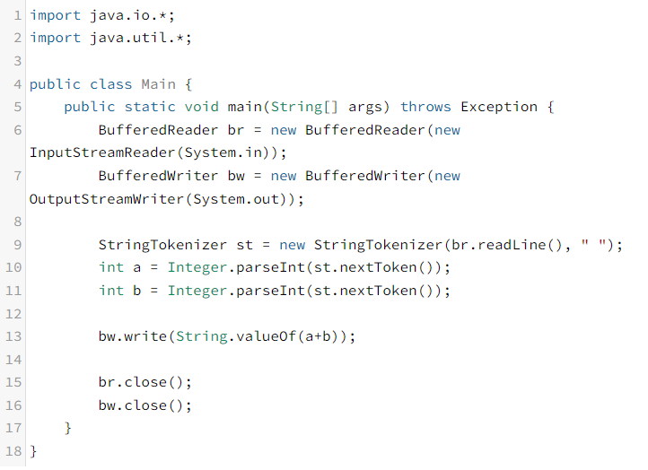

- 백준 코테 공부
```
참고
- 패키지는 작성안해도 된다.
- 이클립스나 VsCode로 코드를 짠 후에 제출하자
- Scanner 보다는 BufferedReader를 사용하자 (속도가 더 빠름)
- 그리고 split() 보다는 StringTokenizer로 입력 (더 빠름)
- 이것보다도 직접 1byte씩 읽어오는 더 빠른 방식이 존재 (https://www.geeksforgeeks.org/fast-io-in-java-in-competitive-programming/)
- System.out.println() 보다 BufferedWriter로 출력하자 (더 빠름)
```


``` java

java.util.*;
java.lang.*;


public class Main {
    public static void main(String[] args) {
        BufferedReader br = new BufferedReader(new InputStreamReader(System.in));
        int n = Integer.parseInt(br.readLine());

        for (int i = 0; i < n; i++) {
            StringTokenizer st = new StringTokenizer(br.readLine());
            int s = Integer.parseInt(st.nextToken());
        }
    }
}
```

```


```

### 1000 번 (A+B)


- 하면서 배운 건데, bw.write는 정수를 직접 출력할 수 없다고 함 (Text로만 반환시켜주기 때문에)

### 1002 번 (터렛)

```
import java.io.*;
import java.util.*;

public class Main {
    public static void main(String[] args) throws Exception {
        BufferedReader br = new BufferedReader(new InputStreamReader(System.in));
        BufferedWriter bw = new BufferedWriter(new OutputStreamWriter(System.out));

        String n = br.readLine();
        int num = Integer.parseInt(n);
        StringTokenizer st = null;

        for (int i=0; i < num; i++) {
            st = new StringTokenizer(br.readLine(), " ");
            // 두 개의 원이 겹치는 개수를 구하면 되는데...,
            int x1 = Integer.parseInt(st.nextToken()); 
            int y1 = Integer.parseInt(st.nextToken());
            int r1 = Integer.parseInt(st.nextToken());

            int x2 = Integer.parseInt(st.nextToken()); 
            int y2 = Integer.parseInt(st.nextToken()); 
            int r2 = Integer.parseInt(st.nextToken());

            // 두 개의 원이 동심원일 경우 (즉 x1과 x2, y1과 y2가 같을 경우)
            if (x1 == x2 && y1 == y2) {
                if (r1 != r2) {
                    bw.write("0\n"); 
                    continue;   
                }
                bw.write("-1\n");
                continue;
            }

            // 두 원이 안쪽에서 만날 경우 (r1 - r2) 와 

            // (px - x1)^2 + (py - y1)^2 = (px - x2)^2 + (py - y2)^2;
            // -2px(x1) + x1^2 -2py(y1) + y1^2 = -2px(x2) + x2^2 -2py(y2) + y2^2
            // x1^2 - x2^2 + y1^2 - y2^2 = 2px(x1-x2) + 2py(y1-y2)
            // (x1 - x2)(x1 + x2)/2 + (y1 - y2)(y1 + y2)/2 = px(x1-x2) + py(y1-y2)
            // 위는 px, py 좌표를 구하는 식이고

            // 여기서부터 개수를 구하려면
            // 두 원의 중심간의 거리를 구하고, 두원의 반지름의 합을 비교
            // sqrt{(x2-x1)^2 + (y2-y1)^2} = 두 원의 중심간의 거리
            // 만약 두 원의 중심간의 거리와 두 원의 반지름의 길이와 같다면 1개
            // 두 원의 중심간의 거리보다 반지름의 합이 크다면 2개
            // 반지름의 합이 작다면 0개
            double distance = Math.sqrt(Math.pow((x2 - x1), 2) + Math.pow((y2 - y1), 2));
            if (distance == r1+r2 || distance == Math.abs(r1 - r2)) {
                // 바깥쪽에서 크기가 같거나, 안쪽에서 크기가 같을 경우
                bw.write("1\n");
            } else if (distance < r1+r2 && distance > Math.abs(r1 - r2)) {
                // 바깥쪽에서 크기가 크거나, 안쪽에서 크기가 작을 경우 (무조건 이래야함)
                bw.write("2\n");
            } else {
                bw.write("0\n");
            }
        }

        bw.flush();
        bw.close();
    }
}
```

### 1003번 (피보나치 함수)

```
import java.io.*;
import java.util.*;

public class Main {

    // 다음은 피보나치 수열 for로 구현한 함수이며,
    static int fibonacciNum1(int number) {
        int a = 0;
        int b = 1;
        int fib = 0;

        if (number == 0) {
            return a;
        } else if (number == 1) {
            return b;
        }
        for (int i=2; i<=number; i++) {
            fib = a + b;
            a = b;
            b = fib;
        }
        return fib;
    }

    // 예시로 4를 넣으면
    /*
     * 4 -> 3(*) 2(*)
     * 3 -> 2(*) 1
     * 2 -> 1 0
     * 2 -> 1 0
     * 즉 1은 3번 0은 2번이 나온다.
     * 
     * 5 -> 4(1은 3번 0은 2번) 3(1은 2번 0은 1번)
     * 즉 1은 5번 0은 3번이 나온다.
     * 
     * 6 -> 5(1은 5번 0은 3번) 4(1은 3번 0은 2번)
     * 즉 1은 8번 0은 5번이 나온다.
     * 
     * 7 -> 6(1:8,0:5) 5(1:5,0:3)
     * 즉 1은 13번 0은 8번이 나오는데,
     * 
     * 즉 나오는 개수도 피보나치 수열처럼 커진다.
     * 
     * 1은 기존 피보나치 수열 1 1 2 3 5 ...
     * 0은 기존보다 한칸 아래 수열 1 1 1 2 3 5 ...
     * 
     * 따라서 for로 구한 피보나치 수열을 이용해서 적용
     */
    public static void main(String[] args) throws Exception {
        BufferedReader br = new BufferedReader(new InputStreamReader(System.in));
        BufferedWriter bw = new BufferedWriter(new OutputStreamWriter(System.out));

        String n = br.readLine();
        int num = Integer.parseInt(n);
        StringTokenizer st = null;

        for (int i=0; i < num; i++) {
            st = new StringTokenizer(br.readLine());

            int number = Integer.parseInt(st.nextToken());

            int result0 = 0;
            int result1 = 0;

            // 입력되는 값이 0이면, 1,0은 고정, 1이면 0,1은 고정
            if (number == 0) {
                result0 = 1;
                result1 = 0;
            } else if (number == 1) {
                result0 = 0;
                result1 = 1;
            } else {
                // 즉 0이 나오는 개수는 기존 피보나치 수보다 -1의 값 이고
                result0 = fibonacciNum1(number-1);
                // 1이 나오는 개수는 기존 피보나치 number의 값
                result1 = fibonacciNum1(number);
            }
            bw.write(String.valueOf(result0)+" "+ String.valueOf(result1)+"\n");
        }

        bw.flush();
        bw.close();
    }
}
```